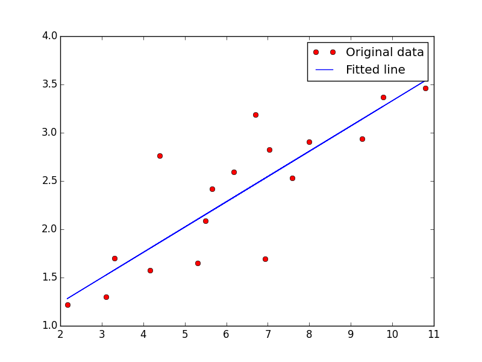
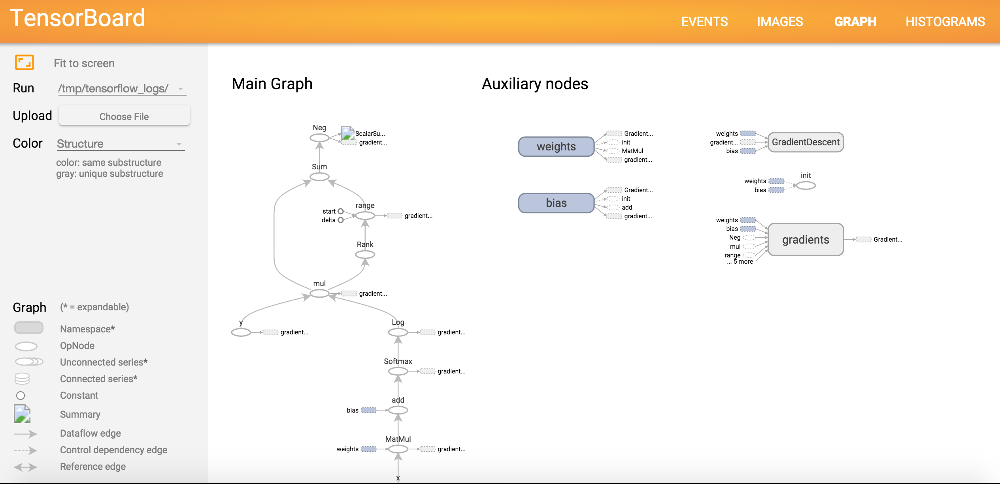
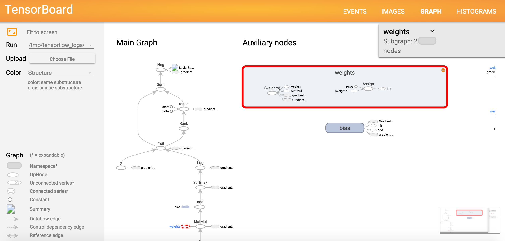
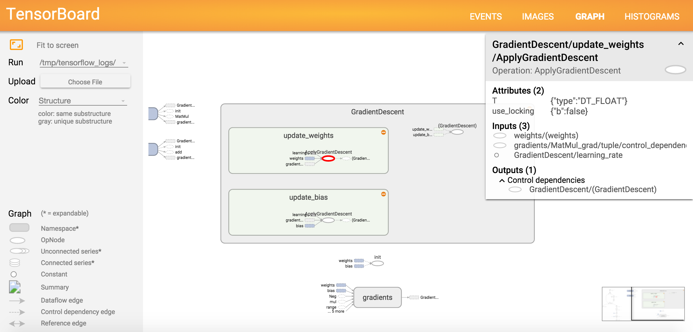
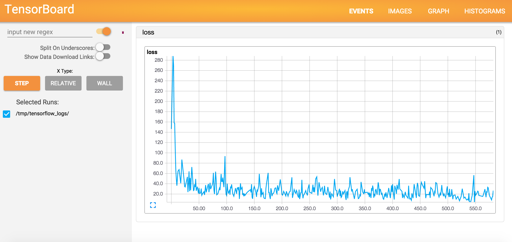

# 一、TensorFlow

> 原文：[TensorFlow Tutorials](https://github.com/donnemartin/data-science-ipython-notebooks#tensor-flow-tutorials)
> 
> 译者：[飞龙](https://github.com/wizardforcel)
> 
> 协议：[CC BY-NC-SA 4.0](http://creativecommons.org/licenses/by-nc-sa/4.0/)

## 1.1 TensorFlow 基本操作

> 致谢：派生于 Aymeric Damien 的 [TensorFlow 示例](https://github.com/aymericdamien/TensorFlow-Examples)

### 配置

参考[配置指南](http://nbviewer.ipython.org/github/donnemartin/data-science-ipython-notebooks/blob/master/deep-learning/tensor-flow-examples/Setup_TensorFlow.md)。

```py
import tensorflow as tf

# 基本的常量操作
# 由构造器返回的值
# 表示常量操作的输出
a = tf.constant(2)
b = tf.constant(3)

# 加载默认图
with tf.Session() as sess:
    print "a=2, b=3"
    print "Addition with constants: %i" % sess.run(a+b)
    print "Multiplication with constants: %i" % sess.run(a*b)
    
'''
a=2, b=3
Addition with constants: 5
Multiplication with constants: 6
'''

# 作为图输入的变量的基本操作
# 由构造器返回的值
# 表示变量操作的输出（运行会话时定义为输出）
# TF 图输入
a = tf.placeholder(tf.int16)
b = tf.placeholder(tf.int16)

# 定义一些操作
add = tf.add(a, b)
mul = tf.mul(a, b)

# 加载默认图
with tf.Session() as sess:
    # 使用遍历输入运行每个操作
    print "Addition with variables: %i" % sess.run(add, feed_dict={a: 2, b: 3})
    print "Multiplication with variables: %i" % sess.run(mul, feed_dict={a: 2, b: 3})
    
'''
Addition with variables: 5
Multiplication with variables: 6
'''

# ----------------
# 更多细节：
# 来自 TF 官方教程的矩阵乘法教程

# 创建常量操作，产生 1x2 矩阵
# 操作作为节点添加到默认图中
#
# 由构造器返回的值
# 表示常量操作的输出
matrix1 = tf.constant([[3., 3.]])

# 创建另一个常量，产生 2x1 矩阵
matrix2 = tf.constant([[2.],[2.]])

# 创建 Matmul 操作，它接受 'matrix1' 和 'matrix2' 作为输入
# 返回的值 'product' 表示矩阵乘法的结果
product = tf.matmul(matrix1, matrix2)

# 为了执行 matmul 操作，我们调用会话的 'run()' 方法，传入 'product'
# 它表示 matmul 操作的输出。这对调用表明我们向获取 matmul 操作的输出
#
# 操作所需的所有输入都由会话自动运行
# 它们通常是并行运行的
#
# 'run(product)' 的调用会执行图中的三个操作：
# 两个常量和 matmul
#
# 操作的输出在 'result' 中返回，作为 NumPy `ndarray` 对象
with tf.Session() as sess:
    result = sess.run(product)
    print result
    
# [[ 12.]]
```

## 1.2 TensorFlow 线性回归

> 致谢：派生于 Aymeric Damien 的 [TensorFlow 示例](https://github.com/aymericdamien/TensorFlow-Examples)

### 配置

参考[配置指南](http://nbviewer.ipython.org/github/donnemartin/data-science-ipython-notebooks/blob/master/deep-learning/tensor-flow-examples/Setup_TensorFlow.md)。

```py
import tensorflow as tf
import numpy
import matplotlib.pyplot as plt
rng = numpy.random

# 参数
learning_rate = 0.01
training_epochs = 2000
display_step = 50

# 训练数据
train_X = numpy.asarray([3.3,4.4,5.5,6.71,6.93,4.168,9.779,6.182,7.59,2.167,7.042,10.791,5.313,7.997,5.654,9.27,3.1])
train_Y = numpy.asarray([1.7,2.76,2.09,3.19,1.694,1.573,3.366,2.596,2.53,1.221,2.827,3.465,1.65,2.904,2.42,2.94,1.3])
n_samples = train_X.shape[0]

# TF 图输入
X = tf.placeholder("float")
Y = tf.placeholder("float")

# 创建模型

# 设置模型权重
W = tf.Variable(rng.randn(), name="weight")
b = tf.Variable(rng.randn(), name="bias")

# 构造线性模型
activation = tf.add(tf.mul(X, W), b)

# 最小化平方误差
cost = tf.reduce_sum(tf.pow(activation-Y, 2))/(2*n_samples) #L2 loss
optimizer = tf.train.GradientDescentOptimizer(learning_rate).minimize(cost) #Gradient descent

# 初始化变量
init = tf.initialize_all_variables()

# 加载图
with tf.Session() as sess:
    sess.run(init)

    # 拟合所有训练数据
    for epoch in range(training_epochs):
        for (x, y) in zip(train_X, train_Y):
            sess.run(optimizer, feed_dict={X: x, Y: y})

        # 展示每一步的日志
        if epoch % display_step == 0:
            print "Epoch:", '%04d' % (epoch+1), "cost=", \
                "{:.9f}".format(sess.run(cost, feed_dict={X: train_X, Y:train_Y})), \
                "W=", sess.run(W), "b=", sess.run(b)

    print "Optimization Finished!"
    print "cost=", sess.run(cost, feed_dict={X: train_X, Y: train_Y}), \
          "W=", sess.run(W), "b=", sess.run(b)

    # 展示图
    plt.plot(train_X, train_Y, 'ro', label='Original data')
    plt.plot(train_X, sess.run(W) * train_X + sess.run(b), label='Fitted line')
    plt.legend()
    plt.show()
    
'''
Epoch: 0001 cost= 3.389688730 W= 0.0198441 b= -0.273522
Epoch: 0051 cost= 0.134034902 W= 0.383208 b= -0.159746
Epoch: 0101 cost= 0.127440125 W= 0.375261 b= -0.102578
Epoch: 0151 cost= 0.121607177 W= 0.367787 b= -0.0488099
Epoch: 0201 cost= 0.116448022 W= 0.360758 b= 0.00175997
Epoch: 0251 cost= 0.111884907 W= 0.354146 b= 0.0493223
Epoch: 0301 cost= 0.107848980 W= 0.347928 b= 0.0940558
Epoch: 0351 cost= 0.104279339 W= 0.34208 b= 0.136129
Epoch: 0401 cost= 0.101122171 W= 0.336579 b= 0.1757
Epoch: 0451 cost= 0.098329842 W= 0.331405 b= 0.212917
Epoch: 0501 cost= 0.095860250 W= 0.32654 b= 0.247921
Epoch: 0551 cost= 0.093676031 W= 0.321963 b= 0.280843
Epoch: 0601 cost= 0.091744311 W= 0.317659 b= 0.311807
Epoch: 0651 cost= 0.090035893 W= 0.313611 b= 0.340929
Epoch: 0701 cost= 0.088524953 W= 0.309804 b= 0.36832
Epoch: 0751 cost= 0.087188691 W= 0.306222 b= 0.394082
Epoch: 0801 cost= 0.086007021 W= 0.302854 b= 0.418311
Epoch: 0851 cost= 0.084961981 W= 0.299687 b= 0.441099
Epoch: 0901 cost= 0.084037818 W= 0.296708 b= 0.462532
Epoch: 0951 cost= 0.083220571 W= 0.293905 b= 0.48269
Epoch: 1001 cost= 0.082497880 W= 0.29127 b= 0.50165
Epoch: 1051 cost= 0.081858821 W= 0.288791 b= 0.519481
Epoch: 1101 cost= 0.081293717 W= 0.28646 b= 0.536251
Epoch: 1151 cost= 0.080794014 W= 0.284267 b= 0.552026
Epoch: 1201 cost= 0.080352172 W= 0.282205 b= 0.566861
Epoch: 1251 cost= 0.079961479 W= 0.280265 b= 0.580815
Epoch: 1301 cost= 0.079616025 W= 0.278441 b= 0.593939
Epoch: 1351 cost= 0.079310589 W= 0.276725 b= 0.606284
Epoch: 1401 cost= 0.079040587 W= 0.275111 b= 0.617893
Epoch: 1451 cost= 0.078801893 W= 0.273594 b= 0.62881
Epoch: 1501 cost= 0.078590907 W= 0.272167 b= 0.639077
Epoch: 1551 cost= 0.078404360 W= 0.270824 b= 0.648734
Epoch: 1601 cost= 0.078239456 W= 0.269562 b= 0.657817
Epoch: 1651 cost= 0.078093678 W= 0.268374 b= 0.66636
Epoch: 1701 cost= 0.077964827 W= 0.267257 b= 0.674395
Epoch: 1751 cost= 0.077850945 W= 0.266207 b= 0.681952
Epoch: 1801 cost= 0.077750273 W= 0.265219 b= 0.68906
Epoch: 1851 cost= 0.077661335 W= 0.264289 b= 0.695745
Epoch: 1901 cost= 0.077582702 W= 0.263416 b= 0.702033
Epoch: 1951 cost= 0.077513263 W= 0.262593 b= 0.707947
Optimization Finished!
cost= 0.077453 W= 0.261835 b= 0.713401
'''

from IPython.display import Image
Image(filename='linearreg.png')
```



## 1.3 TensorFlow Logistic 回归

> 致谢：派生于 Aymeric Damien 的 [TensorFlow 示例](https://github.com/aymericdamien/TensorFlow-Examples)

### 配置

参考[配置指南](http://nbviewer.ipython.org/github/donnemartin/data-science-ipython-notebooks/blob/master/deep-learning/tensor-flow-examples/Setup_TensorFlow.md)。

```py
# 导入 MINST 数据
import input_data
mnist = input_data.read_data_sets("/tmp/data/", one_hot=True)

'''
Extracting /tmp/data/train-images-idx3-ubyte.gz
Extracting /tmp/data/train-labels-idx1-ubyte.gz
Extracting /tmp/data/t10k-images-idx3-ubyte.gz
Extracting /tmp/data/t10k-labels-idx1-ubyte.gz
'''

import tensorflow as tf

# 参数
learning_rate = 0.01
training_epochs = 25
batch_size = 100
display_step = 1

# TF 图输入
x = tf.placeholder("float", [None, 784]) # mnist 数据图像，形状为 28*28=784
y = tf.placeholder("float", [None, 10]) # 0-9 数字识别 => 10 个类

# 创建模型

# 设置模型权重
W = tf.Variable(tf.zeros([784, 10]))
b = tf.Variable(tf.zeros([10]))

# 构造模型
activation = tf.nn.softmax(tf.matmul(x, W) + b) # Softmax

# 最小化交叉熵误差
# 交叉熵
cost = -tf.reduce_sum(y*tf.log(activation)) 
# 梯度下降
optimizer = tf.train.GradientDescentOptimizer(learning_rate).minimize(cost) 

# 初始化变量
init = tf.initialize_all_variables()

# 加载图
with tf.Session() as sess:
    sess.run(init)

    # 训练循环
    for epoch in range(training_epochs):
        avg_cost = 0.
        total_batch = int(mnist.train.num_examples/batch_size)
        # 遍历所有批量
        for i in range(total_batch):
            batch_xs, batch_ys = mnist.train.next_batch(batch_size)
            # 使用批量数据拟合训练
            sess.run(optimizer, feed_dict={x: batch_xs, y: batch_ys})
            # 计算平均损失
            avg_cost += sess.run(cost, feed_dict={x: batch_xs, y: batch_ys})/total_batch
        #  展示每一步的日志
        if epoch % display_step == 0:
            print "Epoch:", '%04d' % (epoch+1), "cost=", "{:.9f}".format(avg_cost)

    print "Optimization Finished!"

    # 测试模型
    correct_prediction = tf.equal(tf.argmax(activation, 1), tf.argmax(y, 1))
    # 计算准确率
    accuracy = tf.reduce_mean(tf.cast(correct_prediction, "float"))
    print "Accuracy:", accuracy.eval({x: mnist.test.images, y: mnist.test.labels})
    
'''
Epoch: 0001 cost= 29.860479714
Epoch: 0002 cost= 22.080549484
Epoch: 0003 cost= 21.237104595
Epoch: 0004 cost= 20.460196280
Epoch: 0005 cost= 20.185128237
Epoch: 0006 cost= 19.940297202
Epoch: 0007 cost= 19.645111119
Epoch: 0008 cost= 19.507218031
Epoch: 0009 cost= 19.389794492
Epoch: 0010 cost= 19.177005816
Epoch: 0011 cost= 19.082493615
Epoch: 0012 cost= 19.072873598
Epoch: 0013 cost= 18.938005402
Epoch: 0014 cost= 18.891806430
Epoch: 0015 cost= 18.839480221
Epoch: 0016 cost= 18.769349510
Epoch: 0017 cost= 18.590865587
Epoch: 0018 cost= 18.623413677
Epoch: 0019 cost= 18.546149085
Epoch: 0020 cost= 18.432274895
Epoch: 0021 cost= 18.358189004
Epoch: 0022 cost= 18.380014628
Epoch: 0023 cost= 18.499993471
Epoch: 0024 cost= 18.386477311
Epoch: 0025 cost= 18.258080609
Optimization Finished!
Accuracy: 0.9048
'''
```

## 1.4 TensorFlow 最近邻

> 致谢：派生于 Aymeric Damien 的 [TensorFlow 示例](https://github.com/aymericdamien/TensorFlow-Examples)

### 配置

参考[配置指南](http://nbviewer.ipython.org/github/donnemartin/data-science-ipython-notebooks/blob/master/deep-learning/tensor-flow-examples/Setup_TensorFlow.md)。

```py
import numpy as np
import tensorflow as tf

# 导入 MINST 数据
import input_data
mnist = input_data.read_data_sets("/tmp/data/", one_hot=True)

'''
Extracting /tmp/data/train-images-idx3-ubyte.gz
Extracting /tmp/data/train-labels-idx1-ubyte.gz
Extracting /tmp/data/t10k-images-idx3-ubyte.gz
Extracting /tmp/data/t10k-labels-idx1-ubyte.gz
'''

# 这个例子中，我们限制 mnist 数据
Xtr, Ytr = mnist.train.next_batch(5000) # 训练集 5000 个（nn 候选）
Xte, Yte = mnist.test.next_batch(200) # 测试集 200 个

# 将图像的形状变为一维
Xtr = np.reshape(Xtr, newshape=(-1, 28*28))
Xte = np.reshape(Xte, newshape=(-1, 28*28))

# TF 图输入
xtr = tf.placeholder("float", [None, 784])
xte = tf.placeholder("float", [784])

# 使用 L1 距离计算最近邻
distance = tf.reduce_sum(tf.abs(tf.add(xtr, tf.neg(xte))), reduction_indices=1)
# 预测：获取最小距离的下标（最近邻）
pred = tf.arg_min(distance, 0)

accuracy = 0.

# 初始化变量
init = tf.initialize_all_variables()

# 加载图
with tf.Session() as sess:
    sess.run(init)

    # 遍历测试数据
    for i in range(len(Xte)):
        # 获取最近邻
        nn_index = sess.run(pred, feed_dict={xtr: Xtr, xte: Xte[i,:]})
        # 获取最近邻的类标签，并将其与真实标签比较
        print "Test", i, "Prediction:", np.argmax(Ytr[nn_index]), \
              "True Class:", np.argmax(Yte[i])
        # 计算准确率
        if np.argmax(Ytr[nn_index]) == np.argmax(Yte[i]):
            accuracy += 1./len(Xte)
    print "Done!"
    print "Accuracy:", accuracy
    
'''
Test 0 Prediction: 7 True Class: 7
Test 1 Prediction: 2 True Class: 2
Test 2 Prediction: 1 True Class: 1
Test 3 Prediction: 0 True Class: 0
Test 4 Prediction: 4 True Class: 4
Test 5 Prediction: 1 True Class: 1
Test 6 Prediction: 4 True Class: 4
Test 7 Prediction: 9 True Class: 9
Test 8 Prediction: 8 True Class: 5
Test 9 Prediction: 9 True Class: 9
Test 10 Prediction: 0 True Class: 0
Test 11 Prediction: 0 True Class: 6
Test 12 Prediction: 9 True Class: 9
Test 13 Prediction: 0 True Class: 0
Test 14 Prediction: 1 True Class: 1
Test 15 Prediction: 5 True Class: 5
Test 16 Prediction: 4 True Class: 9
Test 17 Prediction: 7 True Class: 7
Test 18 Prediction: 3 True Class: 3
Test 19 Prediction: 4 True Class: 4
Test 20 Prediction: 9 True Class: 9
Test 21 Prediction: 6 True Class: 6
Test 22 Prediction: 6 True Class: 6
Test 23 Prediction: 5 True Class: 5
Test 24 Prediction: 4 True Class: 4
Test 25 Prediction: 0 True Class: 0
Test 26 Prediction: 7 True Class: 7
Test 27 Prediction: 4 True Class: 4
Test 28 Prediction: 0 True Class: 0
Test 29 Prediction: 1 True Class: 1
Test 30 Prediction: 3 True Class: 3
Test 31 Prediction: 1 True Class: 1
Test 32 Prediction: 3 True Class: 3
Test 33 Prediction: 4 True Class: 4
Test 34 Prediction: 7 True Class: 7
Test 35 Prediction: 2 True Class: 2
Test 36 Prediction: 7 True Class: 7
Test 37 Prediction: 1 True Class: 1
Test 38 Prediction: 2 True Class: 2
Test 39 Prediction: 1 True Class: 1
Test 40 Prediction: 1 True Class: 1
Test 41 Prediction: 7 True Class: 7
Test 42 Prediction: 4 True Class: 4
Test 43 Prediction: 1 True Class: 2
Test 44 Prediction: 3 True Class: 3
Test 45 Prediction: 5 True Class: 5
Test 46 Prediction: 1 True Class: 1
Test 47 Prediction: 2 True Class: 2
Test 48 Prediction: 4 True Class: 4
Test 49 Prediction: 4 True Class: 4
Test 50 Prediction: 6 True Class: 6
Test 51 Prediction: 3 True Class: 3
Test 52 Prediction: 5 True Class: 5
Test 53 Prediction: 5 True Class: 5
Test 54 Prediction: 6 True Class: 6
Test 55 Prediction: 0 True Class: 0
Test 56 Prediction: 4 True Class: 4
Test 57 Prediction: 1 True Class: 1
Test 58 Prediction: 9 True Class: 9
Test 59 Prediction: 5 True Class: 5
Test 60 Prediction: 7 True Class: 7
Test 61 Prediction: 8 True Class: 8
Test 62 Prediction: 9 True Class: 9
Test 63 Prediction: 3 True Class: 3
Test 64 Prediction: 7 True Class: 7
Test 65 Prediction: 4 True Class: 4
Test 66 Prediction: 6 True Class: 6
Test 67 Prediction: 4 True Class: 4
Test 68 Prediction: 3 True Class: 3
Test 69 Prediction: 0 True Class: 0
Test 70 Prediction: 7 True Class: 7
Test 71 Prediction: 0 True Class: 0
Test 72 Prediction: 2 True Class: 2
Test 73 Prediction: 7 True Class: 9
Test 74 Prediction: 1 True Class: 1
Test 75 Prediction: 7 True Class: 7
Test 76 Prediction: 3 True Class: 3
Test 77 Prediction: 7 True Class: 2
Test 78 Prediction: 9 True Class: 9
Test 79 Prediction: 7 True Class: 7
Test 80 Prediction: 7 True Class: 7
Test 81 Prediction: 6 True Class: 6
Test 82 Prediction: 2 True Class: 2
Test 83 Prediction: 7 True Class: 7
Test 84 Prediction: 8 True Class: 8
Test 85 Prediction: 4 True Class: 4
Test 86 Prediction: 7 True Class: 7
Test 87 Prediction: 3 True Class: 3
Test 88 Prediction: 6 True Class: 6
Test 89 Prediction: 1 True Class: 1
Test 90 Prediction: 3 True Class: 3
Test 91 Prediction: 6 True Class: 6
Test 92 Prediction: 9 True Class: 9
Test 93 Prediction: 3 True Class: 3
Test 94 Prediction: 1 True Class: 1
Test 95 Prediction: 4 True Class: 4
Test 96 Prediction: 1 True Class: 1
Test 97 Prediction: 7 True Class: 7
Test 98 Prediction: 6 True Class: 6
Test 99 Prediction: 9 True Class: 9
Test 100 Prediction: 6 True Class: 6
Test 101 Prediction: 0 True Class: 0
Test 102 Prediction: 5 True Class: 5
Test 103 Prediction: 4 True Class: 4
Test 104 Prediction: 9 True Class: 9
Test 105 Prediction: 9 True Class: 9
Test 106 Prediction: 2 True Class: 2
Test 107 Prediction: 1 True Class: 1
Test 108 Prediction: 9 True Class: 9
Test 109 Prediction: 4 True Class: 4
Test 110 Prediction: 8 True Class: 8
Test 111 Prediction: 7 True Class: 7
Test 112 Prediction: 3 True Class: 3
Test 113 Prediction: 9 True Class: 9
Test 114 Prediction: 7 True Class: 7
Test 115 Prediction: 9 True Class: 4
Test 116 Prediction: 9 True Class: 4
Test 117 Prediction: 4 True Class: 4
Test 118 Prediction: 9 True Class: 9
Test 119 Prediction: 7 True Class: 2
Test 120 Prediction: 5 True Class: 5
Test 121 Prediction: 4 True Class: 4
Test 122 Prediction: 7 True Class: 7
Test 123 Prediction: 6 True Class: 6
Test 124 Prediction: 7 True Class: 7
Test 125 Prediction: 9 True Class: 9
Test 126 Prediction: 0 True Class: 0
Test 127 Prediction: 5 True Class: 5
Test 128 Prediction: 8 True Class: 8
Test 129 Prediction: 5 True Class: 5
Test 130 Prediction: 6 True Class: 6
Test 131 Prediction: 6 True Class: 6
Test 132 Prediction: 5 True Class: 5
Test 133 Prediction: 7 True Class: 7
Test 134 Prediction: 8 True Class: 8
Test 135 Prediction: 1 True Class: 1
Test 136 Prediction: 0 True Class: 0
Test 137 Prediction: 1 True Class: 1
Test 138 Prediction: 6 True Class: 6
Test 139 Prediction: 4 True Class: 4
Test 140 Prediction: 6 True Class: 6
Test 141 Prediction: 7 True Class: 7
Test 142 Prediction: 2 True Class: 3
Test 143 Prediction: 1 True Class: 1
Test 144 Prediction: 7 True Class: 7
Test 145 Prediction: 1 True Class: 1
Test 146 Prediction: 8 True Class: 8
Test 147 Prediction: 2 True Class: 2
Test 148 Prediction: 0 True Class: 0
Test 149 Prediction: 1 True Class: 2
Test 150 Prediction: 9 True Class: 9
Test 151 Prediction: 9 True Class: 9
Test 152 Prediction: 5 True Class: 5
Test 153 Prediction: 5 True Class: 5
Test 154 Prediction: 1 True Class: 1
Test 155 Prediction: 5 True Class: 5
Test 156 Prediction: 6 True Class: 6
Test 157 Prediction: 0 True Class: 0
Test 158 Prediction: 3 True Class: 3
Test 159 Prediction: 4 True Class: 4
Test 160 Prediction: 4 True Class: 4
Test 161 Prediction: 6 True Class: 6
Test 162 Prediction: 5 True Class: 5
Test 163 Prediction: 4 True Class: 4
Test 164 Prediction: 6 True Class: 6
Test 165 Prediction: 5 True Class: 5
Test 166 Prediction: 4 True Class: 4
Test 167 Prediction: 5 True Class: 5
Test 168 Prediction: 1 True Class: 1
Test 169 Prediction: 4 True Class: 4
Test 170 Prediction: 9 True Class: 4
Test 171 Prediction: 7 True Class: 7
Test 172 Prediction: 2 True Class: 2
Test 173 Prediction: 3 True Class: 3
Test 174 Prediction: 2 True Class: 2
Test 175 Prediction: 1 True Class: 7
Test 176 Prediction: 1 True Class: 1
Test 177 Prediction: 8 True Class: 8
Test 178 Prediction: 1 True Class: 1
Test 179 Prediction: 8 True Class: 8
Test 180 Prediction: 1 True Class: 1
Test 181 Prediction: 8 True Class: 8
Test 182 Prediction: 5 True Class: 5
Test 183 Prediction: 0 True Class: 0
Test 184 Prediction: 2 True Class: 8
Test 185 Prediction: 9 True Class: 9
Test 186 Prediction: 2 True Class: 2
Test 187 Prediction: 5 True Class: 5
Test 188 Prediction: 0 True Class: 0
Test 189 Prediction: 1 True Class: 1
Test 190 Prediction: 1 True Class: 1
Test 191 Prediction: 1 True Class: 1
Test 192 Prediction: 0 True Class: 0
Test 193 Prediction: 4 True Class: 9
Test 194 Prediction: 0 True Class: 0
Test 195 Prediction: 1 True Class: 3
Test 196 Prediction: 1 True Class: 1
Test 197 Prediction: 6 True Class: 6
Test 198 Prediction: 4 True Class: 4
Test 199 Prediction: 2 True Class: 2
Done!
Accuracy: 0.92
'''
```

## 1.5 TensorFlow AlexNet

> 致谢：派生于 Aymeric Damien 的 [TensorFlow 示例](https://github.com/aymericdamien/TensorFlow-Examples)

### 配置

参考[配置指南](http://nbviewer.ipython.org/github/donnemartin/data-science-ipython-notebooks/blob/master/deep-learning/tensor-flow-examples/Setup_TensorFlow.md)。

```py
# 导入 MINST 数据
import input_data
mnist = input_data.read_data_sets("/tmp/data/", one_hot=True)

'''
Extracting /tmp/data/train-images-idx3-ubyte.gz
Extracting /tmp/data/train-labels-idx1-ubyte.gz
Extracting /tmp/data/t10k-images-idx3-ubyte.gz
Extracting /tmp/data/t10k-labels-idx1-ubyte.gz
'''

import tensorflow as tf

# 参数
learning_rate = 0.001
training_iters = 300000
batch_size = 64
display_step = 100

# 网络参数
n_input = 784 # MNIST 数据输入（图像大小：28x28）
n_classes = 10 # MNIST 全部类别（0-9 的数字）
dropout = 0.8 # 丢弃，单元被保留的概率

# TF 图输入
x = tf.placeholder(tf.float32, [None, n_input])
y = tf.placeholder(tf.float32, [None, n_classes])
keep_prob = tf.placeholder(tf.float32) # 丢弃（保留的概率）

# 创建 AlexNet 模型
def conv2d(name, l_input, w, b):
    return tf.nn.relu(tf.nn.bias_add(tf.nn.conv2d(l_input, w, strides=[1, 1, 1, 1], 
                                                  padding='SAME'),b), name=name)

def max_pool(name, l_input, k):
    return tf.nn.max_pool(l_input, ksize=[1, k, k, 1], strides=[1, k, k, 1], 
                          padding='SAME', name=name)

def norm(name, l_input, lsize=4):
    return tf.nn.lrn(l_input, lsize, bias=1.0, alpha=0.001 / 9.0, beta=0.75, name=name)

def alex_net(_X, _weights, _biases, _dropout):
    # 改变输入图片的形状
    _X = tf.reshape(_X, shape=[-1, 28, 28, 1])

    # 卷积层
    conv1 = conv2d('conv1', _X, _weights['wc1'], _biases['bc1'])
    # 最大池化（下采样）
    pool1 = max_pool('pool1', conv1, k=2)
    # 应用标准化
    norm1 = norm('norm1', pool1, lsize=4)
    # 应用丢弃
    norm1 = tf.nn.dropout(norm1, _dropout)

    # 卷积层
    conv2 = conv2d('conv2', norm1, _weights['wc2'], _biases['bc2'])
    # 最大池化（下采样）
    pool2 = max_pool('pool2', conv2, k=2)
    # 应用标准化
    norm2 = norm('norm2', pool2, lsize=4)
    # 应用丢弃
    norm2 = tf.nn.dropout(norm2, _dropout)

    # 卷积层
    conv3 = conv2d('conv3', norm2, _weights['wc3'], _biases['bc3'])
    # 最大池化（下采样）
    pool3 = max_pool('pool3', conv3, k=2)
    # 应用标准化
    norm3 = norm('norm3', pool3, lsize=4)
    # 应用丢弃
    norm3 = tf.nn.dropout(norm3, _dropout)

    # 全连接层
    # 修改 conv3 输出的形状来匹配密集层的输入
    dense1 = tf.reshape(norm3, [-1, _weights['wd1'].get_shape().as_list()[0]]) 
    # Relu 激活
    dense1 = tf.nn.relu(tf.matmul(dense1, _weights['wd1']) + _biases['bd1'], name='fc1')
    
    # Relu 激活
    dense2 = tf.nn.relu(tf.matmul(dense1, _weights['wd2']) + _biases['bd2'], name='fc2') 

    # 输出，类的预测
    out = tf.matmul(dense2, _weights['out']) + _biases['out']
    return out

# 储存层的权重和偏置
weights = {
    'wc1': tf.Variable(tf.random_normal([3, 3, 1, 64])),
    'wc2': tf.Variable(tf.random_normal([3, 3, 64, 128])),
    'wc3': tf.Variable(tf.random_normal([3, 3, 128, 256])),
    'wd1': tf.Variable(tf.random_normal([4*4*256, 1024])),
    'wd2': tf.Variable(tf.random_normal([1024, 1024])),
    'out': tf.Variable(tf.random_normal([1024, 10]))
}
biases = {
    'bc1': tf.Variable(tf.random_normal([64])),
    'bc2': tf.Variable(tf.random_normal([128])),
    'bc3': tf.Variable(tf.random_normal([256])),
    'bd1': tf.Variable(tf.random_normal([1024])),
    'bd2': tf.Variable(tf.random_normal([1024])),
    'out': tf.Variable(tf.random_normal([n_classes]))
}

# 构造模型
pred = alex_net(x, weights, biases, keep_prob)

# 定义损失和优化器
cost = tf.reduce_mean(tf.nn.softmax_cross_entropy_with_logits(pred, y))
optimizer = tf.train.AdamOptimizer(learning_rate=learning_rate).minimize(cost)

# 评估模型
correct_pred = tf.equal(tf.argmax(pred,1), tf.argmax(y,1))
accuracy = tf.reduce_mean(tf.cast(correct_pred, tf.float32))

# 初始化变量
init = tf.global_variables_initializer()

# 加载图
with tf.Session() as sess:
    sess.run(init)
    step = 1
    # 持续训练，直到达到最大迭代
    while step * batch_size < training_iters:
        batch_xs, batch_ys = mnist.train.next_batch(batch_size)
        # 使用批量数据拟合训练
        sess.run(optimizer, feed_dict={x: batch_xs, y: batch_ys, keep_prob: dropout})
        if step % display_step == 0:
            # 计算批量准确率
            acc = sess.run(accuracy, feed_dict={x: batch_xs, y: batch_ys, keep_prob: 1.})
            # 计算批量损失
            loss = sess.run(cost, feed_dict={x: batch_xs, y: batch_ys, keep_prob: 1.})
            print "Iter " + str(step*batch_size) + ", Minibatch Loss= " \
                  + "{:.6f}".format(loss) + ", Training Accuracy= " + "{:.5f}".format(acc)
        step += 1
    print "Optimization Finished!"
    # 为 256 个 mnist 测试图像计算准确率
    print "Testing Accuracy:", sess.run(accuracy, feed_dict={x: mnist.test.images[:256], 
                                                             y: mnist.test.labels[:256], 
                                                             keep_prob: 1.})

'''
Iter 6400, Minibatch Loss= 29666.185547, Training Accuracy= 0.59375
Iter 12800, Minibatch Loss= 22125.562500, Training Accuracy= 0.60938
Iter 19200, Minibatch Loss= 22631.134766, Training Accuracy= 0.59375
Iter 25600, Minibatch Loss= 18498.414062, Training Accuracy= 0.62500
Iter 32000, Minibatch Loss= 11318.283203, Training Accuracy= 0.70312
Iter 38400, Minibatch Loss= 12076.280273, Training Accuracy= 0.70312
Iter 44800, Minibatch Loss= 8195.520508, Training Accuracy= 0.82812
Iter 51200, Minibatch Loss= 5176.181641, Training Accuracy= 0.84375
Iter 57600, Minibatch Loss= 8951.896484, Training Accuracy= 0.81250
Iter 64000, Minibatch Loss= 10096.946289, Training Accuracy= 0.78125
Iter 70400, Minibatch Loss= 11466.641602, Training Accuracy= 0.68750
Iter 76800, Minibatch Loss= 7469.824219, Training Accuracy= 0.78125
Iter 83200, Minibatch Loss= 4147.449219, Training Accuracy= 0.89062
Iter 89600, Minibatch Loss= 5904.782227, Training Accuracy= 0.82812
Iter 96000, Minibatch Loss= 718.493713, Training Accuracy= 0.93750
Iter 102400, Minibatch Loss= 2184.151367, Training Accuracy= 0.93750
Iter 108800, Minibatch Loss= 2354.463135, Training Accuracy= 0.89062
Iter 115200, Minibatch Loss= 8612.959961, Training Accuracy= 0.81250
Iter 121600, Minibatch Loss= 2225.773926, Training Accuracy= 0.84375
Iter 128000, Minibatch Loss= 160.583618, Training Accuracy= 0.96875
Iter 134400, Minibatch Loss= 1524.846069, Training Accuracy= 0.93750
Iter 140800, Minibatch Loss= 3501.871094, Training Accuracy= 0.89062
Iter 147200, Minibatch Loss= 661.977051, Training Accuracy= 0.96875
Iter 153600, Minibatch Loss= 367.857788, Training Accuracy= 0.98438
Iter 160000, Minibatch Loss= 1735.458740, Training Accuracy= 0.90625
Iter 166400, Minibatch Loss= 209.320374, Training Accuracy= 0.95312
Iter 172800, Minibatch Loss= 1788.553955, Training Accuracy= 0.90625
Iter 179200, Minibatch Loss= 912.995544, Training Accuracy= 0.93750
Iter 185600, Minibatch Loss= 2534.074463, Training Accuracy= 0.87500
Iter 192000, Minibatch Loss= 73.052612, Training Accuracy= 0.96875
Iter 198400, Minibatch Loss= 1609.606323, Training Accuracy= 0.93750
Iter 204800, Minibatch Loss= 1823.219727, Training Accuracy= 0.96875
Iter 211200, Minibatch Loss= 578.051086, Training Accuracy= 0.96875
Iter 217600, Minibatch Loss= 1532.326172, Training Accuracy= 0.89062
Iter 224000, Minibatch Loss= 769.775269, Training Accuracy= 0.95312
Iter 230400, Minibatch Loss= 2614.737793, Training Accuracy= 0.92188
Iter 236800, Minibatch Loss= 938.664368, Training Accuracy= 0.95312
Iter 243200, Minibatch Loss= 1520.495605, Training Accuracy= 0.93750
Iter 249600, Minibatch Loss= 657.419739, Training Accuracy= 0.95312
Iter 256000, Minibatch Loss= 522.802124, Training Accuracy= 0.90625
Iter 262400, Minibatch Loss= 211.188477, Training Accuracy= 0.96875
Iter 268800, Minibatch Loss= 520.451172, Training Accuracy= 0.92188
Iter 275200, Minibatch Loss= 1418.759155, Training Accuracy= 0.89062
Iter 281600, Minibatch Loss= 241.748596, Training Accuracy= 0.96875
Iter 288000, Minibatch Loss= 0.000000, Training Accuracy= 1.00000
Iter 294400, Minibatch Loss= 1535.772827, Training Accuracy= 0.92188
Optimization Finished!
Testing Accuracy: 0.980469
'''
```

## 1.6 TensorFlow 卷积神经网络

> 致谢：派生于 Aymeric Damien 的 [TensorFlow 示例](https://github.com/aymericdamien/TensorFlow-Examples)

### 配置

参考[配置指南](http://nbviewer.ipython.org/github/donnemartin/data-science-ipython-notebooks/blob/master/deep-learning/tensor-flow-examples/Setup_TensorFlow.md)。

```py
# 导入 MINST 数据
import input_data
mnist = input_data.read_data_sets("/tmp/data/", one_hot=True)

'''
Extracting /tmp/data/train-images-idx3-ubyte.gz
Extracting /tmp/data/train-labels-idx1-ubyte.gz
Extracting /tmp/data/t10k-images-idx3-ubyte.gz
Extracting /tmp/data/t10k-labels-idx1-ubyte.gz
'''

import tensorflow as tf

# 参数
learning_rate = 0.001
training_iters = 100000
batch_size = 128
display_step = 20

# 网络参数
n_input = 784 # MNIST 数据输入（图像大小：28x28）
n_classes = 10 # MNIST 全部类别（0-9 的数字）
dropout = 0.75 # 丢弃，单元被保留的概率

# TF 图输入
x = tf.placeholder(tf.float32, [None, n_input])
y = tf.placeholder(tf.float32, [None, n_classes])
keep_prob = tf.placeholder(tf.float32) #dropout (keep probability)

# 创建模型
def conv2d(img, w, b):
    return tf.nn.relu(tf.nn.bias_add(tf.nn.conv2d(img, w, strides=[1, 1, 1, 1], 
                                                  padding='SAME'),b))

def max_pool(img, k):
    return tf.nn.max_pool(img, ksize=[1, k, k, 1], strides=[1, k, k, 1], padding='SAME')

def conv_net(_X, _weights, _biases, _dropout):
    # 改变输入图片的形状
    _X = tf.reshape(_X, shape=[-1, 28, 28, 1])

    # 卷积层
    conv1 = conv2d(_X, _weights['wc1'], _biases['bc1'])
    # 最大池化（下采样）
    conv1 = max_pool(conv1, k=2)
    # 应用丢弃
    conv1 = tf.nn.dropout(conv1, _dropout)

    # 卷积层
    conv2 = conv2d(conv1, _weights['wc2'], _biases['bc2'])
    # 最大池化（下采样）
    conv2 = max_pool(conv2, k=2)
    # 应用丢弃
    conv2 = tf.nn.dropout(conv2, _dropout)

    # 全连接层
    # Reshape conv2 output to fit dense layer input
    dense1 = tf.reshape(conv2, [-1, _weights['wd1'].get_shape().as_list()[0]]) 
    # Relu 激活
    dense1 = tf.nn.relu(tf.add(tf.matmul(dense1, _weights['wd1']), _biases['bd1']))
    # 应用丢弃
    dense1 = tf.nn.dropout(dense1, _dropout) # 应用丢弃

    # 输出，类的预测
    out = tf.add(tf.matmul(dense1, _weights['out']), _biases['out'])
    return out

# 储存层的权重和偏置
weights = {
    # 5x5 卷积, 1 输入, 32 输出
    'wc1': tf.Variable(tf.random_normal([5, 5, 1, 32])), 
    # 5x5 卷积, 32 输入, 64 输出
    'wc2': tf.Variable(tf.random_normal([5, 5, 32, 64])), 
    # 全连接, 7*7*64 输入, 1024 输出
    'wd1': tf.Variable(tf.random_normal([7*7*64, 1024])), 
    # 1024 输入, 10 输出（类别预测）
    'out': tf.Variable(tf.random_normal([1024, n_classes])) 
}

biases = {
    'bc1': tf.Variable(tf.random_normal([32])),
    'bc2': tf.Variable(tf.random_normal([64])),
    'bd1': tf.Variable(tf.random_normal([1024])),
    'out': tf.Variable(tf.random_normal([n_classes]))
}

# 构造模型
pred = conv_net(x, weights, biases, keep_prob)

# 定义损失和优化器
cost = tf.reduce_mean(tf.nn.softmax_cross_entropy_with_logits(pred, y))
optimizer = tf.train.AdamOptimizer(learning_rate=learning_rate).minimize(cost)

# 评估模型
correct_pred = tf.equal(tf.argmax(pred,1), tf.argmax(y,1))
accuracy = tf.reduce_mean(tf.cast(correct_pred, tf.float32))

# 初始化变量
init = tf.global_variables_initializer()

# 加载图
with tf.Session() as sess:
    sess.run(init)
    step = 1
    # 持续训练，直到达到最大迭代
    while step * batch_size < training_iters:
        batch_xs, batch_ys = mnist.train.next_batch(batch_size)
        # 使用批量数据拟合训练
        sess.run(optimizer, feed_dict={x: batch_xs, y: batch_ys, keep_prob: dropout})
        if step % display_step == 0:
            # 计算批量准确率
            acc = sess.run(accuracy, feed_dict={x: batch_xs, y: batch_ys, keep_prob: 1.})
            # 计算批量损失
            loss = sess.run(cost, feed_dict={x: batch_xs, y: batch_ys, keep_prob: 1.})
            print "Iter " + str(step*batch_size) + ", Minibatch Loss= " + \
                  "{:.6f}".format(loss) + ", Training Accuracy= " + "{:.5f}".format(acc)
        step += 1
    print "Optimization Finished!"
    # 计算准确率 for 256 mnist test images
    print "Testing Accuracy:", sess.run(accuracy, feed_dict={x: mnist.test.images[:256], 
                                                             y: mnist.test.labels[:256], 
                                                             keep_prob: 1.})

'''
Iter 2560, Minibatch Loss= 26046.011719, Training Accuracy= 0.21094
Iter 5120, Minibatch Loss= 10456.769531, Training Accuracy= 0.52344
Iter 7680, Minibatch Loss= 6273.207520, Training Accuracy= 0.71875
Iter 10240, Minibatch Loss= 6276.231445, Training Accuracy= 0.64062
Iter 12800, Minibatch Loss= 4188.221680, Training Accuracy= 0.77344
Iter 15360, Minibatch Loss= 2717.077637, Training Accuracy= 0.80469
Iter 17920, Minibatch Loss= 4057.120361, Training Accuracy= 0.81250
Iter 20480, Minibatch Loss= 1696.550415, Training Accuracy= 0.87500
Iter 23040, Minibatch Loss= 2525.317627, Training Accuracy= 0.85938
Iter 25600, Minibatch Loss= 2341.906738, Training Accuracy= 0.87500
Iter 28160, Minibatch Loss= 4200.535156, Training Accuracy= 0.79688
Iter 30720, Minibatch Loss= 1888.964355, Training Accuracy= 0.89062
Iter 33280, Minibatch Loss= 2167.645996, Training Accuracy= 0.84375
Iter 35840, Minibatch Loss= 1932.107544, Training Accuracy= 0.89844
Iter 38400, Minibatch Loss= 1562.430054, Training Accuracy= 0.90625
Iter 40960, Minibatch Loss= 1676.755249, Training Accuracy= 0.84375
Iter 43520, Minibatch Loss= 1003.626099, Training Accuracy= 0.93750
Iter 46080, Minibatch Loss= 1176.615479, Training Accuracy= 0.86719
Iter 48640, Minibatch Loss= 1260.592651, Training Accuracy= 0.88281
Iter 51200, Minibatch Loss= 1399.667969, Training Accuracy= 0.86719
Iter 53760, Minibatch Loss= 1259.961426, Training Accuracy= 0.89844
Iter 56320, Minibatch Loss= 1415.800781, Training Accuracy= 0.89062
Iter 58880, Minibatch Loss= 1835.365967, Training Accuracy= 0.85156
Iter 61440, Minibatch Loss= 1395.168823, Training Accuracy= 0.90625
Iter 64000, Minibatch Loss= 973.283569, Training Accuracy= 0.88281
Iter 66560, Minibatch Loss= 818.093811, Training Accuracy= 0.92969
Iter 69120, Minibatch Loss= 1178.744263, Training Accuracy= 0.92188
Iter 71680, Minibatch Loss= 845.889709, Training Accuracy= 0.89844
Iter 74240, Minibatch Loss= 1259.505615, Training Accuracy= 0.90625
Iter 76800, Minibatch Loss= 738.037109, Training Accuracy= 0.89844
Iter 79360, Minibatch Loss= 862.499146, Training Accuracy= 0.93750
Iter 81920, Minibatch Loss= 739.704041, Training Accuracy= 0.90625
Iter 84480, Minibatch Loss= 652.880310, Training Accuracy= 0.95312
Iter 87040, Minibatch Loss= 635.464600, Training Accuracy= 0.92969
Iter 89600, Minibatch Loss= 933.166626, Training Accuracy= 0.90625
Iter 92160, Minibatch Loss= 213.874893, Training Accuracy= 0.96094
Iter 94720, Minibatch Loss= 609.575684, Training Accuracy= 0.91406
Iter 97280, Minibatch Loss= 560.208008, Training Accuracy= 0.93750
Iter 99840, Minibatch Loss= 963.577148, Training Accuracy= 0.90625
Optimization Finished!
Testing Accuracy: 0.960938
'''
```

## 1.7 TensorFlow 多层感知机

> 致谢：派生于 Aymeric Damien 的 [TensorFlow 示例](https://github.com/aymericdamien/TensorFlow-Examples)

### 配置

参考[配置指南](http://nbviewer.ipython.org/github/donnemartin/data-science-ipython-notebooks/blob/master/deep-learning/tensor-flow-examples/Setup_TensorFlow.md)。

```py
# 导入 MINST 数据
import input_data
mnist = input_data.read_data_sets("/tmp/data/", one_hot=True)

'''
Extracting /tmp/data/train-images-idx3-ubyte.gz
Extracting /tmp/data/train-labels-idx1-ubyte.gz
Extracting /tmp/data/t10k-images-idx3-ubyte.gz
Extracting /tmp/data/t10k-labels-idx1-ubyte.gz
'''

import tensorflow as tf

# 参数
learning_rate = 0.001
training_epochs = 15
batch_size = 100
display_step = 1

# 网络参数
n_hidden_1 = 256 # 第一层的特征数量
n_hidden_2 = 256 # 第二层的特征数量
n_input = 784 # MNIST 数据输入（图像形状：28x28）
n_classes = 10 # MNIST 全部类比（0-9 的数字）

# TF 图输入
x = tf.placeholder("float", [None, n_input])
y = tf.placeholder("float", [None, n_classes])

# 创建模型
def multilayer_perceptron(_X, _weights, _biases):
    # 带有 RELU 激活的隐层
    layer_1 = tf.nn.relu(tf.add(tf.matmul(_X, _weights['h1']), _biases['b1'])) 
    # 带有 RELU 激活的隐层
    layer_2 = tf.nn.relu(tf.add(tf.matmul(layer_1, _weights['h2']), _biases['b2'])) 
    return tf.matmul(layer_2, weights['out']) + biases['out']

# 储存层的权重和偏置
weights = {
    'h1': tf.Variable(tf.random_normal([n_input, n_hidden_1])),
    'h2': tf.Variable(tf.random_normal([n_hidden_1, n_hidden_2])),
    'out': tf.Variable(tf.random_normal([n_hidden_2, n_classes]))
}
biases = {
    'b1': tf.Variable(tf.random_normal([n_hidden_1])),
    'b2': tf.Variable(tf.random_normal([n_hidden_2])),
    'out': tf.Variable(tf.random_normal([n_classes]))
}

# 构造模型
pred = multilayer_perceptron(x, weights, biases)

# 定义损失和优化器
# Softmax 损失
cost = tf.reduce_mean(tf.nn.softmax_cross_entropy_with_logits(pred, y)) 
# Adam 优化器
optimizer = tf.train.AdamOptimizer(learning_rate=learning_rate).minimize(cost) 

# 初始化变量
init = tf.global_variables_initializer()

# 加载图
with tf.Session() as sess:
    sess.run(init)

    # 训练循环
    for epoch in range(training_epochs):
        avg_cost = 0.
        total_batch = int(mnist.train.num_examples/batch_size)
        # 遍历所有批量
        for i in range(total_batch):
            batch_xs, batch_ys = mnist.train.next_batch(batch_size)
            # 使用批量数据拟合训练
            sess.run(optimizer, feed_dict={x: batch_xs, y: batch_ys})
            # 计算平均损失
            avg_cost += sess.run(cost, feed_dict={x: batch_xs, y: batch_ys})/total_batch
        #  展示每一步的日志
        if epoch % display_step == 0:
            print "Epoch:", '%04d' % (epoch+1), "cost=", "{:.9f}".format(avg_cost)

    print "Optimization Finished!"

    # 测试模型
    correct_prediction = tf.equal(tf.argmax(pred, 1), tf.argmax(y, 1))
    # 计算准确率
    accuracy = tf.reduce_mean(tf.cast(correct_prediction, "float"))
    print "Accuracy:", accuracy.eval({x: mnist.test.images, y: mnist.test.labels})
    
'''
Epoch: 0001 cost= 160.113980416
Epoch: 0002 cost= 38.665780694
Epoch: 0003 cost= 24.118004577
Epoch: 0004 cost= 16.440921303
Epoch: 0005 cost= 11.689460141
Epoch: 0006 cost= 8.469423468
Epoch: 0007 cost= 6.223237230
Epoch: 0008 cost= 4.560174118
Epoch: 0009 cost= 3.250516910
Epoch: 0010 cost= 2.359658795
Epoch: 0011 cost= 1.694081847
Epoch: 0012 cost= 1.167997509
Epoch: 0013 cost= 0.872986831
Epoch: 0014 cost= 0.630616366
Epoch: 0015 cost= 0.487381571
Optimization Finished!
Accuracy: 0.9462
'''
```

## 1.8 TensorFlow 循环神经网络

> 致谢：派生于 Aymeric Damien 的 [TensorFlow 示例](https://github.com/aymericdamien/TensorFlow-Examples)

### 配置

参考[配置指南](http://nbviewer.ipython.org/github/donnemartin/data-science-ipython-notebooks/blob/master/deep-learning/tensor-flow-examples/Setup_TensorFlow.md)。

```py
# 导入 MINST 数据
import input_data
mnist = input_data.read_data_sets("/tmp/data/", one_hot=True)

import tensorflow as tf
from tensorflow.models.rnn import rnn, rnn_cell
import numpy as np

'''
Extracting /tmp/data/train-images-idx3-ubyte.gz
Extracting /tmp/data/train-labels-idx1-ubyte.gz
Extracting /tmp/data/t10k-images-idx3-ubyte.gz
Extracting /tmp/data/t10k-labels-idx1-ubyte.gz
'''

'''
为了使用 reccurent 神经网络对图像进行分类，我们将每个图像的行视为像素序列。
由于 MNIST 图像形状为 28*28 px，因此我们将为每个样本处理为 28 个 28 步序列。
'''

# 参数
learning_rate = 0.001
training_iters = 100000
batch_size = 128
display_step = 10

# 网络参数
n_input = 28 # MNIST 数据输入（图像大小：28x28）
n_steps = 28 # 时间步骤
n_hidden = 128 # 隐层的特征数量
n_classes = 10 # MNIST 全部类别（0-9 的数字）

# TF 图输入
x = tf.placeholder("float", [None, n_steps, n_input])
istate = tf.placeholder("float", [None, 2*n_hidden]) # 状态和单元 => 2x n_hidden
y = tf.placeholder("float", [None, n_classes])

# 定义权重
weights = {
    'hidden': tf.Variable(tf.random_normal([n_input, n_hidden])), # 隐层权重
    'out': tf.Variable(tf.random_normal([n_hidden, n_classes]))
}
biases = {
    'hidden': tf.Variable(tf.random_normal([n_hidden])),
    'out': tf.Variable(tf.random_normal([n_classes]))
}

def RNN(_X, _istate, _weights, _biases):

    # 输入形状：(batch_size, n_steps, n_input)
    _X = tf.transpose(_X, [1, 0, 2])  # 转置 n_steps 和 batch_size
    # 改变形状来准备隐层激活的输入
    _X = tf.reshape(_X, [-1, n_input]) # (n_steps*batch_size, n_input)
    # 线性激活
    _X = tf.matmul(_X, _weights['hidden']) + _biases['hidden']

    # 定义 lstm cell
    lstm_cell = rnn_cell.BasicLSTMCell(n_hidden, forget_bias=1.0)
    # 分割数据，因为 RNN 单元需要输入的列表，用于 RNN 内部循环
    _X = tf.split(0, n_steps, _X) # n_steps * (batch_size, n_hidden)

    # 获得 lstm 单元输入
    outputs, states = rnn.rnn(lstm_cell, _X, initial_state=_istate)

    # 线性激活
    # 获取内部循环的最后输入
    return tf.matmul(outputs[-1], _weights['out']) + _biases['out']

pred = RNN(x, istate, weights, biases)

# 定义损失和优化器
cost = tf.reduce_mean(tf.nn.softmax_cross_entropy_with_logits(pred, y)) # Softmax 损失
optimizer = tf.train.AdamOptimizer(learning_rate=learning_rate).minimize(cost) # Adam 优化器

# 评估模型
correct_pred = tf.equal(tf.argmax(pred,1), tf.argmax(y,1))
accuracy = tf.reduce_mean(tf.cast(correct_pred, tf.float32))

# 初始化变量
init = tf.global_variables_initializer()

# 加载图
with tf.Session() as sess:
    sess.run(init)
    step = 1
    # 持续训练，直到达到最大迭代
    while step * batch_size < training_iters:
        batch_xs, batch_ys = mnist.train.next_batch(batch_size)
        # 重塑数据来获取 28 个元素的 28 序列
        batch_xs = batch_xs.reshape((batch_size, n_steps, n_input))
        # 使用批量数据拟合训练
        sess.run(optimizer, feed_dict={x: batch_xs, y: batch_ys,
                                       istate: np.zeros((batch_size, 2*n_hidden))})
        if step % display_step == 0:
            # 计算批量准确率
            acc = sess.run(accuracy, feed_dict={x: batch_xs, y: batch_ys,
                                                istate: np.zeros((batch_size, 2*n_hidden))})
            # 计算批量损失
            loss = sess.run(cost, feed_dict={x: batch_xs, y: batch_ys,
                                             istate: np.zeros((batch_size, 2*n_hidden))})
            print "Iter " + str(step*batch_size) + ", Minibatch Loss= " + "{:.6f}".format(loss) + \
                  ", Training Accuracy= " + "{:.5f}".format(acc)
        step += 1
    print "Optimization Finished!"
    # 为 256 个 mnist 测试图像计算准确率
    test_len = 256
    test_data = mnist.test.images[:test_len].reshape((-1, n_steps, n_input))
    test_label = mnist.test.labels[:test_len]
    print "Testing Accuracy:", sess.run(accuracy, feed_dict={x: test_data, y: test_label,
                                                             istate: np.zeros((test_len, 2*n_hidden))})
                                                             
'''
Iter 1280, Minibatch Loss= 1.888242, Training Accuracy= 0.39844
Iter 2560, Minibatch Loss= 1.519879, Training Accuracy= 0.47656
Iter 3840, Minibatch Loss= 1.238005, Training Accuracy= 0.63281
Iter 5120, Minibatch Loss= 0.933760, Training Accuracy= 0.71875
Iter 6400, Minibatch Loss= 0.832130, Training Accuracy= 0.73438
Iter 7680, Minibatch Loss= 0.979760, Training Accuracy= 0.70312
Iter 8960, Minibatch Loss= 0.821921, Training Accuracy= 0.71875
Iter 10240, Minibatch Loss= 0.710566, Training Accuracy= 0.79688
Iter 11520, Minibatch Loss= 0.578501, Training Accuracy= 0.82812
Iter 12800, Minibatch Loss= 0.765049, Training Accuracy= 0.75000
Iter 14080, Minibatch Loss= 0.582995, Training Accuracy= 0.78125
Iter 15360, Minibatch Loss= 0.575092, Training Accuracy= 0.79688
Iter 16640, Minibatch Loss= 0.701214, Training Accuracy= 0.75781
Iter 17920, Minibatch Loss= 0.561972, Training Accuracy= 0.78125
Iter 19200, Minibatch Loss= 0.394480, Training Accuracy= 0.85938
Iter 20480, Minibatch Loss= 0.356244, Training Accuracy= 0.91406
Iter 21760, Minibatch Loss= 0.632163, Training Accuracy= 0.78125
Iter 23040, Minibatch Loss= 0.269334, Training Accuracy= 0.90625
Iter 24320, Minibatch Loss= 0.485007, Training Accuracy= 0.86719
Iter 25600, Minibatch Loss= 0.569704, Training Accuracy= 0.78906
Iter 26880, Minibatch Loss= 0.267697, Training Accuracy= 0.92188
Iter 28160, Minibatch Loss= 0.381177, Training Accuracy= 0.90625
Iter 29440, Minibatch Loss= 0.350800, Training Accuracy= 0.87500
Iter 30720, Minibatch Loss= 0.356782, Training Accuracy= 0.90625
Iter 32000, Minibatch Loss= 0.322511, Training Accuracy= 0.89062
Iter 33280, Minibatch Loss= 0.309195, Training Accuracy= 0.90625
Iter 34560, Minibatch Loss= 0.535408, Training Accuracy= 0.83594
Iter 35840, Minibatch Loss= 0.281643, Training Accuracy= 0.92969
Iter 37120, Minibatch Loss= 0.290962, Training Accuracy= 0.89844
Iter 38400, Minibatch Loss= 0.204718, Training Accuracy= 0.93750
Iter 39680, Minibatch Loss= 0.205882, Training Accuracy= 0.92969
Iter 40960, Minibatch Loss= 0.481441, Training Accuracy= 0.84375
Iter 42240, Minibatch Loss= 0.348245, Training Accuracy= 0.89844
Iter 43520, Minibatch Loss= 0.274692, Training Accuracy= 0.90625
Iter 44800, Minibatch Loss= 0.171815, Training Accuracy= 0.94531
Iter 46080, Minibatch Loss= 0.171035, Training Accuracy= 0.93750
Iter 47360, Minibatch Loss= 0.235800, Training Accuracy= 0.89844
Iter 48640, Minibatch Loss= 0.235974, Training Accuracy= 0.93750
Iter 49920, Minibatch Loss= 0.207323, Training Accuracy= 0.92188
Iter 51200, Minibatch Loss= 0.212989, Training Accuracy= 0.91406
Iter 52480, Minibatch Loss= 0.151774, Training Accuracy= 0.95312
Iter 53760, Minibatch Loss= 0.090070, Training Accuracy= 0.96875
Iter 55040, Minibatch Loss= 0.264714, Training Accuracy= 0.92969
Iter 56320, Minibatch Loss= 0.235086, Training Accuracy= 0.92969
Iter 57600, Minibatch Loss= 0.160302, Training Accuracy= 0.95312
Iter 58880, Minibatch Loss= 0.106515, Training Accuracy= 0.96875
Iter 60160, Minibatch Loss= 0.236039, Training Accuracy= 0.94531
Iter 61440, Minibatch Loss= 0.279540, Training Accuracy= 0.90625
Iter 62720, Minibatch Loss= 0.173585, Training Accuracy= 0.93750
Iter 64000, Minibatch Loss= 0.191009, Training Accuracy= 0.92188
Iter 65280, Minibatch Loss= 0.210331, Training Accuracy= 0.89844
Iter 66560, Minibatch Loss= 0.223444, Training Accuracy= 0.94531
Iter 67840, Minibatch Loss= 0.278210, Training Accuracy= 0.91406
Iter 69120, Minibatch Loss= 0.174290, Training Accuracy= 0.95312
Iter 70400, Minibatch Loss= 0.188701, Training Accuracy= 0.94531
Iter 71680, Minibatch Loss= 0.210277, Training Accuracy= 0.94531
Iter 72960, Minibatch Loss= 0.249951, Training Accuracy= 0.95312
Iter 74240, Minibatch Loss= 0.209853, Training Accuracy= 0.92188
Iter 75520, Minibatch Loss= 0.049742, Training Accuracy= 0.99219
Iter 76800, Minibatch Loss= 0.250095, Training Accuracy= 0.92969
Iter 78080, Minibatch Loss= 0.133853, Training Accuracy= 0.95312
Iter 79360, Minibatch Loss= 0.110206, Training Accuracy= 0.97656
Iter 80640, Minibatch Loss= 0.141906, Training Accuracy= 0.93750
Iter 81920, Minibatch Loss= 0.126872, Training Accuracy= 0.94531
Iter 83200, Minibatch Loss= 0.138925, Training Accuracy= 0.95312
Iter 84480, Minibatch Loss= 0.128652, Training Accuracy= 0.96094
Iter 85760, Minibatch Loss= 0.099837, Training Accuracy= 0.96094
Iter 87040, Minibatch Loss= 0.119000, Training Accuracy= 0.95312
Iter 88320, Minibatch Loss= 0.179807, Training Accuracy= 0.95312
Iter 89600, Minibatch Loss= 0.141792, Training Accuracy= 0.96094
Iter 90880, Minibatch Loss= 0.142424, Training Accuracy= 0.96094
Iter 92160, Minibatch Loss= 0.159564, Training Accuracy= 0.96094
Iter 93440, Minibatch Loss= 0.111984, Training Accuracy= 0.95312
Iter 94720, Minibatch Loss= 0.238978, Training Accuracy= 0.92969
Iter 96000, Minibatch Loss= 0.068002, Training Accuracy= 0.97656
Iter 97280, Minibatch Loss= 0.191819, Training Accuracy= 0.94531
Iter 98560, Minibatch Loss= 0.081197, Training Accuracy= 0.99219
Iter 99840, Minibatch Loss= 0.206797, Training Accuracy= 0.95312
Optimization Finished!
Testing Accuracy: 0.941406
'''
```

## 1.9 TensorFlow 基本的多 GPU 计算

> 致谢：派生于 Aymeric Damien 的 [TensorFlow 示例](https://github.com/aymericdamien/TensorFlow-Examples)

### 配置

参考[配置指南](http://nbviewer.ipython.org/github/donnemartin/data-science-ipython-notebooks/blob/master/deep-learning/tensor-flow-examples/Setup_TensorFlow.md)。

本教程要求你的计算机有2个GPU

* "/cpu:0"：你的机器的 CPU
* "/gpu:0"：你的机器的第一个 GPU
* "/gpu:1"：你的机器的第二个 GPU
* 对于这个示例，我们使用两个 GTX-980

```py
import numpy as np
import tensorflow as tf
import datetime

# 处理器的日志
log_device_placement = True

# 需要执行的乘法数量
n = 10

# 示例：在两个 GPU 上计算 A^n + B^n

# 创建随机的大型矩阵
A = np.random.rand(1e4, 1e4).astype('float32')
B = np.random.rand(1e4, 1e4).astype('float32')

# 创建图来储存结果
c1 = []
c2 = []

# 定义矩阵的幂
def matpow(M, n):
    if n < 1: # n < 1 的抽象情况
        return M
    else:
        return tf.matmul(M, matpow(M, n-1))

# 单 GPU 计算

with tf.device('/gpu:0'):
    a = tf.constant(A)
    b = tf.constant(B)
    # 计算 A^n 和 B^n 并在 c1 中储存结果
    c1.append(matpow(a, n))
    c1.append(matpow(b, n))

with tf.device('/cpu:0'):
  sum = tf.add_n(c1) # c1 中所有元素的和，也就是 A^n + B^n

t1_1 = datetime.datetime.now()
with tf.Session(config=tf.ConfigProto(log_device_placement=log_device_placement)) as sess:
    # 运行操作
    sess.run(sum)
t2_1 = datetime.datetime.now()

# 多 GPU 计算
# GPU:0 计算 A^n
with tf.device('/gpu:0'):
    # 计算 A^n 并在 c2 中储存结果
    a = tf.constant(A)
    c2.append(matpow(a, n))

#GPU:1 计算 B^n
with tf.device('/gpu:1'):
    # 计算 B^n 并在 c2 中储存结果
    b = tf.constant(B)
    c2.append(matpow(b, n))

with tf.device('/cpu:0'):
  sum = tf.add_n(c2) # c2 中所有元素的和，也就是 A^n + B^n

t1_2 = datetime.datetime.now()
with tf.Session(config=tf.ConfigProto(log_device_placement=log_device_placement)) as sess:
    # 运行操作
    sess.run(sum)
t2_2 = datetime.datetime.now()

print "Single GPU computation time: " + str(t2_1-t1_1)
print "Multi GPU computation time: " + str(t2_2-t1_2)

'''
Single GPU computation time: 0:00:11.833497
Multi GPU computation time: 0:00:07.085913
'''
```

## 1.10 TensorFlow 图的可视化

> 致谢：派生于 Aymeric Damien 的 [TensorFlow 示例](https://github.com/aymericdamien/TensorFlow-Examples)

### 配置

参考[配置指南](http://nbviewer.ipython.org/github/donnemartin/data-science-ipython-notebooks/blob/master/deep-learning/tensor-flow-examples/Setup_TensorFlow.md)。

```py
import tensorflow as tf
import numpy

# 导入 MINST 数据
import input_data
mnist = input_data.read_data_sets("/tmp/data/", one_hot=True)

'''
Extracting /tmp/data/train-images-idx3-ubyte.gz
Extracting /tmp/data/train-labels-idx1-ubyte.gz
Extracting /tmp/data/t10k-images-idx3-ubyte.gz
Extracting /tmp/data/t10k-labels-idx1-ubyte.gz
'''

# 使用来自之前示例的 Logistic 回归

# 参数
learning_rate = 0.01
training_epochs = 10
batch_size = 100
display_step = 1

# TF 图输入
x = tf.placeholder("float", [None, 784], name='x') # mnist 数据图像，形状为 28*28=784
y = tf.placeholder("float", [None, 10], name='y') # 0-9 数字识别 => 10 个类

# 创建模型

# 设置模型权重
W = tf.Variable(tf.zeros([784, 10]), name="weights")
b = tf.Variable(tf.zeros([10]), name="bias")

# 构造模型
activation = tf.nn.softmax(tf.matmul(x, W) + b) # Softmax

# 最小化交叉熵误差
cost = -tf.reduce_sum(y*tf.log(activation)) # 交叉熵
optimizer = tf.train.GradientDescentOptimizer(learning_rate).minimize(cost) # 梯度下降

# 初始化变量
init = tf.initialize_all_variables()

# 加载图
with tf.Session() as sess:
    sess.run(init)

    # 将日志写入器设为文件夹 '/tmp/tensorflow_logs'
    summary_writer = tf.train.SummaryWriter('/tmp/tensorflow_logs', graph_def=sess.graph_def)

    # 训练循环
    for epoch in range(training_epochs):
        avg_cost = 0.
        total_batch = int(mnist.train.num_examples/batch_size)
        # 遍历所有批量
        for i in range(total_batch):
            batch_xs, batch_ys = mnist.train.next_batch(batch_size)
            # 使用批量数据拟合训练
            sess.run(optimizer, feed_dict={x: batch_xs, y: batch_ys})
            # 计算平均损失
            avg_cost += sess.run(cost, feed_dict={x: batch_xs, y: batch_ys})/total_batch
        #  展示每一步的日志
        if epoch % display_step == 0:
            print "Epoch:", '%04d' % (epoch+1), "cost=", "{:.9f}".format(avg_cost)

    print "Optimization Finished!"

    # 测试模型
    correct_prediction = tf.equal(tf.argmax(activation, 1), tf.argmax(y, 1))
    # 计算准确率
    accuracy = tf.reduce_mean(tf.cast(correct_prediction, "float"))
    print "Accuracy:", accuracy.eval({x: mnist.test.images, y: mnist.test.labels})
```

### 运行命令行

```
tensorboard --logdir=/tmp/tensorflow_logs
```

### 在你的浏览器中打开 <http://localhost:6006/>

```py
# 图的可视化
# Tensorflow 使你很容易可视化所有计算图
# 你可以点击图的任何部分，来获取更多细节
```



```py
# 权重细节
```



```py
# 梯度下降细节
```



## 1.11 TensorFlow 损失可视化

> 致谢：派生于 Aymeric Damien 的 [TensorFlow 示例](https://github.com/aymericdamien/TensorFlow-Examples)

### 配置

参考[配置指南](http://nbviewer.ipython.org/github/donnemartin/data-science-ipython-notebooks/blob/master/deep-learning/tensor-flow-examples/Setup_TensorFlow.md)。

```py
import tensorflow as tf
import numpy

# 导入 MINST 数据
import input_data
mnist = input_data.read_data_sets("/tmp/data/", one_hot=True)

'''
Extracting /tmp/data/train-images-idx3-ubyte.gz
Extracting /tmp/data/train-labels-idx1-ubyte.gz
Extracting /tmp/data/t10k-images-idx3-ubyte.gz
Extracting /tmp/data/t10k-labels-idx1-ubyte.gz
'''

# 使用来自之前示例的 Logistic 回归

# 参数
learning_rate = 0.01
training_epochs = 10
batch_size = 100
display_step = 1

# TF 图输入
x = tf.placeholder("float", [None, 784], name='x') # mnist 数据图像，形状为 28*28=784
y = tf.placeholder("float", [None, 10], name='y') # 0-9 数字识别 => 10 个类

# 创建模型

# 设置模型权重
W = tf.Variable(tf.zeros([784, 10]), name="weights")
b = tf.Variable(tf.zeros([10]), name="bias")

# 构造模型
activation = tf.nn.softmax(tf.matmul(x, W) + b) # Softmax

# 最小化交叉熵误差
cost = -tf.reduce_sum(y*tf.log(activation)) # 交叉熵
optimizer = tf.train.GradientDescentOptimizer(learning_rate).minimize(cost) # 梯度下降

# 初始化变量
init = tf.initialize_all_variables()

# 创建汇总来监控损失函数
tf.scalar_summary("loss", cost)

# 将所有汇总合并为一个操作
merged_summary_op = tf.merge_all_summaries()

# 加载图
with tf.Session() as sess:
    sess.run(init)

    # 将日志写入器设为文件夹 '/tmp/tensorflow_logs'
    summary_writer = tf.train.SummaryWriter('/tmp/tensorflow_logs', graph_def=sess.graph_def)

    # 训练循环
    for epoch in range(training_epochs):
        avg_cost = 0.
        total_batch = int(mnist.train.num_examples/batch_size)
        # 遍历所有批量
        for i in range(total_batch):
            batch_xs, batch_ys = mnist.train.next_batch(batch_size)
            # 使用批量数据拟合训练
            sess.run(optimizer, feed_dict={x: batch_xs, y: batch_ys})
            # 计算平均损失
            avg_cost += sess.run(cost, feed_dict={x: batch_xs, y: batch_ys})/total_batch
            # 在每个迭代中写日志
            summary_str = sess.run(merged_summary_op, feed_dict={x: batch_xs, y: batch_ys})
            summary_writer.add_summary(summary_str, epoch*total_batch + i)
        #  展示每一步的日志
        if epoch % display_step == 0:
            print "Epoch:", '%04d' % (epoch+1), "cost=", "{:.9f}".format(avg_cost)

    print "Optimization Finished!"

    # 测试模型
    correct_prediction = tf.equal(tf.argmax(activation, 1), tf.argmax(y, 1))
    # 计算准确率
    accuracy = tf.reduce_mean(tf.cast(correct_prediction, "float"))
    print "Accuracy:", accuracy.eval({x: mnist.test.images, y: mnist.test.labels})
```

### 运行命令行

```
tensorboard --logdir=/tmp/tensorflow_logs
```

### 在你的浏览器中打开 <http://localhost:6006/>

```py
# 每个小批量步骤的损失
```


