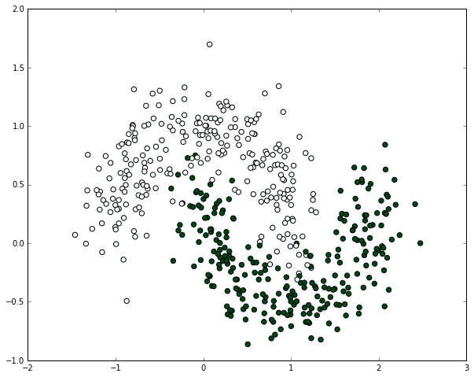
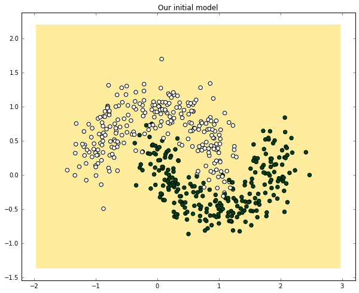
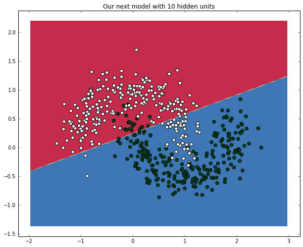
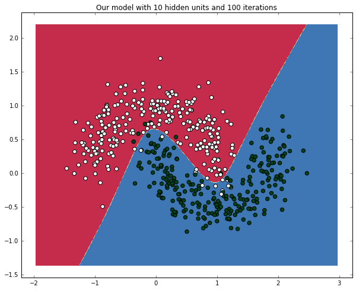
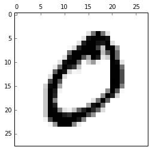
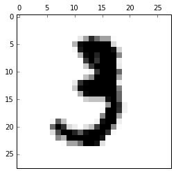
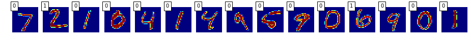
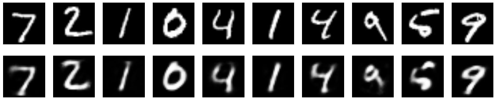

# 四、Keras

> 原文：[keras-tutorials](https://github.com/donnemartin/data-science-ipython-notebooks#keras-tutorials)
> 
> 译者：[飞龙](https://github.com/wizardforcel)
> 
> 协议：[CC BY-NC-SA 4.0](http://creativecommons.org/licenses/by-nc-sa/4.0/)

# 4.1 深度学习导论

> 致谢：派生于 Valerio Maggio 的 [deep-learning-keras-tensorflow](https://github.com/leriomaggio/deep-learning-keras-tensorflow)

深度学习允许由多**层**组成的计算模型，来学习具有多个抽象级别的数据表示。这些方法极大地改进了语音识别，视觉对象识别，物体检测，以及药物发现和基因组学等许多其他领域的最新技术。

**深度学习**是目前数据分析领域的主要工具之一，深度学习最常见的框架之一是 **Keras**。该教程将使用带有实际代码示例的`keras`介绍深度学习。

## 人工神经网络（ANN）

在机器学习和认知科学中，人工神经网络（ANN）是受生物神经网络启发的网络，用于估计或近似可取决于大量输入的函数，这些输入通常是未知的。

ANN 从堆叠的节点（神经元）构建，它们位于特征向量和目标向量之间的层中。神经网络中的节点根据权重和激活函数构建。从一个节点构建的 ANN 的早期版本被称为**感知机**。


感知机是用于二元分类器的监督学习算法。 它是一个函数，可以决定输入（由数字向量表示）是属于一个类还是另一个类的。与逻辑回归非常相似，神经网络中的权重乘以输入向量并求和，并馈送给激活函数的输入。感知机网络可以设计为多层，产生**多层感知器**（又名“MLP”）。


每个神经元的权重是通过**梯度下降**来学习的，其中每个神经元的误差根据它的权重得出。在称为**反向传播**的技术中，针对前一层对每一层进行优化。


## 从零构建神经网络

### 点子：

我们将从第一原则构建神经网络。我们将创建一个非常简单的模型并理解它是如何工作的。我们还将实现反向传播算法。**请注意，此代码未经过优化，不能用于生产**。这是出于教学目的 - 让我们了解 ANN 的工作原理。`theano`这样的库具有高度优化的代码。

（以下代码受到[这个非常棒的笔记本](https://github.com/dennybritz/nn-from-scratch)的启发）

```py
# 导入所需的包
import numpy as np
import pandas as pd
import matplotlib
import matplotlib.pyplot as plt
import scipy

# 内联展示绘图 
%matplotlib inline
# 定义绘图的默认图形大小
matplotlib.rcParams['figure.figsize'] = (10.0, 8.0)

import random
random.seed(123)

# 读取数据集
train = pd.read_csv("data/intro_to_ann.csv")

X, y = np.array(train.ix[:,0:2]), np.array(train.ix[:,2])

X.shape

# (500, 2)

y.shape

# (500,)

# 让我们绘制数据集，来看看它什么样
plt.scatter(X[:,0], X[:,1], s=40, c=y, cmap=plt.cm.BuGn)

# <matplotlib.collections.PathCollection at 0x110b4b0f0>
```




## 开始构建我们的 ANN 积木

注意：此过程最终将产生我们自己的神经网络类

### 看一看细节


### 接受两个数字并生成一个随机数的函数

**它将用在哪里？**：当我们初始化神经网络时，必须随机分配权重。

```py
# 计算满足 a <= rand < b 的随机数
def rand(a, b):
    return (b-a)*random.random() + a

# 创建矩阵
def makeMatrix(I, J, fill=0.0):
    return np.zeros([I,J])
```

### 定义我们的激活函数。让我们使用 sigmoid 函数

```py
# 我们的 sigmoid 函数
def sigmoid(x):
    # 返回 math.tanh(x)
    return 1/(1+np.exp(-x))
```

### 对我们的激活函数求导

注意：当我们运行反向传播算法时，我们需要这个

```py
# sigmoid 函数对输出（也就是 y）的导数
def dsigmoid(y):
    return y - y**2
```

### 我们的神经网络类

当我们首次创建神经网络架构时，我们需要知道输入的数量，隐藏层的数量和输出的数量。权重必须随机初始化。

```py
class ANN:
    def __init__(self, ni, nh, no):
        # 输入，隐层和输出节点的数量
        self.ni = ni + 1 # +1 用于偏置节点
        self.nh = nh
        self.no = no

        # 节点的激活
        self.ai = [1.0]*self.ni
        self.ah = [1.0]*self.nh
        self.ao = [1.0]*self.no
        
        # 创建权重
        self.wi = makeMatrix(self.ni, self.nh)
        self.wo = makeMatrix(self.nh, self.no)
        
        # 将它们设为随机值
        self.wi = rand(-0.2, 0.2, size=self.wi.shape)
        self.wo = rand(-2.0, 2.0, size=self.wo.shape)

        # 最后为动量修改权重
        self.ci = makeMatrix(self.ni, self.nh)
        self.co = makeMatrix(self.nh, self.no)
```

### 激活函数

```py
def activate(self, inputs):
        
    if len(inputs) != self.ni-1:
        print(inputs)
        raise ValueError('wrong number of inputs')

    # 输入激活
    for i in range(self.ni-1):
        self.ai[i] = inputs[i]

    # 隐层激活
    for j in range(self.nh):
        sum_h = 0.0
        for i in range(self.ni):
            sum_h += self.ai[i] * self.wi[i][j]
        self.ah[j] = sigmoid(sum_h)

    # 输出激活
    for k in range(self.no):
        sum_o = 0.0
        for j in range(self.nh):
            sum_o += self.ah[j] * self.wo[j][k]
        self.ao[k] = sigmoid(sum_o)

    return self.ao[:]
```

### 反向传播

```py
def backPropagate(self, targets, N, M):
        
    if len(targets) != self.no:
        print(targets)
        raise ValueError('wrong number of target values')

    # 为输出计算误差项
    output_deltas = np.zeros(self.no)
    for k in range(self.no):
        error = targets[k]-self.ao[k]
        output_deltas[k] = dsigmoid(self.ao[k]) * error

    # 为隐层计算误差项
    hidden_deltas = np.zeros(self.nh)
    for j in range(self.nh):
        error = 0.0
        for k in range(self.no):
            error += output_deltas[k]*self.wo[j][k]
        hidden_deltas[j] = dsigmoid(self.ah[j]) * error

    # 更新输出权重
    for j in range(self.nh):
        for k in range(self.no):
            change = output_deltas[k] * self.ah[j]
            self.wo[j][k] += N*change + 
                             M*self.co[j][k]
            self.co[j][k] = change

    # 更新输入权重
    for i in range(self.ni):
        for j in range(self.nh):
            change = hidden_deltas[j]*self.ai[i]
            self.wi[i][j] += N*change + 
                             M*self.ci[i][j]
            self.ci[i][j] = change

    # 计算误差
    error = 0.0
    for k in range(len(targets)):
        error += 0.5*(targets[k]-self.ao[k])**2
    return error

## 把所有东西放在一起

class ANN:
    def __init__(self, ni, nh, no):
        # 输入，隐层和输出节点的数量
        self.ni = ni + 1 # +1 用于偏置节点
        self.nh = nh
        self.no = no

        # 节点的激活
        self.ai = [1.0]*self.ni
        self.ah = [1.0]*self.nh
        self.ao = [1.0]*self.no
        
        # 创建权重
        self.wi = makeMatrix(self.ni, self.nh)
        self.wo = makeMatrix(self.nh, self.no)
        
        # 将它们设为随机值
        for i in range(self.ni):
            for j in range(self.nh):
                self.wi[i][j] = rand(-0.2, 0.2)
        for j in range(self.nh):
            for k in range(self.no):
                self.wo[j][k] = rand(-2.0, 2.0)

        # 最后为动量修改权重
        self.ci = makeMatrix(self.ni, self.nh)
        self.co = makeMatrix(self.nh, self.no)
        

    def backPropagate(self, targets, N, M):
        
        if len(targets) != self.no:
            print(targets)
            raise ValueError('wrong number of target values')

        # 为输出计算误差项
        output_deltas = np.zeros(self.no)
        for k in range(self.no):
            error = targets[k]-self.ao[k]
            output_deltas[k] = dsigmoid(self.ao[k]) * error

        # 为隐层计算误差项
        hidden_deltas = np.zeros(self.nh)
        for j in range(self.nh):
            error = 0.0
            for k in range(self.no):
                error += output_deltas[k]*self.wo[j][k]
            hidden_deltas[j] = dsigmoid(self.ah[j]) * error

        # 更新输出权重
        for j in range(self.nh):
            for k in range(self.no):
                change = output_deltas[k] * self.ah[j]
                self.wo[j][k] += N*change + M*self.co[j][k]
                self.co[j][k] = change

        # 更新输入权重
        for i in range(self.ni):
            for j in range(self.nh):
                change = hidden_deltas[j]*self.ai[i]
                self.wi[i][j] += N*change + M*self.ci[i][j]
                self.ci[i][j] = change

        # 计算误差
        error = 0.0
        for k in range(len(targets)):
            error += 0.5*(targets[k]-self.ao[k])**2
        return error


    def test(self, patterns):
        self.predict = np.empty([len(patterns), self.no])
        for i, p in enumerate(patterns):
            self.predict[i] = self.activate(p)
            #self.predict[i] = self.activate(p[0])
            
    def activate(self, inputs):
        
        if len(inputs) != self.ni-1:
            print(inputs)
            raise ValueError('wrong number of inputs')

        # 输入激活
        for i in range(self.ni-1):
            self.ai[i] = inputs[i]

        # 隐层激活
        for j in range(self.nh):
            sum_h = 0.0
            for i in range(self.ni):
                sum_h += self.ai[i] * self.wi[i][j]
            self.ah[j] = sigmoid(sum_h)

        # 输出激活
        for k in range(self.no):
            sum_o = 0.0
            for j in range(self.nh):
                sum_o += self.ah[j] * self.wo[j][k]
            self.ao[k] = sigmoid(sum_o)

        return self.ao[:]
    

    def train(self, patterns, iterations=1000, N=0.5, M=0.1):
        # N: 学习率
        # M: 动量因子
        patterns = list(patterns)
        for i in range(iterations):
            error = 0.0
            for p in patterns:
                inputs = p[0]
                targets = p[1]
                self.activate(inputs)
                error += self.backPropagate([targets], N, M)
            if i % 5 == 0:
                print('error in interation %d : %-.5f' % (i,error))
            print('Final training error: %-.5f' % error)
```

### 在数据集上运行模型

```py
# 创建网络，带有两个输入，一个隐层，和一个输出节点
ann = ANN(2, 1, 1)

%timeit -n 1 -r 1 ann.train(zip(X,y), iterations=2)

'''
error in interation 0 : 53.62995
Final training error: 53.62995
Final training error: 47.35136
1 loop, best of 1: 97.6 ms per loop
'''
```

### 预测训练数据集，并测量样本内准确率

```py
%timeit -n 1 -r 1 ann.test(X)

# 1 loop, best of 1: 22.6 ms per loop

prediction = pd.DataFrame(data=np.array([y, np.ravel(ann.predict)]).T, 
                          columns=["actual", "prediction"])
prediction.head()
```

|  | actual | prediction |
| --- | --- | --- |
| 0 | 1.0 | 0.491100 |
| 1 | 1.0 | 0.495469 |
| 2 | 0.0 | 0.097362 |
| 3 | 0.0 | 0.400006 |
| 4 | 1.0 | 0.489664 |

```py
np.min(prediction.prediction)

# 0.076553078113180129
```

### 让我们可视化并观察结果

```py
# 绘制决策边界的辅助函数
# 它生成等高线图，来展示决策边界
def plot_decision_boundary(nn_model):
    # 设置最大最小值并给它一些填充
    x_min, x_max = X[:, 0].min() - .5, X[:, 0].max() + .5
    y_min, y_max = X[:, 1].min() - .5, X[:, 1].max() + .5
    h = 0.01
    # 生成点的网格，它们之间距离为 h
    xx, yy = np.meshgrid(np.arange(x_min, x_max, h), 
                         np.arange(y_min, y_max, h))
    # 为整个网格预测函数值
    nn_model.test(np.c_[xx.ravel(), yy.ravel()])
    Z = nn_model.predict
    Z[Z>=0.5] = 1
    Z[Z<0.5] = 0
    Z = Z.reshape(xx.shape)
    # 绘制等高线和训练样本
    plt.contourf(xx, yy, Z, cmap=plt.cm.Spectral)
    plt.scatter(X[:, 0], X[:, 1], s=40,  c=y, cmap=plt.cm.BuGn)

plot_decision_boundary(ann)
plt.title("Our initial model")

# <matplotlib.text.Text at 0x110bdb940>
```




**练习**：

在上面的代码中创建具有 10 个隐藏节点的神经网络。对准确率有什么影响？

```py
# 将你的代码放在这里
# （或者如果你想作弊，加载答案）

# %load solutions/sol_111.py
ann = ANN(2, 10, 1)
%timeit -n 1 -r 1 ann.train(zip(X,y), iterations=2)
plot_decision_boundary(ann)
plt.title("Our next model with 10 hidden units")

'''
error in interation 0 : 34.91394
Final training error: 34.91394
Final training error: 25.36183
1 loop, best of 1: 288 ms per loop

<matplotlib.text.Text at 0x11151f630>
'''
```




**练习：**

通过增加迭代来训练神经网络。对准确率有什么影响？

```py
# 把你的代码放在这里

# %load solutions/sol_112.py
ann = ANN(2, 10, 1)
%timeit -n 1 -r 1 ann.train(zip(X,y), iterations=100)
plot_decision_boundary(ann)
plt.title("Our model with 10 hidden units and 100 iterations")

'''
error in interation 0 : 31.63185
Final training error: 31.63185
Final training error: 25.12319
Final training error: 24.92547
Final training error: 24.89692
Final training error: 24.88124
...
error in interation 95 : 7.50499
Final training error: 7.50499
Final training error: 7.46215
Final training error: 7.42298
Final training error: 7.38707
Final training error: 7.35410
1 loop, best of 1: 14.5 s per loop

<matplotlib.text.Text at 0x1115951d0>
'''
```




## 附录

仓库中还有一个额外的笔记本，即“用于 MNIST 的 ANN 的简单实现”，用于实现 **SGD** 和 **MLP** 并用于 **MNIST** 数据集。它和 <http://neuralnetworksanddeeplearning.com/> 配套。强烈推荐这本书。


# 4.2 Theano

> 致谢：派生于 Valerio Maggio 的 [deep-learning-keras-tensorflow](https://github.com/leriomaggio/deep-learning-keras-tensorflow)

语言中的语言。

处理权重矩阵和梯度可能是棘手的，有时不是没有意义的。Theano 是处理向量，矩阵和高维张量代数的一个很好的框架。本教程的大部分内容都将引用 Theano，但 TensorFlow 是另一个伟大的框架，能够为复杂代数提供令人难以置信的抽象。TensorFlow 的更多信息请参阅下一章。

```py
import theano
import theano.tensor as T
```

## 符号变量

Theano 拥有自己的变量和函数，定义如下：

```py
x = T.scalar()

x
```

变量可以用在表达式中：

```py
y = 3*(x**2) + 1
```

`y`现在是一个表达式。结果也是符号：

```py
type(y)
y.shape

# Shape.0
```

##### 打印

我们将要看到，正常的打印对于 theano 来说并不是最好的：

```py
print(y)

# Elemwise{add,no_inplace}.0

theano.pprint(y)

# '((TensorConstant{3} * (<TensorType(float32, scalar)> ** TensorConstant{2})) + TensorConstant{1})'

theano.printing.debugprint(y)

'''
Elemwise{add,no_inplace} [@A] ''   
 |Elemwise{mul,no_inplace} [@B] ''   
 | |TensorConstant{3} [@C]
 | |Elemwise{pow,no_inplace} [@D] ''   
 |   |<TensorType(float32, scalar)> [@E]
 |   |TensorConstant{2} [@F]
 |TensorConstant{1} [@G]
'''
```

## 表达式求值

提供将变量映射到值的`dict`：

```py
y.eval({x: 2})

# array(13.0, dtype=float32)
```

或者编译函数：

```py
f = theano.function([x], y)

f(2)

# array(13.0, dtype=float32)
```

## 其它张量类型

```py
X = T.vector()
X = T.matrix()
X = T.tensor3()
X = T.tensor4()
```

## 自动求导

- 梯度是自动的！

```py
x = T.scalar()
y = T.log(x)

gradient = T.grad(y, x)
print gradient
print gradient.eval({x: 2})
print (2 * gradient)

'''
Elemwise{true_div}.0
0.5
Elemwise{mul,no_inplace}.0
'''
```

## 共享变量

- 符号 + 存储

```py
import numpy as np
x = theano.shared(np.zeros((2, 3), dtype=theano.config.floatX))

x

# <CudaNdarrayType(float32, matrix)>
```

我们可以获取和设置变量的值。

```py
values = x.get_value()
print(values.shape)
print(values)

'''
(2, 3)
[[ 0.  0.  0.]
 [ 0.  0.  0.]]
'''

x.set_value(values)
```

共享变量也可以在表达式中使用：

```py
(x + 2) ** 2

# Elemwise{pow,no_inplace}.0
```

在求值时，它们的值用作输入：

```py
((x + 2) ** 2).eval()

'''
array([[ 4.,  4.,  4.],
       [ 4.,  4.,  4.]], dtype=float32)
'''

theano.function([], (x + 2) ** 2)()

'''
array([[ 4.,  4.,  4.],
       [ 4.,  4.,  4.]], dtype=float32)
'''
```

## 更新

- 储存函数求值的结果
- `dict`将共享变量映射到新的值

```py
count = theano.shared(0)
new_count = count + 1
updates = {count: new_count}

f = theano.function([], count, updates=updates)

f()

# array(0)

f()

# array(1)

f()

# array(2)
```

### 热身！逻辑回归

```py
%matplotlib inline

import numpy as np
import pandas as pd
import theano
import theano.tensor as T
import matplotlib.pyplot as plt
from sklearn.preprocessing import StandardScaler
from sklearn.preprocessing import LabelEncoder 
from keras.utils import np_utils

# Using Theano backend.
```

在本节中，我们将使用 Kaggle otto 挑战。如果你想关注它，请从 Kaggle 获取数据：https://www.kaggle.com/c/otto-group-product-classification-challenge/data

#### 关于数据

奥托集团是世界上最大的电子商务公司之一，对产品性能的一致分析至关重要。 然而，由于全球基础设施多样化，许多相同的产品具有不同分类。在本次比赛中，我们提供了超过 200,000 种产品和 93 个特征的数据集。 目标是建立一个能够区分我们主要产品类别的预测模型。每行对应一个产品。 共有 93 个数字特征，代表不同事件的计数。 所有特征都已经过混淆，不再进一步定义。

https://www.kaggle.com/c/otto-group-product-classification-challenge/data

```py
def load_data(path, train=True):
    """从 CSV 文件加载数据
    
    参数
    ----------
    path: str
        CSV 文件的路径
        
    train: bool (默认为 True)
        决定数据是否是*训练数据*
        如果为 True，执行一些打乱
        
    返回值
    ------
    X: numpy.ndarray 
        作为浮点的多维数组的数据
    ids: numpy.ndarray
        每个样本的 id 向量
    """
    df = pd.read_csv(path)
    X = df.values.copy()
    if train:
        np.random.shuffle(X)  # https://youtu.be/uyUXoap67N8
        X, labels = X[:, 1:-1].astype(np.float32), X[:, -1]
        return X, labels
    else:
        X, ids = X[:, 1:].astype(np.float32), X[:, 0].astype(str)
        return X, ids

def preprocess_data(X, scaler=None):
    """通过减去均值并缩放到单位方差
    来标准化数据，来处理输入数据"""
    if not scaler:
        scaler = StandardScaler()
        scaler.fit(X)
    X = scaler.transform(X)
    return X, scaler


def preprocess_labels(labels, encoder=None, categorical=True):
    """使用 0~`n-classes-1` 的值编码标签"""
    if not encoder:
        encoder = LabelEncoder()
        encoder.fit(labels)
    y = encoder.transform(labels).astype(np.int32)
    if categorical:
        y = np_utils.to_categorical(y)
    return y, encoder

print("Loading data...")
X, labels = load_data('train.csv', train=True)
X, scaler = preprocess_data(X)
Y, encoder = preprocess_labels(labels)


X_test, ids = load_data('test.csv', train=False)
X_test, ids = X_test[:1000], ids[:1000]

# 绘制数据
print(X_test[:1])

X_test, _ = preprocess_data(X_test, scaler)

nb_classes = Y.shape[1]
print(nb_classes, 'classes')

dims = X.shape[1]
print(dims, 'dims')

'''
Loading data...
[[  0.   0.   0.   0.   0.   0.   0.   0.   0.   3.   0.   0.   0.   3.
    2.   1.   0.   0.   0.   0.   0.   0.   0.   5.   3.   1.   1.   0.
    0.   0.   0.   0.   1.   0.   0.   1.   0.   1.   0.   1.   0.   0.
    0.   0.   0.   0.   0.   0.   0.   0.   0.   0.   0.   0.   0.   0.
    0.   0.   0.   0.   0.   0.   0.   3.   0.   0.   0.   0.   1.   1.
    0.   1.   0.   0.   0.   0.   0.   0.   0.   0.   0.   0.   0.   0.
    0.  11.   1.  20.   0.   0.   0.   0.   0.]]
(9L, 'classes')
(93L, 'dims')
'''
```

现在让我们创建并训练逻辑回归模型

#### 实战 - 逻辑回归

```py
# 基于来自 DeepLearning.net 的示例
rng = np.random
N = 400
feats = 93
training_steps = 1

# 声明 Theano 符号变量
x = T.matrix("x")
y = T.vector("y")
w = theano.shared(rng.randn(feats), name="w")
b = theano.shared(0., name="b")

# 构造 Theano 表达式图
p_1 = 1 / (1 + T.exp(-T.dot(x, w) - b))   # 目标为 1 的概率
prediction = p_1 > 0.5                    # 预测阈值
xent = -y * T.log(p_1) - (1-y) * T.log(1-p_1) # 交叉熵损失函数
cost = xent.mean() + 0.01 * (w ** 2).sum()# 要最小化的损失
gw, gb = T.grad(cost, [w, b])             # 计算损失的梯度
                                          # （我们将在这个教程的后面的章节中返回这里）

# 编译
train = theano.function(
          inputs=[x,y],
          outputs=[prediction, xent],
          updates=((w, w - 0.1 * gw), (b, b - 0.1 * gb)),
          allow_input_downcast=True)
predict = theano.function(inputs=[x], outputs=prediction, allow_input_downcast=True)

# class1 的变换
y_class1 = []
for i in Y:
    y_class1.append(i[0])
y_class1 = np.array(y_class1)

# 训练
for i in range(training_steps):
    print('Epoch %s' % (i+1,))
    pred, err = train(X, y_class1)

print("target values for Data:")
print(y_class1)
print("prediction on training set:")
print(predict(X))

'''
Epoch 1
target values for Data:
[ 0.  0.  1. ...,  0.  0.  0.]
prediction on training set:
[0 0 0 ..., 0 0 0]
'''
```

# 4.3 Keras

> 致谢：派生于 Valerio Maggio 的 [deep-learning-keras-tensorflow](https://github.com/leriomaggio/deep-learning-keras-tensorflow)

```py
%matplotlib inline

import numpy as np
import pandas as pd
import theano
import theano.tensor as T
import matplotlib.pyplot as plt
import keras 
from sklearn.preprocessing import StandardScaler
from sklearn.preprocessing import LabelEncoder 
from keras.utils import np_utils
from sklearn.cross_validation import train_test_split
from keras.callbacks import EarlyStopping, ModelCheckpoint
from keras.models import Sequential
from keras.layers import Dense, Activation

# Using Theano backend.
```

## 用于 Theano 和 TensorFlow 的深度学习库

Keras 是一个极简，高度模块化的神经网络库，用 Python 编写，能够在 TensorFlow 或 Theano 之上运行。 它的开发重点是实现快速实验。 能够在最短时间内将理念变成结果，是进行良好研究的关键。

参考：https://keras.io/

## Keras，为什么是这个名字?

Keras（κέρας）在希腊语中的意思是号角。 它是古希腊和拉丁文学的文学形象的参考，首先在《奥德赛》中发现，其中梦灵（_Oneiroi_，单数为 _Oneiros_）被分为用虚假异象欺骗人的一种，它们通过象牙门到达地球，以及宣布未来的另一种，它们通过号角之门到达。 这是一个关于单词 κέρας（号角）/κραίνω（履行）和 ἐλέφας（象牙）/ἐλεφαίρομαι（欺骗）的戏剧。

Keras 最初作为项目 ONEIROS（开放式神经电子智能机器人操作系统）的研究工作的一部分而开发。

> "Oneiroi are beyond our unravelling --who can be sure what tale they tell? Not all that men look for comes to pass. Two gates there are that give passage to fleeting Oneiroi; one is made of horn, one of ivory. The Oneiroi that pass through sawn ivory are deceitful, bearing a message that will not be fulfilled; those that come out through polished horn have truth behind them, to be accomplished for men who see them."
> 
> Homer, Odyssey 19. 562 ff (Shewring translation).

## 实战 - Keras 逻辑回归

```py
dims = X.shape[1]
print(dims, 'dims')
print("Building model...")

nb_classes = Y.shape[1]
print(nb_classes, 'classes')

model = Sequential()
model.add(Dense(nb_classes, input_shape=(dims,)))
model.add(Activation('softmax'))
model.compile(optimizer='sgd', loss='categorical_crossentropy')
model.fit(X, Y)

'''
(93L, 'dims')
Building model...
(9L, 'classes')
Epoch 1/10
61878/61878 [==============================] - 1s - loss: 1.0574     
Epoch 2/10
61878/61878 [==============================] - 1s - loss: 0.7730     
Epoch 3/10
61878/61878 [==============================] - 1s - loss: 0.7297     
Epoch 4/10
61878/61878 [==============================] - 1s - loss: 0.7080     
Epoch 5/10
61878/61878 [==============================] - 1s - loss: 0.6948     
Epoch 6/10
61878/61878 [==============================] - 1s - loss: 0.6854     
Epoch 7/10
61878/61878 [==============================] - 1s - loss: 0.6787     
Epoch 8/10
61878/61878 [==============================] - 1s - loss: 0.6734     
Epoch 9/10
61878/61878 [==============================] - 1s - loss: 0.6691     
Epoch 10/10
61878/61878 [==============================] - 1s - loss: 0.6657     
'''

# <keras.callbacks.History at 0x23d330f0>
```

简洁是非常令人印象深刻的吗？现在让我们理解：

> Keras 的核心数据结构是**模型**，一种组织层的方法。主要类型的模型是**顺序**模型，层的线性栈。

我们在这里做的是，从输入到输出堆叠可训练权重的全连接（**密集**）层，并在权重层顶部堆叠**激活**层。

##### 密集层（`Dense`）

```py
from keras.layers.core import Dense

Dense(output_dim, init='glorot_uniform', activation='linear', 
      weights=None, W_regularizer=None, b_regularizer=None,
      activity_regularizer=None, W_constraint=None, 
      b_constraint=None, bias=True, input_dim=None)
```

##### 激活（`Activation`）

```py
from keras.layers.core import Activation

Activation(activation)
```

##### 优化器

如果需要，你可以进一步配置优化器。Keras 的核心原则是使事情变得相当简单，同时在需要的时候，允许用户完全控制（终极控制是源代码的易扩展性）。在这里，我们使用 **SGD**随机梯度下降）作为我们可训练权重的优化算法。

## 对这个示例执行更多的"数据分析"

我们在这里做的很好，但是在现实世界中由于过拟合而无法使用。让我们尝试用交叉验证来解决它。

##### 过拟合

在过度拟合中，统计模型描述随机误差或噪声而不是底层关系。 当模型过于复杂时发生过拟合，例如相对于观察数量参数太多。过拟合的模型具有较差的预测表现，因为它对训练数据中的微小波动过度反应。


为了避免过拟合，我们将首先将数据拆分为训练集和测试集，并在测试集上测试模型。下一步：我们将使用两个 keras 的回调`EarlyStopping`和`ModelCheckpoint`。

```py
X, X_test, Y, Y_test = train_test_split(X, Y, test_size=0.15, random_state=42)

fBestModel = 'best_model.h5' 
early_stop = EarlyStopping(monitor='val_loss', patience=4, verbose=1) 
best_model = ModelCheckpoint(fBestModel, verbose=0, save_best_only=True)
model.fit(X, Y, validation_data = (X_test, Y_test), nb_epoch=20, 
          batch_size=128, verbose=True, validation_split=0.15, 
          callbacks=[best_model, early_stop]) 
          
'''
Train on 19835 samples, validate on 3501 samples
Epoch 1/20
19835/19835 [==============================] - 0s - loss: 0.6391 - val_loss: 0.6680
Epoch 2/20
19835/19835 [==============================] - 0s - loss: 0.6386 - val_loss: 0.6689
Epoch 3/20
19835/19835 [==============================] - 0s - loss: 0.6384 - val_loss: 0.6695
Epoch 4/20
19835/19835 [==============================] - 0s - loss: 0.6381 - val_loss: 0.6702
Epoch 5/20
19835/19835 [==============================] - 0s - loss: 0.6378 - val_loss: 0.6709
Epoch 6/20
19328/19835 [============================>.] - ETA: 0s - loss: 0.6380Epoch 00005: early stopping
19835/19835 [==============================] - 0s - loss: 0.6375 - val_loss: 0.6716
'''

# <keras.callbacks.History at 0x1d7245f8>
```

## 多层感知机和全连接

那么，用 keras 构建多层感知器有多难？它是一样的，只需添加更多层！

```py
model = Sequential()
model.add(Dense(100, input_shape=(dims,)))
model.add(Dense(nb_classes))
model.add(Activation('softmax'))
model.compile(optimizer='sgd', loss='categorical_crossentropy')
model.fit(X, Y)
```

你的回合！

## 实战 - Keras 全连接

花几分钟时间尝试优化层数和层中的参数数量，来获得最佳效果。

```py
model = Sequential()
model.add(Dense(100, input_shape=(dims,)))

# ...
# ...
# 玩转它！按你的想法添加一些层！尝试获得更好的结果。

model.add(Dense(nb_classes))
model.add(Activation('softmax'))
model.compile(optimizer='sgd', loss='categorical_crossentropy')
model.fit(X, Y)
```

构建问答系统，图像分类模型，神经图灵机，word2vec 嵌入器或任何其他模型，是同样快的。 深度学习背后的想法很简单，那么为什么他们的实现会很痛苦呢？

#### 深度的理论动机

> 有很多研究都是关于神经网络的深度。已经在数学上 [1] 和经验上证明，卷积神经网络从深度中获益！
> 
> [1] - On the Expressive Power of Deep Learning: A Tensor Analysis - Cohen, et al 2015

神经网络的一个引用定理说明：

> 通用近似定理 [1] 表明，具有单个隐层包含有限数量的神经元的前馈网络（即多层感知器），在激活函数的温和假设下，可以近似 $\mathbb{R}^n$ 的紧致子集上的连续函数。因此该定理表明，当给出适当的参数时，简单的神经网络可以表示各种有趣的函数；但是，它没有涉及这些参数的算法可学习性。
> 
> [1] - Approximation Capabilities of Multilayer Feedforward Networks - Kurt Hornik 1991

# 4.4 用于 MNIST 的 ANN 简单实现

> 致谢：派生于 Valerio Maggio 的 [deep-learning-keras-tensorflow](https://github.com/leriomaggio/deep-learning-keras-tensorflow)
> 
> 代码取自：https://github.com/mnielsen/neural-networks-and-deep-learning
> 
> 这一节与在线文本 <http://neuralnetworksanddeeplearning.com/> 配套。强烈推荐这本书。

```py
# 导入库
import random
import numpy as np
import keras
from keras.datasets import mnist

'''
Using Theano backend.
Using gpu device 0: GeForce GTX 760 (CNMeM is enabled with initial size: 90.0% of memory, cuDNN 4007)
'''

# 将完整路径设为 mnist.pkl.gz
# 将其指向仓库里的数据文件夹
path_to_dataset = "euroscipy2016_dl-tutorial/data/mnist.pkl.gz"

!mkdir -p $HOME/.keras/datasets/euroscipy2016_dl-tutorial/data/

# 加载数据集
(X_train, y_train), (X_test, y_test) = mnist.load_data(path_to_dataset)

'''
Downloading data from https://s3.amazonaws.com/img-datasets/mnist.pkl.gz
15286272/15296311 [============================>.] - ETA: 0s
'''

print(X_train.shape, y_train.shape)
print(X_test.shape, y_test.shape)

'''
(60000, 28, 28) (60000,)
(10000, 28, 28) (10000,)
'''

"""
network.py
~~~~~~~~~~
为前馈神经网络实现随机梯度下降学习算法的模块。
使用反向传播计算梯度。
请注意，我专注于使代码简单，易读且易于修改。
它没有经过优化，省略了许多理想的特性。
"""

#### 库
# 标准库
import random

# 三方库
import numpy as np

class Network(object):

    def __init__(self, sizes):
        """列表``sizes``包含网络各层中的神经元数量。 例如，
        如果列表是 [2,3,1] 那么它将是三层网络，第一层包含 2
        个神经元，第二层 3 个神经元，第三层 1 个神经元。
        网络的偏置和权重是随机初始化的，使用均值为 0 方差为 1
        的高斯分布。注意，假设第一层是输入层，按照惯例，我们不会
        为这些神经元设置任何偏置，因为偏差只用于计算后面的层的输出。"""
        self.num_layers = len(sizes)
        self.sizes = sizes
        self.biases = [np.random.randn(y, 1) for y in sizes[1:]]
        self.weights = [np.random.randn(y, x)
                        for x, y in zip(sizes[:-1], sizes[1:])]

    def feedforward(self, a):
        """如果输入``a``，则返回网络的输出。"""
        for b, w in zip(self.biases, self.weights):
            a = sigmoid(np.dot(w, a)+b)
        return a

    def SGD(self, training_data, epochs, mini_batch_size, eta,
            test_data=None):
        """使用小批量随机梯度下降训练神经网络。``training_data``
        是``(x, y)``元组的列表，表示训练输入和所需输出。其他非可选
        参数是不言自明的。如果提供``test_data``，那么将在每个
        迭代之后对测试数据评估网络，并打印出部分进度。这对于
        跟踪进度很有用，但会大大减慢速度。"""
        training_data = list(training_data)
        test_data = list(test_data)
        if test_data: n_test = len(test_data)
        n = len(training_data)
        for j in range(epochs):
            random.shuffle(training_data)
            mini_batches = [
                training_data[k:k+mini_batch_size]
                for k in range(0, n, mini_batch_size)]
            for mini_batch in mini_batches:
                self.update_mini_batch(mini_batch, eta)
            if test_data:
                print( "Epoch {0}: {1} / {2}".format(
                    j, self.evaluate(test_data), n_test))
            else:
                print( "Epoch {0} complete".format(j))

    def update_mini_batch(self, mini_batch, eta):
        """通过使用反向传播，将梯度下降应用于
        单个小批量，来更新网络的权重和偏差。 
        ``mini_batch``是``(x, y)``元组列表，``eta``是学习率。"""
        nabla_b = [np.zeros(b.shape) for b in self.biases]
        nabla_w = [np.zeros(w.shape) for w in self.weights]
        for x, y in mini_batch:
            delta_nabla_b, delta_nabla_w = self.backprop(x, y)
            nabla_b = [nb+dnb for nb, dnb in zip(nabla_b, delta_nabla_b)]
            nabla_w = [nw+dnw for nw, dnw in zip(nabla_w, delta_nabla_w)]
        self.weights = [w-(eta/len(mini_batch))*nw
                        for w, nw in zip(self.weights, nabla_w)]
        self.biases = [b-(eta/len(mini_batch))*nb
                       for b, nb in zip(self.biases, nabla_b)]

    def backprop(self, x, y):
        """返回元组``(nabla_b, nabla_w)，表示损失函数
        C_x 的梯度``。 ``nabla_b``和``nabla_w``是 numpy 
        数组的逐层列表，类似于``self.biases``和``self.weights``。"""
        nabla_b = [np.zeros(b.shape) for b in self.biases]
        nabla_w = [np.zeros(w.shape) for w in self.weights]
        # 前馈
        activation = x
        activations = [x] # 用于逐层储存所有激活的列表
        zs = [] # 用于逐层储存所有 z 向量的列表
        for b, w in zip(self.biases, self.weights):
            z = np.dot(w, activation)+b
            zs.append(z)
            activation = sigmoid(z)
            activations.append(activation)
        # 反向传播
        delta = self.cost_derivative(activations[-1], y) * \
            sigmoid_prime(zs[-1])
        nabla_b[-1] = delta
        nabla_w[-1] = np.dot(delta, activations[-2].transpose())
        # 请注意，下面循环中的变量`l`与本书第 2 章中的表示法略有不同。 
        # 这里，`l = 1`表示最后一层神经元，`l = 2`表示倒数第二层，
        # 依此类推。 它是本书中方案的重新编号，
        # 利用了可以在 Python 列表中使用负数索引的事实。
        for l in range(2, self.num_layers):
            z = zs[-l]
            sp = sigmoid_prime(z)
            delta = np.dot(self.weights[-l+1].transpose(), delta) * sp
            nabla_b[-l] = delta
            nabla_w[-l] = np.dot(delta, activations[-l-1].transpose())
        return (nabla_b, nabla_w)

    def evaluate(self, test_data):
        """返回神经网络输出正确结果的测试输入数。 
        注意，神经网络的输出被假定为，
        具有最高激活的最终层中任何神经元的索引。"""
        test_results = [(np.argmax(self.feedforward(x)), y)
                        for (x, y) in test_data]
        return sum(int(x == y) for (x, y) in test_results)

    def cost_derivative(self, output_activations, y):
        """为输出激活返回 C_x 对 a 的偏导数"""
        return (output_activations-y)

#### 杂项函数
def sigmoid(z):
    """sigmoid 函数"""
    return 1.0/(1.0+np.exp(-z))

def sigmoid_prime(z):
    """sigmoid 函数的导数"""
    return sigmoid(z)*(1-sigmoid(z))

def vectorized_result(j):
    """返回一个 10 维单位向量，其中第 j 个位置为 1.0，
    其他位置为零。 这用于将数字 0~9 转换为
    来自神经网络的对应的期望输出。"""
    e = np.zeros((10, 1))
    e[j] = 1.0
    return e

net = Network([784, 30, 10])

training_inputs = [np.reshape(x, (784, 1)) for x in X_train.copy()]
training_results = [vectorized_result(y) for y in y_train.copy()]
training_data = zip(training_inputs, training_results)

test_inputs = [np.reshape(x, (784, 1)) for x in X_test.copy()]
test_data = zip(test_inputs, y_test.copy())

net.SGD(training_data, 10, 10, 3.0, test_data=test_data)

'''
Epoch 0: 1348 / 10000
Epoch 1: 1939 / 10000
Epoch 2: 2046 / 10000
Epoch 3: 1422 / 10000
Epoch 4: 1365 / 10000
Epoch 5: 1351 / 10000
Epoch 6: 1879 / 10000
Epoch 7: 1806 / 10000
Epoch 8: 1754 / 10000
Epoch 9: 1974 / 10000
'''

net = Network([784, 10, 10])

training_inputs = [np.reshape(x, (784, 1)) for x in X_train.copy()]
training_results = [vectorized_result(y) for y in y_train.copy()]
training_data = zip(training_inputs, training_results)

test_inputs = [np.reshape(x, (784, 1)) for x in X_test.copy()]
test_data = zip(test_inputs, y_test.copy())

net.SGD(training_data, 10, 10, 1.0, test_data=test_data)

'''
Epoch 0: 3526 / 10000
Epoch 1: 3062 / 10000
Epoch 2: 2946 / 10000
Epoch 3: 2462 / 10000
Epoch 4: 3617 / 10000
Epoch 5: 3773 / 10000
Epoch 6: 3568 / 10000
Epoch 7: 4459 / 10000
Epoch 8: 3009 / 10000
Epoch 9: 2660 / 10000
'''
```

# 4.5 卷积神经网络

> 致谢：派生于 Valerio Maggio 的 [deep-learning-keras-tensorflow](https://github.com/leriomaggio/deep-learning-keras-tensorflow)

### 参考：

我使用的一些图片和内容来自[这篇精彩的博客文章](https://adeshpande3.github.io/adeshpande3.github.io/)和这本非常棒的书，[《神经网络和深度学习》](http://neuralnetworksanddeeplearning.com/)，由 Michael Nielsen 撰写（**强烈推荐**）。

卷积神经网络（CNN，或 ConvNet）是一种**前馈**人工神经网络，其神经元之间的连接模式受到动物视觉皮层组织的启发。网络由多层小神经元集合组成，它们处理输入图像的部分，称为**感受域**。然后展开这些集合的输出，使它们的输入区域重叠，来获得原始图像的更好表示。 对于每个这样的层重复这一过程。

## 看起来是什么样呢？


> 来源：https://flickrcode.files.wordpress.com/2014/10/conv-net2.png

## 问题空间

## 图像分类

图像分类是一类任务，获取输入图像并输出类别（猫，狗等），或最能描述图像的类别的概率。对于人类而言，这种识别的任务是我们从出生那一刻开始学习的第一个技能之一，也是成年人自然而轻松地学习的技能之一。这些技能，能够快速识别模式，*从先前知识泛化*并适应不同图像环境，是我们和机器不同的技能。

## 输入和输出


> 来源：http://www.pawbuzz.com/wp-content/uploads/sites/551/2014/11/corgi-puppies-21.jpg

当计算机看到图像（接受图像作为输入）时，它将看到一个像素值数组。根据图像的分辨率和大小，它将看到一个 32 x 32 x 3 的数字数组（3 表示 RGB 值）。假设我们有 JPG 格式的彩色图像，其大小为 480 x 480。表示数组将为 480 x 480 x 3。这些数字中的每一个都提供 0 到 255 之间的值，该值描述了该点的像素强度。

## 目标

我们希望计算机做的是，能够区分给它的所有图像，并找出使狗成为狗或使猫成为猫的独特特征。当我们看一张狗的照片时，如果照片有可识别的特征，如爪子或四条腿，我们可以将它分类。以类似的方式，计算机应该能够通过查找*低级*特征（例如边和曲线），然后通过一系列**卷积层**构建更抽象的概念来执行图像分类。

## CNN 的结构

> A more detailed overview of what CNNs do would be that you take the image, pass it through a series of convolutional, nonlinear, pooling (downsampling), and fully connected layers, and get an output. As we said earlier, the output can be a single class or a probability of classes that best describes the image. 
> 
> 来源：[1]

## 卷积层

CNN 中的第一层始终是**卷积层**。


### 卷积过滤器

像图像识别中的**内核**一样，卷积滤波器是一个小的矩阵，可用于模糊，锐化，浮雕，边缘检测等。这是通过内核和图像之间的卷积来实现的。另一个主要区别是，卷积核是**学到的**。


当过滤器在输入图像上滑动或**卷积**时，它将过滤器中的值乘以图像的原始像素值（也称为计算**逐元素乘法**）。


现在，我们对输入图像上的每个位置重复此过程。（下一步是将过滤器向右移动 1 个单位，然后再向右移动 1，依此类推）。将过滤器滑过所有位置后，我们会留下一组数字，通常称为**激活映射**或**特征映射**。

## 高阶视角

让我们从高层简单谈谈，这个卷积实际上做的事情。这些过滤器中的每一个都可以被认为是**特征标识符**（例如*直边，简单颜色，曲线*）。


### 感知域的可视化


值要低得多！ 这是因为图像部分中没有任何响应曲线检测过滤器的内容。 请记住，此卷积层的输出是激活映射。

## 深入网络

现在，在传统的**卷积神经网络**架构中，还有其他层散布在这些卷积层之间。


## ReLU（整流线性单元）层

在每个卷积层之后，通常立即应用*非线性层*（或**激活层**）。

这一层的目的是为一个系统引入非线性，该系统基本上只是在卷积层中计算线性运算（只是元素乘法和加法）。在过去，使用 tanh 和 Sigmoid 等非线性函数，但研究人员发现 **ReLU** 工作得更好，因为网络能够训练得更快（因为计算效率），而没有准确性的显着差异。

它还有助于缓解**梯度消失问题**，这是网络的较低层训练得非常缓慢的问题，因为通过各层的梯度呈指数下降。

（**简而言之**）消失梯度问题取决于激活函数的选择。许多常见的激活函数（例如`sigmoid`或`tanh`）*以非常非线性的方式，将它们压缩到非常小的输出范围内。例如，sigmoid 将实数映射到 [0,1] 的“小”范围。结果，输入空间的大区域被映射到极小的范围。在输入空间的这些区域中，即使输入的大的变化也会在输出中产生小的变化 - 因此**梯度很小**。

### ReLu

**ReLu** 函数定义为 $f(x) = \max(0, x),$ [2]。整流器的平滑近似是*解析函数*：$f(x) = \ln(1 + e^x)$，这被称为 **softplus** 函数。softplus 的导数是 $f'(x) = e^x / (e^x + 1) = 1 / (1 + e^{-x})$，即**逻辑函数**。

> [2] [http://www.cs.toronto.edu/~fritz/absps/reluICML.pdf]() by G. E. Hinton 

## 池化层

在一些 ReLU 层之后，通常应用**池化层**（也称为*下采样层*）。在这个类别中，还有几个层的选项，**最大池化**是最受欢迎的。

最大池化过滤器的示例：


池化层的其他选项是平均池化和 L2 标准池化。这个池化层背后的直觉是，一旦我们知道特定特征在原始输入中（高激活值的地方），其确切位置就不如与其他特征的相对位置一样重要。因此，该层极大地减小了输入的空间尺寸（长度和宽度，但不是深度）。

这有两个主要目的：减少参数的数量；控制过拟合。可以用一个例子来直观解释池化的作用：让我们假设我们有一个用于检测面部的过滤器。面部的确切像素位置，与面部“位于顶部某处”的事实相关性较小。


## 丢弃层

**丢失层**具有非常特殊的功能，即通过在前向传递中将它们设置为零，来剔除该层中的一组随机激活。就那么简单。它允许避免*过拟合*，但必须在训练时使用而不是测试期间。

## 全连接层

然而，最后一层是重要的层，即**全连接层**。基本上，FC 层会查看与特定类别相关度最强的高级特征，并且具有特定权重，以便在计算权重和上一层的乘积时，可以获得不同类别的正确概率。


## Keras 中的 CNN

**Keras** 支持：

- 1D 卷积层；
- 2D 卷积层；
- 3D 卷积层；

相应的`keras`包是`keras.layers.convolutional`。

#### `Convolution1D`

```py
from keras.layers.convolutional import Convolution1D
Convolution1D(nb_filter, filter_length, init='uniform',
              activation='linear', weights=None,
              border_mode='valid', subsample_length=1,
              W_regularizer=None, b_regularizer=None,
              activity_regularizer=None, W_constraint=None,
              b_constraint=None, bias=True, input_dim=None,
              input_length=None)
```

> 用于过滤一维输入的邻域的**卷积算子**。 当使用此层作为模型中的第一层时，要么提供关键字参数`input_dim`（`int`，例如 128 表示 128 维向量的序列），要么提供`input_shape`（整数元组，例如`(10, 128)`表示 128 维向量的 10 个向量的序列。

#### 示例

```py
# 在 10 个时间步骤的序列上应用
# 带有 64 个输出过滤器的长度为 3 的一维卷积
model = Sequential()
model.add(Convolution1D(64, 3, border_mode='same', input_shape=(10, 32)))
# 现在 model.output_shape == (None, 10, 64)

# 添加新的add a new conv1d on top
model.add(Convolution1D(32, 3, border_mode='same'))
# 现在 model.output_shape == (None, 10, 32)
```

#### `Convolution2D`

```py
from keras.layers.convolutional import Convolution2D
Convolution2D(nb_filter, nb_row, nb_col, 
              init='glorot_uniform',
              activation='linear', weights=None,
              border_mode='valid', subsample=(1, 1),
              dim_ordering='default', W_regularizer=None,
              b_regularizer=None, activity_regularizer=None,
              W_constraint=None, b_constraint=None, 
              bias=True)
```

#### 示例

```py

# 在 256x256 图像上应用带有 64 个过滤器的 3x3 卷积
model = Sequential()
model.add(Convolution2D(64, 3, 3, border_mode='same', 
          input_shape=(3, 256, 256)))
# 现在 model.output_shape == (None, 64, 256, 256)

# 在顶上添加 3x3 卷积，带有 32 个输出过滤器
model.add(Convolution2D(32, 3, 3, border_mode='same'))
# 现在 model.output_shape == (None, 32, 256, 256)

```

## Keras 中的卷积过滤器的维度

ConvNets 的复杂结构可能使表示难以理解。当然，维度根据卷积滤波器的维度（例如 1D，2D）而变化

### `Convolution1D`

**输入形状**：

**3D** 张量，形状为：`(samples, steps, input_dim)`。

**输出形状**：

**3D** 张量，形状为：`(samples, new_steps, nb_filter)`。

### `Convolution2D`

**输入形状**：

**4D** 张量，形状为：

- `(samples, channels, rows, cols)`，如果`dim_ordering='th'`
- `(samples, rows, cols, channels)`，如果`dim_ordering='tf'`

**输出形状**：

**4D** 张量，形状为：

- `(samples, nb_filter, new_rows, new_cols)`，如果`dim_ordering='th'`
- `(samples, new_rows, new_cols, nb_filter)`，如果`dim_ordering='tf'`

# 4.6 Keras ConvNet 实战

> 致谢：派生于 Valerio Maggio 的 [deep-learning-keras-tensorflow](https://github.com/leriomaggio/deep-learning-keras-tensorflow)

## 问题定义

识别手写数字。

## 数据

[MNIST 数据库](http://yann.lecun.com/exdb/mnist) 有一个手写数字数据集。训练集有 60,000 个样本。测试集有 10,000 个样本。数字是尺寸标准化的并且以固定尺寸的图像为中心。数据页面描述了如何收集数据。 它还报告了测试数据集上各种算法的基准。

### 加载数据

数据存在于仓库的`data`文件夹中。让我们使用`keras`库加载它。现在，让我们加载数据并查看它的外观。

```py
import numpy as np
import keras
from keras.datasets import mnist

'''
Using Theano backend.
Using gpu device 0: GeForce GTX 760 (CNMeM is enabled with initial size: 90.0% of memory, cuDNN 4007)
'''

!mkdir -p $HOME/.keras/datasets/euroscipy_2016_dl-keras/data/

# 将完整路径设为 mnist.pkl.gz
path_to_dataset = "euroscipy_2016_dl-keras/data/mnist.pkl.gz"

# 加载数据集
(X_train, y_train), (X_test, y_test) = mnist.load_data(path_to_dataset)

'''
Downloading data from https://s3.amazonaws.com/img-datasets/mnist.pkl.gz
15024128/15296311 [============================>.] - ETA: 0s
'''
```

## 数据集上的基本数据分析

```py
# X_train 的类型是什么？


# y_train 的类型是什么？


# 寻找训练数据中的观测数


# 寻找测试数据中的观测数


# 展示 X_train 的前两个记录

'''
array([[[0, 0, 0, ..., 0, 0, 0],
    [0, 0, 0, ..., 0, 0, 0],
    [0, 0, 0, ..., 0, 0, 0],
    ..., 
    [0, 0, 0, ..., 0, 0, 0],
    [0, 0, 0, ..., 0, 0, 0],
    [0, 0, 0, ..., 0, 0, 0]],

   [[0, 0, 0, ..., 0, 0, 0],
    [0, 0, 0, ..., 0, 0, 0],
    [0, 0, 0, ..., 0, 0, 0],
    ..., 
    [0, 0, 0, ..., 0, 0, 0],
    [0, 0, 0, ..., 0, 0, 0],
    [0, 0, 0, ..., 0, 0, 0]]], dtype=uint8)
'''

# 展示 y_train 的前十个记录

# array([5, 0, 4, 1, 9, 2, 1, 3, 1, 4], dtype=uint8)

# 寻找 y_train 数据集中每个数字的观测数

'''
(array([0, 1, 2, 3, 4, 5, 6, 7, 8, 9], dtype=uint8),
 array([5923, 6742, 5958, 6131, 5842, 5421, 5918, 6265, 5851, 5949]))
'''

# 寻找 y_test 数据集中每个数字的观测数

'''
(array([0, 1, 2, 3, 4, 5, 6, 7, 8, 9], dtype=uint8),
 array([ 980, 1135, 1032, 1010,  982,  892,  958, 1028,  974, 1009]))
'''

# X_train 的维度是什么，这是什么意思？

# (60000, 28, 28)
```

### 展示图像

现在让我们展示一些图像并看看它们的外观。我们将使用`matplotlib`库来显示图像。

```py
from matplotlib import pyplot
import matplotlib as mpl
%matplotlib inline

# 展示第一个训练数据

fig = pyplot.figure()
ax = fig.add_subplot(1,1,1)
imgplot = ax.imshow(X_train[1], cmap=mpl.cm.Greys)
imgplot.set_interpolation('nearest')
ax.xaxis.set_ticks_position('top')
ax.yaxis.set_ticks_position('left')
pyplot.show()
```



```py
# 让我们展示第 11 个记录
```



# 4.7 用于 MNIST 的卷积网络

> 致谢：派生于 Valerio Maggio 的 [deep-learning-keras-tensorflow](https://github.com/leriomaggio/deep-learning-keras-tensorflow)

深度学习模型可能需要相当长的时间来运行，尤其是在不使用 GPU 的情况下。

为了节省时间，你可以采样一个观测子集（例如 1000 个），这是你选择的特定数字（例如 6）和 1000 非特定数字的观察值（即非 6）。我们将使用它构建一个模型，并查看它在测试数据集上的表现。

```py
# 导入所需的库
import numpy as np
np.random.seed(1338)

from keras.datasets import mnist

'''
Using Theano backend.
Using gpu device 0: GeForce GTX 760 (CNMeM is enabled with initial size: 90.0% of memory, cuDNN 4007)
'''

from keras.models import Sequential

from keras.layers.core import Dense, Dropout, Activation, Flatten

from keras.layers.convolutional import Convolution2D
from keras.layers.pooling import MaxPooling2D

from keras.utils import np_utils
from keras.optimizers import SGD
```

## 加载数据

```py
path_to_dataset = "euroscipy_2016_dl-keras/data/mnist.pkl.gz"

# 加载训练和测试数据
(X_train, y_train), (X_test, y_test) = mnist.load_data(path_to_dataset)

X_test_orig = X_test
```

## 数据准备

```py
img_rows, img_cols = 28, 28

X_train = X_train.reshape(X_train.shape[0], 1, img_rows, img_cols)
X_test = X_test.reshape(X_test.shape[0], 1, img_rows, img_cols)

X_train = X_train.astype('float32')
X_test = X_test.astype('float32')

X_train /= 255
X_test /= 255

# 用于复现的种子
np.random.seed(1338)

# 测试数据
X_test = X_test.copy()
Y = y_test.copy()

# 将输出转换为二元分类（6 => 1，!6 => 0）
Y_test = Y == 6
Y_test = Y_test.astype(int)

# 选择输出是 6 的 5918 个样本
X_six = X_train[y_train == 6].copy()
Y_six = y_train[y_train == 6].copy()

# 选择输出不是 6 的样本
X_not_six = X_train[y_train != 6].copy()
Y_not_six = y_train[y_train != 6].copy()

# 从输出不是 6 的数据 6000 个随机样本
random_rows = np.random.randint(0,X_six.shape[0],6000)
X_not_six = X_not_six[random_rows]
Y_not_six = Y_not_six[random_rows]

# 附加输出是 6 的数据，和输出不是 6 的数据
X_train = np.append(X_six,X_not_six)

# 改变附加数据的形状
X_train = X_train.reshape(X_six.shape[0] + X_not_six.shape[0], 
                          1, img_rows, img_cols)

# 附加标签，并将标签转换为二元分类（6 => 1，!6 => 0）
Y_labels = np.append(Y_six,Y_not_six)
Y_train = Y_labels == 6 
Y_train = Y_train.astype(int)

print(X_train.shape, Y_labels.shape, X_test.shape, Y_test.shape)

# (11918, 1, 28, 28) (11918,) (10000, 1, 28, 28) (10000, 2)

# 将分类转换为二元类别形式
nb_classes = 2
Y_train = np_utils.to_categorical(Y_train, nb_classes)
Y_test = np_utils.to_categorical(Y_test, nb_classes)
```

## 简单的 CNN

```py
# 为卷积神经网络初始化值
nb_epoch = 2
batch_size = 128
# 要使用的卷积过滤器数量
nb_filters = 32
# 用于最大池化的池化区数量
nb_pool = 2
# 卷积核大小
nb_conv = 3

sgd = SGD(lr=0.1, decay=1e-6, momentum=0.9, nesterov=True)
```

### 第一步：模型定义

```py
model = Sequential()

model.add(Convolution2D(nb_filters, nb_conv, nb_conv,
                        border_mode='valid',
                        input_shape=(1, img_rows, img_cols)))
model.add(Activation('relu'))

model.add(Flatten())
model.add(Dense(nb_classes))
model.add(Activation('softmax'))
```

### 第二步：编译

```py
model.compile(loss='categorical_crossentropy',
              optimizer='sgd',
              metrics=['accuracy'])
```

### 第三步：拟合

```py
model.fit(X_train, Y_train, batch_size=batch_size, 
          nb_epoch=nb_epoch,verbose=1,
          validation_data=(X_test, Y_test))
          
'''
Train on 11918 samples, validate on 10000 samples
Epoch 1/2
11918/11918 [==============================] - 0s - loss: 0.2890 - acc: 0.9326 - val_loss: 0.1251 - val_acc: 0.9722
Epoch 2/2
11918/11918 [==============================] - 0s - loss: 0.1341 - acc: 0.9612 - val_loss: 0.1298 - val_acc: 0.9599

<keras.callbacks.History at 0x7f6ccb68f630>
'''
```

### 第四步：评估

```py
# 在测试数据上评估模型
score, accuracy = model.evaluate(X_test, Y_test, verbose=0)
print('Test score:', score)
print('Test accuracy:', accuracy)

'''
Test score: 0.129807630396
Test accuracy: 0.9599
'''
```

### 让我们绘制模型预测

```py
import matplotlib.pyplot as plt

%matplotlib inline

slice = 15
predicted = model.predict(X_test[:slice]).argmax(-1)

plt.figure(figsize=(16,8))
for i in range(slice):
    plt.subplot(1, slice, i+1)
    plt.imshow(X_test_orig[i], interpolation='nearest')
    plt.text(0, 0, predicted[i], color='black', 
             bbox=dict(facecolor='white', alpha=1))
    plt.axis('off')
```




## 添加更多密集层

```py
model = Sequential()
model.add(Convolution2D(nb_filters, nb_conv, nb_conv,
                        border_mode='valid',
                        input_shape=(1, img_rows, img_cols)))
model.add(Activation('relu'))

model.add(Flatten())
model.add(Dense(128))
model.add(Activation('relu'))

model.add(Dense(nb_classes))
model.add(Activation('softmax'))

model.compile(loss='categorical_crossentropy',
              optimizer='sgd',
              metrics=['accuracy'])

model.fit(X_train, Y_train, batch_size=batch_size, 
          nb_epoch=nb_epoch,verbose=1,
          validation_data=(X_test, Y_test))
          
'''
Train on 11918 samples, validate on 10000 samples
Epoch 1/2
11918/11918 [==============================] - 0s - loss: 0.3044 - acc: 0.9379 - val_loss: 0.1469 - val_acc: 0.9625
Epoch 2/2
11918/11918 [==============================] - 0s - loss: 0.1189 - acc: 0.9640 - val_loss: 0.1058 - val_acc: 0.9655

<keras.callbacks.History at 0x7f6cf59f7358>
'''

# 在测试数据上评估模型
score, accuracy = model.evaluate(X_test, Y_test, verbose=0)
print('Test score:', score)
print('Test accuracy:', accuracy)

'''
Test score: 0.105762729073
Test accuracy: 0.9655
'''
```

## 添加丢弃

```py
model = Sequential()

model.add(Convolution2D(nb_filters, nb_conv, nb_conv,
                        border_mode='valid',
                        input_shape=(1, img_rows, img_cols)))
model.add(Activation('relu'))

model.add(Flatten())
model.add(Dense(128))
model.add(Activation('relu'))
model.add(Dropout(0.5))
model.add(Dense(nb_classes))
model.add(Activation('softmax'))

model.compile(loss='categorical_crossentropy',
              optimizer='sgd',
              metrics=['accuracy'])

model.fit(X_train, Y_train, batch_size=batch_size, 
          nb_epoch=nb_epoch,verbose=1,
          validation_data=(X_test, Y_test))
          
'''
Train on 11918 samples, validate on 10000 samples
Epoch 1/2
11918/11918 [==============================] - 0s - loss: 0.3128 - acc: 0.9097 - val_loss: 0.1438 - val_acc: 0.9624
Epoch 2/2
11918/11918 [==============================] - 0s - loss: 0.1362 - acc: 0.9580 - val_loss: 0.1145 - val_acc: 0.9628

<keras.callbacks.History at 0x7f6ccb180208>
'''

# 在测试数据上评估模型
score, accuracy = model.evaluate(X_test, Y_test, verbose=0)
print('Test score:', score)
print('Test accuracy:', accuracy)

'''
Test score: 0.11448907243
Test accuracy: 0.9628
'''
```

## 添加更多卷积层

```py
model = Sequential()
model.add(Convolution2D(nb_filters, nb_conv, nb_conv,
                        border_mode='valid',
                        input_shape=(1, img_rows, img_cols)))
model.add(Activation('relu'))
model.add(Convolution2D(nb_filters, nb_conv, nb_conv))
model.add(Activation('relu'))
model.add(MaxPooling2D(pool_size=(nb_pool, nb_pool)))
model.add(Dropout(0.25))
    
model.add(Flatten())
model.add(Dense(128))
model.add(Activation('relu'))
model.add(Dropout(0.5))
model.add(Dense(nb_classes))
model.add(Activation('softmax'))

model.compile(loss='categorical_crossentropy',
              optimizer='sgd',
              metrics=['accuracy'])

model.fit(X_train, Y_train, batch_size=batch_size, 
          nb_epoch=nb_epoch,verbose=1,
          validation_data=(X_test, Y_test))
          
'''
Train on 11918 samples, validate on 10000 samples
Epoch 1/2
11918/11918 [==============================] - 1s - loss: 0.4707 - acc: 0.8288 - val_loss: 0.2307 - val_acc: 0.9399
Epoch 2/2
11918/11918 [==============================] - 1s - loss: 0.1882 - acc: 0.9383 - val_loss: 0.1195 - val_acc: 0.9621

<keras.callbacks.History at 0x7f6cc97b8748>
'''

# 在测试数据上评估模型   
score, accuracy = model.evaluate(X_test, Y_test, verbose=0)
print('Test score:', score)
print('Test accuracy:', accuracy)

'''
Test score: 0.11954063682
Test accuracy: 0.9621
'''
```

## 练习

上面的代码已经编写为函数。改变一些**超参数**并看看会发生什么。

```py
# 用于构造卷积神经网络的函数
# 如果你希望的话，随便添加参数

def build_model():
    """"""
    model = Sequential()
    model.add(Convolution2D(nb_filters, nb_conv, nb_conv,
                        border_mode='valid',
                        input_shape=(1, img_rows, img_cols)))
    model.add(Activation('relu'))
    model.add(Convolution2D(nb_filters, nb_conv, nb_conv))
    model.add(Activation('relu'))
    model.add(MaxPooling2D(pool_size=(nb_pool, nb_pool)))
    model.add(Dropout(0.25))
    
    model.add(Flatten())
    model.add(Dense(128))
    model.add(Activation('relu'))
    model.add(Dropout(0.5))
    model.add(Dense(nb_classes))
    model.add(Activation('softmax'))
    
    model.compile(loss='categorical_crossentropy',
              optimizer='sgd',
              metrics=['accuracy'])

    model.fit(X_train, Y_train, batch_size=batch_size, 
              nb_epoch=nb_epoch,verbose=1,
              validation_data=(X_test, Y_test))
          

    # 在测试集上评估模型
    score, accuracy = model.evaluate(X_test, Y_test, verbose=0)
    print('Test score:', score)
    print('Test accuracy:', accuracy)

# 计算需要多久来构建模型并测试
%timeit -n1 -r1 build_model()

'''
Train on 11918 samples, validate on 10000 samples
Epoch 1/2
11918/11918 [==============================] - 1s - loss: 0.5634 - acc: 0.7860 - val_loss: 0.3574 - val_acc: 0.9363
Epoch 2/2
11918/11918 [==============================] - 1s - loss: 0.2372 - acc: 0.9292 - val_loss: 0.2253 - val_acc: 0.9190
Test score: 0.225333989978
Test accuracy: 0.919
1 loop, best of 1: 5.45 s per loop
'''
```

## 批量标准化

在每批中标准化前一层的激活，即应用一个变换，保持激活均值接近 0 且标准差接近 1。

## 如何在 Keras 中 BatchNorm

```py
from keras.layers.normalization import BatchNormalization

BatchNormalization(epsilon=1e-06, mode=0, 
                   axis=-1, momentum=0.99, 
                   weights=None, beta_init='zero', 
                   gamma_init='one')

# 尝试向模型添加新的 BatchNormalization 层
# （在 Dropout 层之后）
```

# 4.8 深度学习实战

> 致谢：派生于 Valerio Maggio 的 [deep-learning-keras-tensorflow](https://github.com/leriomaggio/deep-learning-keras-tensorflow)

从头开始构建和训练你自己的 ConvNet 可能很难并且是一项长期任务。在深度学习中使用的一个常见技巧是使用**预训练的**模型，并将其微调到它将用于的特定数据。

## Keras 中的著名模型

此笔记本包含以下 Keras 模型的代码和参考（收集自 <https://github.com/fchollet/deep-learning-models>）。

- VGG16
- VGG19
- ResNet50
- Inception v3


## 参考

- [Very Deep Convolutional Networks for Large-Scale Image Recognition](https://arxiv.org/abs/1409.1556) - 如果你在工作中使用 VGG 模型，请引用本文。
- [Deep Residual Learning for Image Recognition](https://arxiv.org/abs/1512.03385) - 如果你在工作中使用 ResNet 模型，请引用本文。
- [Rethinking the Inception Architecture for Computer Vision](http://arxiv.org/abs/1512.00567) - 如果你在工作中使用 Inception v3 模型，请引用本文。


所有架构都兼容 TensorFlow 和 Theano，并且在实例化时，模型将根据 Keras 配置文件中设置的图像维度顺序构建，位于`~/.keras/keras.json`。例如，如果你设置了`image_dim_ordering=tf`，则根据 TensorFlow 维度顺序约定“Width-Height-Depth”，来构建从此仓库加载的任何模型。

### Keras 配置文件

```py
!cat ~/.keras/keras.json

'''
{
    "image_dim_ordering": "th",
    "floatx": "float32",
    "epsilon": 1e-07,
    "backend": "theano"
}
'''

!sed -i 's/theano/tensorflow/g' ~/.keras/keras.json
!cat ~/.keras/keras.json

'''
{
    "image_dim_ordering": "th",
    "floatx": "float32",
    "epsilon": 1e-07,
    "backend": "tensorflow"
}
'''

import keras

# Using TensorFlow backend.

import theano

'''
Using gpu device 0: GeForce GTX 760 (CNMeM is enabled with initial size: 90.0% of memory, cuDNN 4007)
'''

!sed -i 's/tensorflow/theano/g' ~/.keras/keras.json
!cat ~/.keras/keras.json

'''
{
    "image_dim_ordering": "th",
    "backend": "theano",
    "floatx": "float32",
    "epsilon": 1e-07
}
'''

import keras

'''
Using Theano backend.
Using gpu device 0: GeForce GTX 760 (CNMeM is enabled with initial size: 90.0% of memory, cuDNN 4007)
'''

# %load deep_learning_models/imagenet_utils.py
import numpy as np
import json

from keras.utils.data_utils import get_file
from keras import backend as K

CLASS_INDEX = None
CLASS_INDEX_PATH = 'https://s3.amazonaws.com/deep-learning-models/image-models/imagenet_class_index.json'


def preprocess_input(x, dim_ordering='default'):
    if dim_ordering == 'default':
        dim_ordering = K.image_dim_ordering()
    assert dim_ordering in {'tf', 'th'}

    if dim_ordering == 'th':
        x[:, 0, :, :] -= 103.939
        x[:, 1, :, :] -= 116.779
        x[:, 2, :, :] -= 123.68
        # 'RGB'->'BGR'
        x = x[:, ::-1, :, :]
    else:
        x[:, :, :, 0] -= 103.939
        x[:, :, :, 1] -= 116.779
        x[:, :, :, 2] -= 123.68
        # 'RGB'->'BGR'
        x = x[:, :, :, ::-1]
    return x


def decode_predictions(preds):
    global CLASS_INDEX
    assert len(preds.shape) == 2 and preds.shape[1] == 1000
    if CLASS_INDEX is None:
        fpath = get_file('imagenet_class_index.json',
                         CLASS_INDEX_PATH,
                         cache_subdir='models')
        CLASS_INDEX = json.load(open(fpath))
    indices = np.argmax(preds, axis=-1)
    results = []
    for i in indices:
        results.append(CLASS_INDEX[str(i)])
    return results

'''
Using Theano backend.
Using gpu device 0: GeForce GTX 760 (CNMeM is enabled with initial size: 90.0% of memory, cuDNN 4007)
'''

IMAGENET_FOLDER = '../img/imagenet'  #in the repo
```

## VGG16

```py
# %load deep_learning_models/vgg16.py
'''
用于 Keras 的 VGG16 模型。

# 参考：

- [Very Deep Convolutional Networks for Large-Scale Image Recognition](https://arxiv.org/abs/1409.1556)

'''
from __future__ import print_function

import numpy as np
import warnings

from keras.models import Model
from keras.layers import Flatten, Dense, Input
from keras.layers import Convolution2D, MaxPooling2D
from keras.preprocessing import image
from keras.utils.layer_utils import convert_all_kernels_in_model
from keras.utils.data_utils import get_file
from keras import backend as K

TH_WEIGHTS_PATH = 'https://github.com/fchollet/deep-learning-models/releases/download/v0.1/vgg16_weights_th_dim_ordering_th_kernels.h5'
TF_WEIGHTS_PATH = 'https://github.com/fchollet/deep-learning-models/releases/download/v0.1/vgg16_weights_tf_dim_ordering_tf_kernels.h5'
TH_WEIGHTS_PATH_NO_TOP = 'https://github.com/fchollet/deep-learning-models/releases/download/v0.1/vgg16_weights_th_dim_ordering_th_kernels_notop.h5'
TF_WEIGHTS_PATH_NO_TOP = 'https://github.com/fchollet/deep-learning-models/releases/download/v0.1/vgg16_weights_tf_dim_ordering_tf_kernels_notop.h5'


def VGG16(include_top=True, weights='imagenet',
          input_tensor=None):
    '''实例化 VGG16 架构，可选择加载 ImageNet 上预先训练的权重。
    请注意，使用 TensorFlow 时，为了获得最佳性能，你应该在
    `~/.keras/keras.json`的 Keras 配置中设置`image_dim_ordering='tf'`。

    模型和权重与 TensorFlow 和 Theano 兼容。
    模型使用的维度顺序约定是 Keras 配置文件中规定的约定。

    # 参数
        include_top: 是否在网络顶部包含三个全连接层
        weights: `None`（随机初始化）或 "imagenet"（ImageNet 上的预训练）
        input_tensor: 可选的 Keras 张量（也就是`layers.Input()`的输出），用作模型的图像输入

    # 返回值
        Keras 模型实例
    '''
    if weights not in {'imagenet', None}:
        raise ValueError('The `weights` argument should be either '
                         '`None` (random initialization) or `imagenet` '
                         '(pre-training on ImageNet).')
    # 确定合适的输入大小
    if K.image_dim_ordering() == 'th':
        if include_top:
            input_shape = (3, 224, 224)
        else:
            input_shape = (3, None, None)
    else:
        if include_top:
            input_shape = (224, 224, 3)
        else:
            input_shape = (None, None, 3)

    if input_tensor is None:
        img_input = Input(shape=input_shape)
    else:
        if not K.is_keras_tensor(input_tensor):
            img_input = Input(tensor=input_tensor)
        else:
            img_input = input_tensor
    # 块 1
    x = Convolution2D(64, 3, 3, activation='relu', border_mode='same', name='block1_conv1')(img_input)
    x = Convolution2D(64, 3, 3, activation='relu', border_mode='same', name='block1_conv2')(x)
    x = MaxPooling2D((2, 2), strides=(2, 2), name='block1_pool')(x)

    # 块 2
    x = Convolution2D(128, 3, 3, activation='relu', border_mode='same', name='block2_conv1')(x)
    x = Convolution2D(128, 3, 3, activation='relu', border_mode='same', name='block2_conv2')(x)
    x = MaxPooling2D((2, 2), strides=(2, 2), name='block2_pool')(x)

    # 块 3
    x = Convolution2D(256, 3, 3, activation='relu', border_mode='same', name='block3_conv1')(x)
    x = Convolution2D(256, 3, 3, activation='relu', border_mode='same', name='block3_conv2')(x)
    x = Convolution2D(256, 3, 3, activation='relu', border_mode='same', name='block3_conv3')(x)
    x = MaxPooling2D((2, 2), strides=(2, 2), name='block3_pool')(x)

    # 块 4
    x = Convolution2D(512, 3, 3, activation='relu', border_mode='same', name='block4_conv1')(x)
    x = Convolution2D(512, 3, 3, activation='relu', border_mode='same', name='block4_conv2')(x)
    x = Convolution2D(512, 3, 3, activation='relu', border_mode='same', name='block4_conv3')(x)
    x = MaxPooling2D((2, 2), strides=(2, 2), name='block4_pool')(x)

    # 块 5
    x = Convolution2D(512, 3, 3, activation='relu', border_mode='same', name='block5_conv1')(x)
    x = Convolution2D(512, 3, 3, activation='relu', border_mode='same', name='block5_conv2')(x)
    x = Convolution2D(512, 3, 3, activation='relu', border_mode='same', name='block5_conv3')(x)
    x = MaxPooling2D((2, 2), strides=(2, 2), name='block5_pool')(x)

    if include_top:
        # 分类块
        x = Flatten(name='flatten')(x)
        x = Dense(4096, activation='relu', name='fc1')(x)
        x = Dense(4096, activation='relu', name='fc2')(x)
        x = Dense(1000, activation='softmax', name='predictions')(x)

    # 创建模型
    model = Model(img_input, x)

    # 加载权重
    if weights == 'imagenet':
        print('K.image_dim_ordering:', K.image_dim_ordering())
        if K.image_dim_ordering() == 'th':
            if include_top:
                weights_path = get_file('vgg16_weights_th_dim_ordering_th_kernels.h5',
                                        TH_WEIGHTS_PATH,
                                        cache_subdir='models')
            else:
                weights_path = get_file('vgg16_weights_th_dim_ordering_th_kernels_notop.h5',
                                        TH_WEIGHTS_PATH_NO_TOP,
                                        cache_subdir='models')
            model.load_weights(weights_path)
            if K.backend() == 'tensorflow':
                warnings.warn('You are using the TensorFlow backend, yet you '
                              'are using the Theano '
                              'image dimension ordering convention '
                              '(`image_dim_ordering="th"`). '
                              'For best performance, set '
                              '`image_dim_ordering="tf"` in '
                              'your Keras config '
                              'at ~/.keras/keras.json.')
                convert_all_kernels_in_model(model)
        else:
            if include_top:
                weights_path = get_file('vgg16_weights_tf_dim_ordering_tf_kernels.h5',
                                        TF_WEIGHTS_PATH,
                                        cache_subdir='models')
            else:
                weights_path = get_file('vgg16_weights_tf_dim_ordering_tf_kernels_notop.h5',
                                        TF_WEIGHTS_PATH_NO_TOP,
                                        cache_subdir='models')
            model.load_weights(weights_path)
            if K.backend() == 'theano':
                convert_all_kernels_in_model(model)
    return model

import os

model = VGG16(include_top=True, weights='imagenet')

img_path = os.path.join(IMAGENET_FOLDER, 'strawberry_1157.jpeg')
img = image.load_img(img_path, target_size=(224, 224))
x = image.img_to_array(img)
x = np.expand_dims(x, axis=0)
x = preprocess_input(x)
print('Input image shape:', x.shape)

preds = model.predict(x)
print('Predicted:', decode_predictions(preds))
```

K.image_dim_ordering: th
    Input image shape: (1, 3, 224, 224)
    Predicted: [['n07745940', 'strawberry']]
    

## Fine Tuning of a Pre-Trained Model

```py
def VGG16_FT(weights_path = None, 
             img_width = 224, img_height = 224, 
             f_type = None, n_labels = None ):
    
    """调优基于 VGG16 的网络"""

    # 最后一层之前都是 VGG16！
    model = Sequential()
    model.add(ZeroPadding2D((1, 1), 
                            input_shape=(3, 
                            img_width, img_height)))

    model.add(Convolution2D(64, 3, 3, activation='relu', 
                            name='conv1_1'))
    model.add(ZeroPadding2D((1, 1)))
    model.add(Convolution2D(64, 3, 3, activation='relu', 
                            name='conv1_2'))
    model.add(MaxPooling2D((2, 2), strides=(2, 2)))

    model.add(ZeroPadding2D((1, 1)))
    model.add(Convolution2D(128, 3, 3, activation='relu', 
                            name='conv2_1'))
    model.add(ZeroPadding2D((1, 1)))
    model.add(Convolution2D(128, 3, 3, activation='relu', 
                            name='conv2_2'))
    model.add(MaxPooling2D((2, 2), strides=(2, 2)))

    model.add(ZeroPadding2D((1, 1)))
    model.add(Convolution2D(256, 3, 3, activation='relu', 
                            name='conv3_1'))
    model.add(ZeroPadding2D((1, 1)))
    model.add(Convolution2D(256, 3, 3, activation='relu', 
                            name='conv3_2'))
    model.add(ZeroPadding2D((1, 1)))
    model.add(Convolution2D(256, 3, 3, activation='relu', 
                            name='conv3_3'))
    model.add(MaxPooling2D((2, 2), strides=(2, 2)))

    model.add(ZeroPadding2D((1, 1)))
    model.add(Convolution2D(512, 3, 3, activation='relu', 
                            name='conv4_1'))
    model.add(ZeroPadding2D((1, 1)))
    model.add(Convolution2D(512, 3, 3, activation='relu', 
                            name='conv4_2'))
    model.add(ZeroPadding2D((1, 1)))
    model.add(Convolution2D(512, 3, 3, activation='relu', 
                            name='conv4_3'))
    model.add(MaxPooling2D((2, 2), strides=(2, 2)))

    model.add(ZeroPadding2D((1, 1)))
    model.add(Convolution2D(512, 3, 3, activation='relu', 
                            name='conv5_1'))
    model.add(ZeroPadding2D((1, 1)))
    model.add(Convolution2D(512, 3, 3, activation='relu', 
                            name='conv5_2'))
    model.add(ZeroPadding2D((1, 1)))
    model.add(Convolution2D(512, 3, 3, activation='relu', 
                            name='conv5_3'))
    model.add(MaxPooling2D((2, 2), strides=(2, 2)))
    model.add(Flatten())

    # 插入新的层
    model.add(Dense(768, activation='sigmoid'))
    model.add(Dropout(0.0))
    model.add(Dense(768, activation='sigmoid'))
    model.add(Dropout(0.0))
    
    last_layer = Dense(n_labels, activation='sigmoid')
    loss = 'categorical_crossentropy'
    optimizer = optimizers.Adam(lr=1e-4, epsilon=1e-08)
    batch_size = 128
    
    assert os.path.exists(weights_path), 'Model weights not found (see "weights_path" variable in script).'
    #model.load_weights(weights_path)
    f = h5py.File(weights_path)
    for k in range(len(f.attrs['layer_names'])):
       g = f[f.attrs['layer_names'][k]]
       weights = [g[g.attrs['weight_names'][p]] 
                   for p in range(len(g.attrs['weight_names']))]
       if k >= len(model.layers):
           break
       else:
           model.layers[k].set_weights(weights)
    f.close()
    print('Model loaded.')

    model.add(last_layer)

    # 将前 25 层（最后的卷积块之前）设为不可训练
    # （权重不会更新）
    for layer in model.layers[:25]:
        layer.trainable = False

    # 使用 SGD 或动量优化器以及非常小的学习率编译模型
    model.compile(loss=loss,
                  optimizer=optimizer,
                  metrics=['accuracy'])
    return model, batch_size

```

## 实战：

### 尝试用其他模型做相同的事情

```py
%load deep_learning_models/vgg19.py

%load deep_learning_models/resnet50.py
```

# 4.9 无监督学习

> 致谢：派生于 Valerio Maggio 的 [deep-learning-keras-tensorflow](https://github.com/leriomaggio/deep-learning-keras-tensorflow)

### 自编码器

自动编码器是用于学习有效编码的人工神经网络。自动编码器的目的是学习一组数据表示（编码），通常用于降维。


无监督学习是一种机器学习算法，用于从没有标签的输入数据组成的数据集中做出推断。 最常见的无监督学习方法是聚类分析，用于探索性数据分析来发现隐藏的模式或数据分组。

```py
# 基于：https://blog.keras.io/building-autoencoders-in-keras.html

encoding_dim = 32  
input_img = Input(shape=(784,))
encoded = Dense(encoding_dim, activation='relu')(input_img)
decoded = Dense(784, activation='sigmoid')(encoded)
autoencoder = Model(input=input_img, output=decoded)
encoder = Model(input=input_img, output=encoded)

encoded_input = Input(shape=(encoding_dim,))
decoder_layer = autoencoder.layers[-1]
decoder = Model(input=encoded_input, output=decoder_layer(encoded_input))

autoencoder.compile(optimizer='adadelta', loss='binary_crossentropy')

(x_train, _), (x_test, _) = mnist.load_data()

x_train = x_train.astype('float32') / 255.
x_test = x_test.astype('float32') / 255.
x_train = x_train.reshape((len(x_train), np.prod(x_train.shape[1:])))
x_test = x_test.reshape((len(x_test), np.prod(x_test.shape[1:])))

#note: x_train, x_train :) 
autoencoder.fit(x_train, x_train,
                nb_epoch=50,
                batch_size=256,
                shuffle=True,
                validation_data=(x_test, x_test))
                
'''
Train on 60000 samples, validate on 10000 samples
Epoch 1/50
60000/60000 [==============================] - 20s - loss: 0.3832 - val_loss: 0.2730
Epoch 2/50
60000/60000 [==============================] - 19s - loss: 0.2660 - val_loss: 0.2557
Epoch 3/50
60000/60000 [==============================] - 18s - loss: 0.2455 - val_loss: 0.2331
Epoch 4/50
60000/60000 [==============================] - 19s - loss: 0.2254 - val_loss: 0.2152
Epoch 5/50
60000/60000 [==============================] - 19s - loss: 0.2099 - val_loss: 0.2018
...
Epoch 45/50
60000/60000 [==============================] - 19s - loss: 0.1075 - val_loss: 0.1057
Epoch 46/50
60000/60000 [==============================] - 19s - loss: 0.1070 - val_loss: 0.1052
Epoch 47/50
60000/60000 [==============================] - 20s - loss: 0.1065 - val_loss: 0.1047
Epoch 48/50
60000/60000 [==============================] - 17s - loss: 0.1061 - val_loss: 0.1043
Epoch 49/50
60000/60000 [==============================] - 29s - loss: 0.1056 - val_loss: 0.1039
Epoch 50/50
60000/60000 [==============================] - 21s - loss: 0.1052 - val_loss: 0.1034

<keras.callbacks.History at 0x285017b8>
'''
```

#### 测试自编码器

```py
encoded_imgs = encoder.predict(x_test)
decoded_imgs = decoder.predict(encoded_imgs)

n = 10 
plt.figure(figsize=(20, 4))
for i in range(n):
    # 原始
    ax = plt.subplot(2, n, i + 1)
    plt.imshow(x_test[i].reshape(28, 28))
    plt.gray()
    ax.get_xaxis().set_visible(False)
    ax.get_yaxis().set_visible(False)

    # 重构
    ax = plt.subplot(2, n, i + 1 + n)
    plt.imshow(decoded_imgs[i].reshape(28, 28))
    plt.gray()
    ax.get_xaxis().set_visible(False)
    ax.get_yaxis().set_visible(False)
plt.show()
```




#### 使用自编码器的样本生成

```py
encoded_imgs = np.random.rand(10,32)
decoded_imgs = decoder.predict(encoded_imgs)

n = 10 
plt.figure(figsize=(20, 4))
for i in range(n):
    # 生成
    ax = plt.subplot(2, n, i + 1 + n)
    plt.imshow(decoded_imgs[i].reshape(28, 28))
    plt.gray()
    ax.get_xaxis().set_visible(False)
    ax.get_yaxis().set_visible(False)
plt.show()
```


#### 预训练编码器

自编码器的威力之一，是使用编码器从特征向量生成有意义的表示。

```py
# 使用编码器来预训练分类器
```

## 使用人工神经网络的自然语言处理

> “非上帝不信，非数据不认。” – W. Edwards Deming, 统计学家

## 词嵌入

### 是什么？

将单词转换为高维空间中的向量。 每个维度表示一个方面，如性别，对象/单词的类型。“词嵌入”是一系列自然语言处理技术，旨在将语义意义映射到几何空间。 这通过将数字向量与字典中的每个单词相关联来完成，使得任何两个向量之间的距离（例如，L2 距离或更常见的余弦距离）将捕获两个相关单词之间的语义关系的一部分。由这些向量形成的几何空间称为嵌入空间。

### 为什么？

通过将单词转换为向量，我们在单词之间建立关系。单词在维度中更相似，他们的分数就越接近。

### 示例

```py
W(green) = (1.2, 0.98, 0.05, ...)

W(red) = (1.1, 0.2, 0.5, ...)
```

这里`green`和`red`的向量值在一个维度上非常相似，因为它们都是颜色。第二维的值非常不同，因为红色可能描绘了训练数据中的负面内容，而绿色则用于正面。通过向量化，我们间接在不同类型的词之间建立了关系。

## 使用 gensim 的`word2vec`示例

```py
from gensim.models import word2vec
from gensim.models.word2vec import Word2Vec

'''
Using gpu device 0: GeForce GTX 760 (CNMeM is enabled with initial size: 90.0% of memory, cuDNN 4007)
'''
```

### 从数据目录中读取博客文章

```py
import os
import pickle

DATA_DIRECTORY = os.path.join(os.path.abspath(os.path.curdir), 'data')

male_posts = []
female_post = []

with open(os.path.join(DATA_DIRECTORY,"male_blog_list.txt"),"rb") as male_file:
    male_posts= pickle.load(male_file)
    
with open(os.path.join(DATA_DIRECTORY,"female_blog_list.txt"),"rb") as female_file:
    female_posts = pickle.load(female_file)

print(len(female_posts))
print(len(male_posts))

'''
2252
2611
'''

filtered_male_posts = list(filter(lambda p: len(p) > 0, male_posts))
filtered_female_posts = list(filter(lambda p: len(p) > 0, female_posts))
posts = filtered_female_posts + filtered_male_posts

print(len(filtered_female_posts), len(filtered_male_posts), len(posts))

# 2247 2595 4842
```

## `Word2Vec`

```py
w2v = Word2Vec(size=200, min_count=1)
w2v.build_vocab(map(lambda x: x.split(), posts[:100]), )

w2v.vocab

'''
{'see.': <gensim.models.word2vec.Vocab at 0x7f61aa4f1908>,
 'never.': <gensim.models.word2vec.Vocab at 0x7f61aa4f1dd8>,
 'driving': <gensim.models.word2vec.Vocab at 0x7f61aa4f1e48>,
 'buddy': <gensim.models.word2vec.Vocab at 0x7f61aa4f0240>,
 'DEFENSE': <gensim.models.word2vec.Vocab at 0x7f61aa4f0438>,

 ...}
'''

w2v.similarity('I', 'My')

# 0.082851942583535218

print(posts[5])
w2v.similarity('ring', 'husband')

'''
I've tried starting blog after blog and it just never feels right.  Then I read today that it feels strange to most people, but the more you do it the better it gets (hmm, sounds suspiciously like something else!) so I decided to give it another try.    My husband bought me a notepad at  urlLink McNally  (the best bookstore in Western Canada) with that title and a picture of a 50s housewife grinning desperately.  Each page has something funny like "New curtains!  Hurrah!".  For some reason it struck me as absolutely hilarious and has stuck in my head ever since.  What were those women thinking?

0.037229111896779618

'''

w2v.similarity('ring', 'housewife')

# 0.11547398696865138

w2v.similarity('women', 'housewife')  # 多样性友好

# -0.14627530812290576
```

## `Doc2Vec`

word2vec 的相同技术可以扩展到文档。 在这里，我们实现了 word2vec 中完成的所有工作，并且我们也将文档向量化。

```py
import numpy as np

# 0 for male, 1 for female
y_posts = np.concatenate((np.zeros(len(filtered_male_posts)),
                          np.ones(len(filtered_female_posts))))

len(y_posts)

# 4842
```

## 用于句子分类的卷积神经网络


为情感分析训练卷积网络。基于 Yoon Kim 的[“用于句子分类的卷积神经网络”](http://arxiv.org/pdf/1408.5882v2.pdf)。

'CNN-non-static' 在 61 个迭代之后达到 82.1%，设置如下：

```py
embedding_dim = 20          
filter_sizes = (3, 4)
num_filters = 3
dropout_prob = (0.7, 0.8)
hidden_dims = 100
```

'CNN-rand' 在 7-8 个迭代之后达到 78-79%，设置如下：

```py
embedding_dim = 20          
filter_sizes = (3, 4)
num_filters = 150
dropout_prob = (0.25, 0.5)
hidden_dims = 150
```

'CNN-static' 在 7 个迭代之后达到 75.4%，设置如下：

```py
embedding_dim = 100          
filter_sizes = (3, 4)
num_filters = 150
dropout_prob = (0.25, 0.5)
hidden_dims = 150
```

事实证明，如此小的数据集“每个评论只有一个句子的电影评论”（Pang 和 Lee，2005）所需的网络，要比原始文章中介绍的要小得多：

- 嵌入维度只有 20（而不是 300；'CNN-static' 需要大约 100）
- 过滤器大小为 2（而不是 3）
- 更高的丢弃概率，以及
- 3 个过滤器对于 'CNN-non-static' 就足够了（而不是 100）
- 嵌入初始化不需要预构建的 Google Word2Vec 数据

在相同的“电影评论”数据集上训练 Word2Vec 足以实现文章中报道的性能（81.6％）。另一个明显的区别是长度为 2 的 slidind 最大池化窗口，而不是文章所示的，整个特征映射上的最大池化。

```py
import numpy as np
import data_helpers
from w2v import train_word2vec

from keras.models import Sequential, Model
from keras.layers import (Activation, Dense, Dropout, Embedding, 
                          Flatten, Input, Merge, 
                          Convolution1D, MaxPooling1D)

np.random.seed(2)

'''
Using gpu device 0: GeForce GTX 760 (CNMeM is enabled with initial size: 90.0% of memory, cuDNN 4007)
Using Theano backend.
'''
```

### 参数

模型变体。详细信息请参阅 Kim Yoon 用于句子分类的卷积神经网络，第 3 节。

```py
model_variation = 'CNN-rand'  #  CNN-rand | CNN-non-static | CNN-static
print('Model variation is %s' % model_variation)

# 模型变体是 CNN-rand

# 模型超参数
sequence_length = 56
embedding_dim = 20          
filter_sizes = (3, 4)
num_filters = 150
dropout_prob = (0.25, 0.5)
hidden_dims = 150

# 训练参数
batch_size = 32
num_epochs = 100
val_split = 0.1

# Word2Vec 参数，请见 train_word2vec
min_word_count = 1  # 最小词数
context = 10        # 上下文窗口大小
```

### 数据准备

```py
# 加载数据
print("Loading data...")
x, y, vocabulary, vocabulary_inv = data_helpers.load_data()

if model_variation=='CNN-non-static' or model_variation=='CNN-static':
    embedding_weights = train_word2vec(x, vocabulary_inv, 
                                       embedding_dim, min_word_count, 
                                       context)
    if model_variation=='CNN-static':
        x = embedding_weights[0][x]
elif model_variation=='CNN-rand':
    embedding_weights = None
else:
    raise ValueError('Unknown model variation')    
    
# Loading data...

# 打乱数据
shuffle_indices = np.random.permutation(np.arange(len(y)))
x_shuffled = x[shuffle_indices]
y_shuffled = y[shuffle_indices].argmax(axis=1)

print("Vocabulary Size: {:d}".format(len(vocabulary)))

# Vocabulary Size: 18765
```

### 构建 CNN 模型

```py
graph_in = Input(shape=(sequence_length, embedding_dim))
convs = []
for fsz in filter_sizes:
    conv = Convolution1D(nb_filter=num_filters,
                         filter_length=fsz,
                         border_mode='valid',
                         activation='relu',
                         subsample_length=1)(graph_in)
    pool = MaxPooling1D(pool_length=2)(conv)
    flatten = Flatten()(pool)
    convs.append(flatten)
    
if len(filter_sizes)>1:
    out = Merge(mode='concat')(convs)
else:
    out = convs[0]

graph = Model(input=graph_in, output=out)

# 主要序列模型
model = Sequential()
if not model_variation=='CNN-static':
    model.add(Embedding(len(vocabulary), embedding_dim, input_length=sequence_length,
                        weights=embedding_weights))
model.add(Dropout(dropout_prob[0], input_shape=(sequence_length, embedding_dim)))
model.add(graph)
model.add(Dense(hidden_dims))
model.add(Dropout(dropout_prob[1]))
model.add(Activation('relu'))
model.add(Dense(1))
model.add(Activation('sigmoid'))

model.compile(loss='binary_crossentropy', optimizer='rmsprop', 
              metrics=['accuracy'])

# 训练模型
# ==================================================
model.fit(x_shuffled, y_shuffled, batch_size=batch_size,
          nb_epoch=num_epochs, validation_split=val_split, verbose=2)
          
'''
Train on 9595 samples, validate on 1067 samples
Epoch 1/100
1s - loss: 0.6516 - acc: 0.6005 - val_loss: 0.5692 - val_acc: 0.7151
Epoch 2/100
1s - loss: 0.4556 - acc: 0.7896 - val_loss: 0.5154 - val_acc: 0.7573
Epoch 3/100
1s - loss: 0.3556 - acc: 0.8532 - val_loss: 0.5050 - val_acc: 0.7816
Epoch 4/100
1s - loss: 0.2978 - acc: 0.8779 - val_loss: 0.5335 - val_acc: 0.7901
Epoch 5/100
1s - loss: 0.2599 - acc: 0.8972 - val_loss: 0.5592 - val_acc: 0.7769
...
Epoch 95/100
1s - loss: 0.0012 - acc: 0.9997 - val_loss: 2.9582 - val_acc: 0.7545
Epoch 96/100
1s - loss: 0.0058 - acc: 0.9989 - val_loss: 2.8944 - val_acc: 0.7479
Epoch 97/100
1s - loss: 0.0094 - acc: 0.9985 - val_loss: 2.7146 - val_acc: 0.7516
Epoch 98/100
1s - loss: 0.0044 - acc: 0.9993 - val_loss: 2.9052 - val_acc: 0.7498
Epoch 99/100
1s - loss: 0.0030 - acc: 0.9995 - val_loss: 3.1474 - val_acc: 0.7470
Epoch 100/100
1s - loss: 0.0051 - acc: 0.9990 - val_loss: 3.1746 - val_acc: 0.7451

<keras.callbacks.History at 0x7f78362ae400>
'''
```

## 另一个示例

使用 Keras + [**GloVe**](http://nlp.stanford.edu/projects/glove/) - **用于单词表示的全局向量**

## 在 Keras 模型中使用预训练的词向量

**参考：**<https://blog.keras.io/using-pre-trained-word-embeddings-in-a-keras-model.html>

# 4.10 循环神经网络

> 致谢：派生于 Valerio Maggio 的 [deep-learning-keras-tensorflow](https://github.com/leriomaggio/deep-learning-keras-tensorflow)

### RNN


循环神经网络（RNN）是一类人工神经网络，其中单元之间的连接形成有向循环。 这创建了网络的内部状态，允许它展示动态时间行为。

```py
keras.layers.recurrent.SimpleRNN(output_dim, 
                                 init='glorot_uniform', inner_init='orthogonal', activation='tanh', 
                                 W_regularizer=None, U_regularizer=None, b_regularizer=None, 
                                 dropout_W=0.0, dropout_U=0.0)
```

#### 时间上的反向传播

与前馈神经网络相反，RNN 的特征在于编码更长的过去信息的能力，因此非常适合于序列模型。 BPTT 扩展了普通的 BP 算法来适应循环神经结构。


```py
%matplotlib inline

import numpy as np
import pandas as pd
import theano
import theano.tensor as T
import keras 
from keras.models import Sequential
from keras.layers import Dense, Activation
from keras.preprocessing import image
from __future__ import print_function
import numpy as np
import matplotlib.pyplot as plt

from keras.datasets import imdb
from keras.datasets import mnist
from keras.models import Sequential
from keras.layers import Dense, Dropout, Activation, Flatten
from keras.layers import Convolution2D, MaxPooling2D
from keras.utils import np_utils
from keras.preprocessing import sequence
from keras.layers.embeddings import Embedding
from keras.layers.recurrent import LSTM, GRU, SimpleRNN
from sklearn.preprocessing import LabelEncoder
from sklearn.preprocessing import StandardScaler
from sklearn.cross_validation import train_test_split
from keras.layers.core import Activation, TimeDistributedDense, RepeatVector
from keras.callbacks import EarlyStopping, ModelCheckpoint

# Using Theano backend.
```

#### IMDB 情感分类任务

这是用于二元情感分类的数据集，其包含比先前基准数据集更多的数据。IMDB 为训练提供了 25,000 个高级性电影评论，还有 25,000 个用于测试。还有其他未标记的数据可供使用。提供原始文本和已处理的词袋格式。

http://ai.stanford.edu/~amaas/data/sentiment/

#### 数据准备 - IMDB

```py
max_features = 20000
maxlen = 100  # 在这个数量的单词之后截断文本（以及前 max_features 个最常见的单词）
batch_size = 32

print("Loading data...")
(X_train, y_train), (X_test, y_test) = imdb.load_data(nb_words=max_features, test_split=0.2)
print(len(X_train), 'train sequences')
print(len(X_test), 'test sequences')

print('Example:')
print(X_train[:1])

print("Pad sequences (samples x time)")
X_train = sequence.pad_sequences(X_train, maxlen=maxlen)
X_test = sequence.pad_sequences(X_test, maxlen=maxlen)
print('X_train shape:', X_train.shape)
print('X_test shape:', X_test.shape)

'''
Loading data...
20000 train sequences
5000 test sequences
Example:
[ [1, 20, 28, 716, 48, 495, 79, 27, 493, 8, 5067, 7, 50, 5, 4682, 13075, 10, 5, 852, 157, 11, 5, 1716, 3351, 10, 5, 500, 7308, 6, 33, 256, 41, 13610, 7, 17, 23, 48, 1537, 3504, 26, 269, 929, 18, 2, 7, 2, 4284, 8, 105, 5, 2, 182, 314, 38, 98, 103, 7, 36, 2184, 246, 360, 7, 19, 396, 17, 26, 269, 929, 18, 1769, 493, 6, 116, 7, 105, 5, 575, 182, 27, 5, 1002, 1085, 130, 62, 17, 24, 89, 17, 13, 381, 1421, 8, 5167, 7, 5, 2723, 38, 325, 7, 17, 23, 93, 9, 156, 252, 19, 235, 20, 28, 5, 104, 76, 7, 17, 169, 35, 14764, 17, 23, 1460, 7, 36, 2184, 934, 56, 2134, 6, 17, 891, 214, 11, 5, 1552, 6, 92, 6, 33, 256, 82, 7]]
Pad sequences (samples x time)
X_train shape: (20000L, 100L)
X_test shape: (5000L, 100L)
'''
```

#### 模型构建

```py
print('Build model...')
model = Sequential()
model.add(Embedding(max_features, 128, input_length=maxlen))
model.add(SimpleRNN(128))  
model.add(Dropout(0.5))
model.add(Dense(1))
model.add(Activation('sigmoid'))

# 尝试使用不同的优化器和不同的优化器配置
model.compile(loss='binary_crossentropy', optimizer='adam', class_mode="binary")

print("Train...")
model.fit(X_train, y_train, batch_size=batch_size, nb_epoch=1, validation_data=(X_test, y_test), show_accuracy=True)

'''
Build model...
Train...
Train on 20000 samples, validate on 5000 samples
Epoch 1/1
20000/20000 [==============================] - 174s - loss: 0.7213 - val_loss: 0.6179

<keras.callbacks.History at 0x20519860>
'''
```

### LSTM  

LSTM 网络是一种人工神经网络，它包含 LSTM 块而不是常规网络单元，或者除了常规网络单元之外还包含 LSTM 块。 LSTM 块可以被描述为“智能”网络单元，它可以记住任意时间长度的值。

与传统的 RNN 不同，长短期记忆网络非常适合从经验中学习，以便在重要事件之间存在非常长的未知大小的滞后时，对时间序列进行分类，处理和预测。


```py
keras.layers.recurrent.LSTM(output_dim, init='glorot_uniform', inner_init='orthogonal', 
                            forget_bias_init='one', activation='tanh', 
                            inner_activation='hard_sigmoid', 
                            W_regularizer=None, U_regularizer=None, b_regularizer=None, 
                            dropout_W=0.0, dropout_U=0.0)
```

### GRU  

门控循环单元是循环神经网络中的门控机制。与 LSTM 非常相似，它们的参数比 LSTM 少，因为它们没有输出门。

```py
keras.layers.recurrent.GRU(output_dim, init='glorot_uniform', inner_init='orthogonal', 
                           activation='tanh', inner_activation='hard_sigmoid', 
                           W_regularizer=None, U_regularizer=None, b_regularizer=None, 
                           dropout_W=0.0, dropout_U=0.0)
```

### 你的回合！ - RNN 实战

```py
print('Build model...')
model = Sequential()
model.add(Embedding(max_features, 128, input_length=maxlen))

# 玩转它们！尝试获得更好的结果！
#model.add(SimpleRNN(128))  
#model.add(GRU(128))  
#model.add(LSTM(128))  

model.add(Dropout(0.5))
model.add(Dense(1))
model.add(Activation('sigmoid'))

# 尝试使用不同的优化器和不同的优化器配置
model.compile(loss='binary_crossentropy', optimizer='adam', class_mode="binary")

print("Train...")
model.fit(X_train, y_train, batch_size=batch_size, 
          nb_epoch=4, validation_data=(X_test, y_test), show_accuracy=True)
score, acc = model.evaluate(X_test, y_test, batch_size=batch_size, show_accuracy=True)
print('Test score:', score)
print('Test accuracy:', acc)
```

## 使用 RNN(LSTM) 的句子生成

```py
from keras.models import Sequential
from keras.layers import Dense, Activation, Dropout
from keras.layers import LSTM
from keras.optimizers import RMSprop
from keras.utils.data_utils import get_file
import numpy as np
import random
import sys

path = get_file('nietzsche.txt', origin="https://s3.amazonaws.com/text-datasets/nietzsche.txt")
text = open(path).read().lower()
print('corpus length:', len(text))

chars = sorted(list(set(text)))
print('total chars:', len(chars))
char_indices = dict((c, i) for i, c in enumerate(chars))
indices_char = dict((i, c) for i, c in enumerate(chars))

# 在 maxlen 个字符的半冗余序列中剪切文本
maxlen = 40
step = 3
sentences = []
next_chars = []
for i in range(0, len(text) - maxlen, step):
    sentences.append(text[i: i + maxlen])
    next_chars.append(text[i + maxlen])
print('nb sequences:', len(sentences))

print('Vectorization...')
X = np.zeros((len(sentences), maxlen, len(chars)), dtype=np.bool)
y = np.zeros((len(sentences), len(chars)), dtype=np.bool)
for i, sentence in enumerate(sentences):
    for t, char in enumerate(sentence):
        X[i, t, char_indices[char]] = 1
    y[i, char_indices[next_chars[i]]] = 1


# 构建模型：单 LSTM
print('Build model...')
model = Sequential()
model.add(LSTM(128, input_shape=(maxlen, len(chars))))
model.add(Dense(len(chars)))
model.add(Activation('softmax'))

optimizer = RMSprop(lr=0.01)
model.compile(loss='categorical_crossentropy', optimizer=optimizer)


def sample(preds, temperature=1.0):
    # 用于从概率数组中抽样索引的辅助函数
    preds = np.asarray(preds).astype('float64')
    preds = np.log(preds) / temperature
    exp_preds = np.exp(preds)
    preds = exp_preds / np.sum(exp_preds)
    probas = np.random.multinomial(1, preds, 1)
    return np.argmax(probas)

# 训练模型，输出每个迭代之后生成的文本
for iteration in range(1, 60):
    print()
    print('-' * 50)
    print('Iteration', iteration)
    model.fit(X, y, batch_size=128, nb_epoch=1)

    start_index = random.randint(0, len(text) - maxlen - 1)

    for diversity in [0.2, 0.5, 1.0, 1.2]:
        print()
        print('----- diversity:', diversity)

        generated = ''
        sentence = text[start_index: start_index + maxlen]
        generated += sentence
        print('----- Generating with seed: "' + sentence + '"')
        sys.stdout.write(generated)

        for i in range(400):
            x = np.zeros((1, maxlen, len(chars)))
            for t, char in enumerate(sentence):
                x[0, t, char_indices[char]] = 1.

            preds = model.predict(x, verbose=0)[0]
            next_index = sample(preds, diversity)
            next_char = indices_char[next_index]

            generated += next_char
            sentence = sentence[1:] + next_char

            sys.stdout.write(next_char)
            sys.stdout.flush()
        print()
        
'''
Downloading data from https://s3.amazonaws.com/text-datasets/nietzsche.txt
598016/600901 [============================>.] - ETA: 0s('corpus length:', 600901)
('total chars:', 59)
('nb sequences:', 200287)
Vectorization...
Build model...
()
--------------------------------------------------
('Iteration', 1)
Epoch 1/1
200287/200287 [==============================] - 1367s - loss: 1.9977  
()
('----- diversity:', 0.2)
----- Generating with seed: "nd the frenzied
speeches of the prophets"
nd the frenzied
speeches of the prophets and the present and and the preases and the soul to the sense of the morals and the some the consequence of the most and one only the some of the proment and interent of the some devertal to the self-consertion of the some deverent of the some distiness and the sense of the some of the morality of the most proves and the some of the some in the seem of the self-conception of the sees of the sense()
()
('----- diversity:', 0.5)
----- Generating with seed: "nd the frenzied
speeches of the prophets"
nd the frenzied
speeches of the prophets of the preat weak to the master of man who onow in interervain of even which who with it is the isitaial conception of the some live the contented the one who exilfacied in the sees to raters, and the passe expecience the inte that the persented in the pass, in the experious of the soulity of the waith the morally distanding of the some of the most interman only and as a period of the sense and o()
()
('----- diversity:', 1.0)
----- Generating with seed: "nd the frenzied
speeches of the prophets"
nd the frenzied
speeches of the prophets of
ar self now no ecerspoped ivent so not,
that itsed undiswerbatarlials. what it is altrenively evok
now be scotnew
prigardiness intagualds, and coumond-grow to
the respence you as penires never wand be
natuented ost ablinice to love worts an who itnopeancew be than mrank againribl
some something lines in the estlenbtupenies of korils divenowry apmains, curte, were,
ind "feulness.  a will, natur()
()
('----- diversity:', 1.2)
----- Generating with seed: "nd the frenzied
speeches of the prophets"
nd the frenzied
speeches of the prophets, ind someaterting will stroour hast-fards and lofe beausold, in souby in ruarest, we withquus. "the capinistin and it a mode what it be
my oc, to th[se condectay
of ymo fre
dunt and so asexthersess renieved concecunaulies tound"), from glubiakeitiouals kenty am feelitafouer deceanw or sumpind, and by afolod peall--phasoos of sole
iy copprajakias
in
in adcyont-mean to prives apf-rigionall thust wi()
()
--------------------------------------------------
('Iteration', 2)
Epoch 1/1
 40576/200287 [=====>........................] - ETA: 1064s - loss: 1.6878
'''
```


# 4.11 使用 LSTM 的 RNN 

> 致谢：派生于 Valerio Maggio 的 [deep-learning-keras-tensorflow](https://github.com/leriomaggio/deep-learning-keras-tensorflow)


> 来源：http://colah.github.io/posts/2015-08-Understanding-LSTMs

```py
from keras.optimizers import SGD
from keras.preprocessing.text import one_hot, text_to_word_sequence, base_filter
from keras.utils import np_utils
from keras.models import Sequential
from keras.layers.core import Dense, Dropout, Activation
from keras.layers.embeddings import Embedding
from keras.layers.recurrent import LSTM, GRU
from keras.preprocessing import sequence
```

### 从数据目录读取博客文章

```py
import os
import pickle
import numpy as np

DATA_DIRECTORY = os.path.join(os.path.abspath(os.path.curdir), 'data')
print(DATA_DIRECTORY)

# /home/valerio/deep-learning-keras-euroscipy2016/data

male_posts = []
female_post = []

with open(os.path.join(DATA_DIRECTORY,"male_blog_list.txt"),"rb") as male_file:
    male_posts= pickle.load(male_file)
    
with open(os.path.join(DATA_DIRECTORY,"female_blog_list.txt"),"rb") as female_file:
    female_posts = pickle.load(female_file)

filtered_male_posts = list(filter(lambda p: len(p) > 0, male_posts))
filtered_female_posts = list(filter(lambda p: len(p) > 0, female_posts))

# 文本处理 - 单热构建词索引
male_one_hot = []
female_one_hot = []
n = 30000
for post in filtered_male_posts:
    try:
        male_one_hot.append(one_hot(post, n, split=" ", filters=base_filter(), lower=True))
    except:
        continue

for post in filtered_female_posts:
    try:
        female_one_hot.append(one_hot(post,n,split=" ",filters=base_filter(),lower=True))
    except:
        continue

# 男性为 0，女性为 1
concatenate_array_rnn = np.concatenate((np.zeros(len(male_one_hot)),
                                        np.ones(len(female_one_hot))))

from sklearn.cross_validation import train_test_split

X_train_rnn, X_test_rnn, y_train_rnn, y_test_rnn = train_test_split(np.concatenate((female_one_hot,male_one_hot)),
                                                                    concatenate_array_rnn, 
                                                                    test_size=0.2)

maxlen = 100
X_train_rnn = sequence.pad_sequences(X_train_rnn, maxlen=maxlen)
X_test_rnn = sequence.pad_sequences(X_test_rnn, maxlen=maxlen)
print('X_train_rnn shape:', X_train_rnn.shape, y_train_rnn.shape)
print('X_test_rnn shape:', X_test_rnn.shape, y_test_rnn.shape)

'''
X_train_rnn shape: (3873, 100) (3873,)
X_test_rnn shape: (969, 100) (969,)
'''

max_features = 30000
dimension = 128
output_dimension = 128
model = Sequential()
model.add(Embedding(max_features, dimension))
model.add(LSTM(output_dimension))
model.add(Dropout(0.5))
model.add(Dense(1))
model.add(Activation('sigmoid'))

model.compile(loss='mean_squared_error', optimizer='sgd', metrics=['accuracy'])

model.fit(X_train_rnn, y_train_rnn, batch_size=32,
          nb_epoch=4, validation_data=(X_test_rnn, y_test_rnn))
          
'''
Train on 3873 samples, validate on 969 samples
Epoch 1/4
3873/3873 [==============================] - 3s - loss: 0.2487 - acc: 0.5378 - val_loss: 0.2506 - val_acc: 0.5191
Epoch 2/4
3873/3873 [==============================] - 3s - loss: 0.2486 - acc: 0.5401 - val_loss: 0.2508 - val_acc: 0.5191
Epoch 3/4
3873/3873 [==============================] - 3s - loss: 0.2484 - acc: 0.5417 - val_loss: 0.2496 - val_acc: 0.5191
Epoch 4/4
3873/3873 [==============================] - 3s - loss: 0.2484 - acc: 0.5399 - val_loss: 0.2502 - val_acc: 0.5191

<keras.callbacks.History at 0x7fa1e96ac4e0>
'''

score, acc = model.evaluate(X_test_rnn, y_test_rnn, batch_size=32)

# 969/969 [==============================] - 0s     

print(score, acc)

# 0.250189056399 0.519091847357
```

## 将 TFIDF 向量化器用作输入，来代替单热编码器

```py
from sklearn.feature_extraction.text import TfidfVectorizer

vectorizer = TfidfVectorizer(decode_error='ignore', norm='l2', min_df=5)
tfidf_male = vectorizer.fit_transform(filtered_male_posts)
tfidf_female = vectorizer.fit_transform(filtered_female_posts)

flattened_array_tfidf_male = tfidf_male.toarray()
flattened_array_tfidf_female = tfidf_male.toarray()

y_rnn = np.concatenate((np.zeros(len(flattened_array_tfidf_male)),
                                        np.ones(len(flattened_array_tfidf_female))))

X_train_rnn, X_test_rnn, y_train_rnn, y_test_rnn = train_test_split(np.concatenate((flattened_array_tfidf_male, 
                                                                                    flattened_array_tfidf_female)),
                                                                    y_rnn,test_size=0.2)

maxlen = 100
X_train_rnn = sequence.pad_sequences(X_train_rnn, maxlen=maxlen)
X_test_rnn = sequence.pad_sequences(X_test_rnn, maxlen=maxlen)
print('X_train_rnn shape:', X_train_rnn.shape, y_train_rnn.shape)
print('X_test_rnn shape:', X_test_rnn.shape, y_test_rnn.shape)

'''
X_train_rnn shape: (4152, 100) (4152,)
X_test_rnn shape: (1038, 100) (1038,)
'''

max_features = 30000
model = Sequential()
model.add(Embedding(max_features, dimension))
model.add(LSTM(output_dimension))
model.add(Dropout(0.5))
model.add(Dense(1))
model.add(Activation('sigmoid'))

model.compile(loss='mean_squared_error',optimizer='sgd', metrics=['accuracy'])

model.fit(X_train_rnn, y_train_rnn, 
          batch_size=32, nb_epoch=4,
          validation_data=(X_test_rnn, y_test_rnn))
          
'''
Train on 4152 samples, validate on 1038 samples
Epoch 1/4
4152/4152 [==============================] - 3s - loss: 0.2502 - acc: 0.4988 - val_loss: 0.2503 - val_acc: 0.4865
Epoch 2/4
4152/4152 [==============================] - 3s - loss: 0.2507 - acc: 0.4843 - val_loss: 0.2500 - val_acc: 0.4865
Epoch 3/4
4152/4152 [==============================] - 3s - loss: 0.2504 - acc: 0.4952 - val_loss: 0.2501 - val_acc: 0.4865
Epoch 4/4
4152/4152 [==============================] - 3s - loss: 0.2506 - acc: 0.4913 - val_loss: 0.2500 - val_acc: 0.5135

<keras.callbacks.History at 0x7fa1f466f278>
'''

score,acc = model.evaluate(X_test_rnn, y_test_rnn, 
                           batch_size=32)
'''
1038/1038 [==============================] - 0s     
'''

print(score, acc)

'''
0.249981284572 0.513487476145
'''
```

## 使用 LSTM 的句子生成

```py
# 读取所有男性文本数据到一个字符串中
male_post = ' '.join(filtered_male_posts)

# 为男性内容构建字符集
character_set_male = set(male_post)
# 构建两个字典 - 字符到索引的映射，和索引到字符的映射
char_indices = dict((c, i) for i, c in enumerate(character_set_male))
indices_char = dict((i, c) for i, c in enumerate(character_set_male))


# 在 maxlen 个字符的半冗余序列中剪切文本
maxlen = 20
step = 1
sentences = []
next_chars = []
for i in range(0, len(male_post) - maxlen, step):
    sentences.append(male_post[i : i + maxlen])
    next_chars.append(male_post[i + maxlen])


# 将输入向量化
x_male = np.zeros((len(male_post), maxlen, len(character_set_male)), dtype=np.bool)
y_male = np.zeros((len(male_post), len(character_set_male)), dtype=np.bool)

print(x_male.shape, y_male.shape)

for i, sentence in enumerate(sentences):
    for t, char in enumerate(sentence):
        x_male[i, t, char_indices[char]] = 1
    y_male[i, char_indices[next_chars[i]]] = 1

print(x_male.shape, y_male.shape)

'''
(2552476, 20, 152) (2552476, 152)
(2552476, 20, 152) (2552476, 152)
'''


# 构建模型：单 LSTM
print('Build model...')
model = Sequential()
model.add(LSTM(128, input_shape=(maxlen, len(character_set_male))))
model.add(Dense(len(character_set_male)))
model.add(Activation('softmax'))

optimizer = RMSprop(lr=0.01)
model.compile(loss='categorical_crossentropy', optimizer=optimizer)

# Build model...

auto_text_generating_male_model.compile(loss='mean_squared_error',optimizer='sgd')

import random, sys

# 用于从概率数组中抽样索引的辅助函数
def sample(a, diversity=0.75):
    if random.random() > diversity:
        return np.argmax(a)
    while 1:
        i = random.randint(0, len(a)-1)
        if a[i] > random.random():
            return i

# 训练模型，输出每个迭代之后生成的文本
for iteration in range(1,10):
    print()
    print('-' * 50)
    print('Iteration', iteration)
    model.fit(x_male, y_male, batch_size=128, nb_epoch=1)

    start_index = random.randint(0, len(male_post) - maxlen - 1)

    for diversity in [0.2, 0.4, 0.6, 0.8]:
        print()
        print('----- diversity:', diversity)

        generated = ''
        sentence = male_post[start_index : start_index + maxlen]
        generated += sentence
        print('----- Generating with seed: "' + sentence + '"')

        for iteration in range(400):
            try:
                x = np.zeros((1, maxlen, len(character_set_male)))
                for t, char in enumerate(sentence):
                    x[0, t, char_indices[char]] = 1.

                preds = model.predict(x, verbose=0)[0]
                next_index = sample(preds, diversity)
                next_char = indices_char[next_index]

                generated += next_char
                sentence = sentence[1:] + next_char
            except:
                continue
                
        print(sentence)
        print()
        
'''

--------------------------------------------------
Iteration 1
Epoch 1/1
2552476/2552476 [==============================] - 226s - loss: 1.8022   

----- diversity: 0.2
----- Generating with seed: "p from the lack of  "
sense of the search 


----- diversity: 0.4
----- Generating with seed: "p from the lack of  "
through that possibl


----- diversity: 0.6
----- Generating with seed: "p from the lack of  "
. This is a "   by p


----- diversity: 0.8
----- Generating with seed: "p from the lack of  "
d he latermal ta we 

...

--------------------------------------------------
Iteration 9
Epoch 1/1
2552476/2552476 [==============================] - 228s - loss: 8.7874   

----- diversity: 0.2
----- Generating with seed: " I’ve always looked "
ea  e ton ann n ffee


----- diversity: 0.4
----- Generating with seed: " I’ve always looked "
o tire n a anV sia a


----- diversity: 0.6
----- Generating with seed: " I’ve always looked "
r i jooe  Vag  o en 


----- diversity: 0.8
----- Generating with seed: " I’ve always looked "
  ao at ge ena oro o
'''
```
