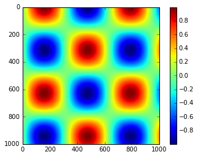
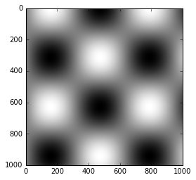
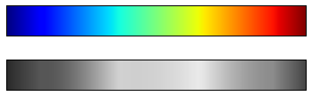
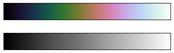
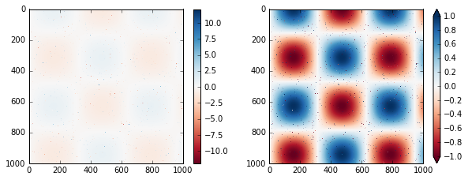
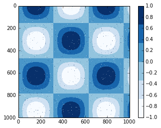
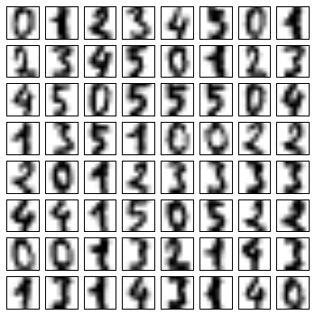
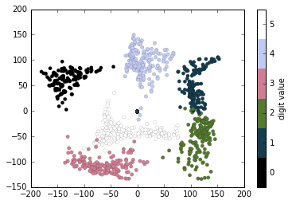

# 8.10 自定义颜色条

> 原文：[Customizing Colorbars](https://nbviewer.jupyter.org/github/donnemartin/data-science-ipython-notebooks/blob/master/matplotlib/04.07-Customizing-Colorbars.ipynb)
> 
> 译者：[飞龙](https://github.com/wizardforcel)
> 
> 协议：[CC BY-NC-SA 4.0](http://creativecommons.org/licenses/by-nc-sa/4.0/)
> 
> 本节是[《Python 数据科学手册》](https://github.com/jakevdp/PythonDataScienceHandbook)（Python Data Science Handbook）的摘录。

绘图图例标识离散点的离散标签。对于基于点，线条或区域颜色的连续标签，带标签的颜色条可能是一个很好的工具。在 Matplotlib 中，颜色条是一个单独的轴域，可以为绘图中的颜色含义提供见解。原书是黑白打印的，但是在线版本是彩色的，你可以在这里看到全彩的图形。我们首先为绘图配置笔记本，并导入我们将使用的函数：

```py
import matplotlib.pyplot as plt
plt.style.use('classic')

%matplotlib inline
import numpy as np
```

我们在本节中多次看到，可以使用``plt.colorbar``函数创建最简单的颜色条：

```py
x = np.linspace(0, 10, 1000)
I = np.sin(x) * np.cos(x[:, np.newaxis])

plt.imshow(I)
plt.colorbar();
```




我们现在将讨论一些想法，自定义这些颜色条，并在各种情况下有效地使用它们。

## 自定义颜色条

可以使用创建可视化的绘图函数的``cmap``参数指定颜色条：

```py
plt.imshow(I, cmap='gray');
```



所有可用的颜色表都在``plt.cm``命名空间中；IPython 的 TAB 补全，将为你提供内置选项的完整列表：

```ipython
plt.cm.<TAB>
```

但是能够选择颜色表只是第一步：更重要的是如何在选项中做决策！选择结果比你最初预期的要微妙得多。

### 选择颜色表

可视化中的颜色选择的完全处理，超出了本书的范围，但是为了阅读这个主题和其他内容，请参阅文章[“更好的绘图的十个简单的规则”](http://journals.plos.org/ploscompbiol/article?id=10.1371/journal.pcbi.1003833)。Matplotlib 的在线文档还有一个关于颜色表选择的[有趣讨论](http://Matplotlib.org/1.4.1/users/colormaps.html)。

一般来讲，你应该了解三种不同类型的颜色表：

-   顺序颜色表：它们由连续的颜色序列组成（例如，``binary``或``viridis``）。
-   发散颜色表：这些通常包含两种不同的颜色，显示相对均值的正偏差和负偏差（例如，``RdBu``或``PuOr``）。
-   定性颜色表：这些混合颜色没有特定的顺序（例如，``rainbow``或``jet``）。

``jet``颜色表是 2.0 版之前 Matplotlib 中的默认值，是定性颜色表的一个示例。它的默认状态非常不幸，因为对于表示定量数据来讲，定性映射往往是不良选择。问题之一是，定性映射通常在尺度增加时不显示任何均匀的亮度变化。

我们可以通过将``jet``颜色表转换成黑白来看到这一点：

```py
from matplotlib.colors import LinearSegmentedColormap

def grayscale_cmap(cmap):
    """返回给定颜色表的灰度版本"""
    cmap = plt.cm.get_cmap(cmap)
    colors = cmap(np.arange(cmap.N))
    
    # 将 RGBA 转换为感知灰度亮度
    # cf. http://alienryderflex.com/hsp.html
    RGB_weight = [0.299, 0.587, 0.114]
    luminance = np.sqrt(np.dot(colors[:, :3] ** 2, RGB_weight))
    colors[:, :3] = luminance[:, np.newaxis]
        
    return LinearSegmentedColormap.from_list(cmap.name + "_gray", colors, cmap.N)
    

def view_colormap(cmap):
    """使用颜色表的灰度等价物来绘制它"""
    cmap = plt.cm.get_cmap(cmap)
    colors = cmap(np.arange(cmap.N))
    
    cmap = grayscale_cmap(cmap)
    grayscale = cmap(np.arange(cmap.N))
    
    fig, ax = plt.subplots(2, figsize=(6, 2),
                           subplot_kw=dict(xticks=[], yticks=[]))
    ax[0].imshow([colors], extent=[0, 10, 0, 1])
    ax[1].imshow([grayscale], extent=[0, 10, 0, 1])

view_colormap('jet')
```




注意灰度图像中的明亮条纹。即使是全彩色，这种不均匀的亮度意味着，眼睛会被吸引到颜色范围的某些部分，这可能会强调数据集的不重要部分。最好使用例如``viridis``（Matplotlib 2.0 的默认值）的颜色表，它专门为在整个范围内具有均匀的亮度变化而构建。因此，它不仅可以很好地适应我们的色彩感知，而且可以很好地转换为灰度打印：

```py
view_colormap('viridis')
```


如果你喜欢彩虹图案，连续数据的另一个良好选择是``cubehelix``颜色表：

```py
view_colormap('cubehelix')
```




对于其他情况，例如显示某些均值的正偏差和负偏差，诸如`RdBu`（Red-Blue）的双色颜色表可能是有用的。但是，你会在下图中看到，重要的是要注意，在转换为灰度时，正负信息将会丢失！

```py
view_colormap('RdBu')
```


当我们继续时，我们将看到使用其中一些颜色表的示例。

Matplotlib 中有大量的颜色表；要查看它们的列表，可以使用 IPython 来探索``plt.cm``子模块。对于在 Python 中使用颜色的更加合乎正道的途径，你可以参考 Seaborn 库中的工具和文档（参见“使用 Seaborn 进行可视化”）。

### 颜色限制和扩展

Matplotlib 允许定制大范围的颜色条。颜色条本身只是``plt.Axes``的一个实例，所以我们学到的所有轴域和刻度的格式化技巧都适用。颜色条有一些有趣的灵活性：例如，我们可以缩小颜色限制，并通过设置``extend``属性，在顶部和底部用三角形箭头指示越界值。这可能会派上用场，例如，如果显示受噪声影响的图像：

```py
# 为 1% 的图像像素生成噪声
speckles = (np.random.random(I.shape) < 0.01)
I[speckles] = np.random.normal(0, 3, np.count_nonzero(speckles))

plt.figure(figsize=(10, 3.5))

plt.subplot(1, 2, 1)
plt.imshow(I, cmap='RdBu')
plt.colorbar()

plt.subplot(1, 2, 2)
plt.imshow(I, cmap='RdBu')
plt.colorbar(extend='both')
plt.clim(-1, 1);
```




请注意，在左侧面板中，默认颜色限制会响应噪声像素，并且噪声范围会完全消除我们感兴趣的模式。在右侧面板中，我们手动设置颜色限制，并添加扩展来标识高于或低于这些限制的值。结果是对我们的数据更加有用的可视化。

### 离散颜色条

默认情况下，颜色表是连续的，但有时你想表示离散值。最简单的方法是使用``plt.cm.get_cmap()``函数，并传递合适的颜色表的名称以及所需的桶数：

```py
plt.imshow(I, cmap=plt.cm.get_cmap('Blues', 6))
plt.colorbar()
plt.clim(-1, 1);
```




颜色表的离散版本可以像任何其他颜色表一样使用。

## 示例：手写数字

对于这可能有用的示例，让我们看一些手写数字数据的有趣可视化。
这些数据包含在 Scikit-Learn 中，包含近 2,000 张`8x8`的缩略图，显示各种手写数字。

现在，让我们首先下载数字数据并使用``plt.imshow()``可视化几个示例图像：

```py
# 加载数字 0~5 的图像
# 可视化它们中的几个
from sklearn.datasets import load_digits
digits = load_digits(n_class=6)

fig, ax = plt.subplots(8, 8, figsize=(6, 6))
for i, axi in enumerate(ax.flat):
    axi.imshow(digits.images[i], cmap='binary')
    axi.set(xticks=[], yticks=[])
```




因为每个数字由其 64 个像素的亮度定义，我们可以将每个数字视为位于 64 维空间中的点：每个维度代表一个像素的亮度。但是在这种高维空间中可视化关系可能非常困难。解决这个问题的一种方法是使用降维技术，例如流形学习，来减少数据的维度，同时保持感兴趣的关系。降维是无监督机器学习的一个例子，我们将在“什么是机器学习？”中更详细地讨论它。

推迟对这些细节的讨论，让我们看一下这个数字数据的二维流形学习投影（详见“深入分析：流形学习”）：

```py
# 使用 IsoMap 将数字投影到二维
from sklearn.manifold import Isomap
iso = Isomap(n_components=2)
projection = iso.fit_transform(digits.data)
```

我们将使用我们的离散颜色表来查看结果，设置``ticks``和``clim``来改善所得颜色条的美感：

```py
# 绘制结果
plt.scatter(projection[:, 0], projection[:, 1], lw=0.1,
            c=digits.target, cmap=plt.cm.get_cmap('cubehelix', 6))
plt.colorbar(ticks=range(6), label='digit value')
plt.clim(-0.5, 5.5)
```




该投影还为我们提供了一些数据集内部关系的有趣见解：例如，5 和 3 的范围在此投影中几乎重叠，表明一些手写的五和三难以区分，因此更容易由自动分类算法混淆。其他值，如 0 和 1，更加分散，因此更不容易混淆。这个观察结果与我们的直觉一致，因为 5 和 3 看起来比 0 和 1 更相似。

我们将在第 5 章中返回流形学习和数字分类。