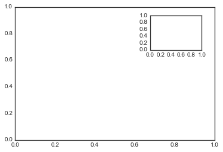
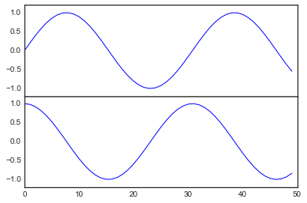
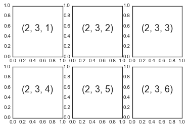
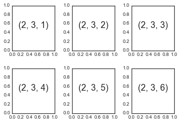
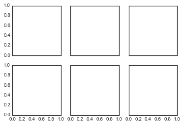
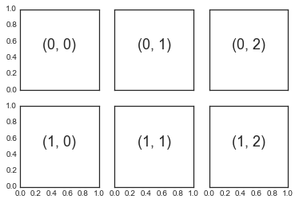
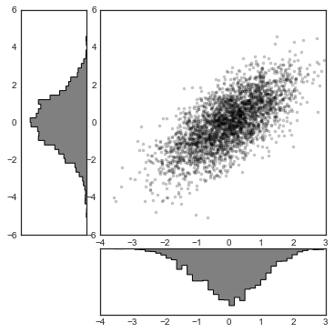

# 8.11 多个子图

> 原文：[Multiple Subplots](https://nbviewer.jupyter.org/github/donnemartin/data-science-ipython-notebooks/blob/master/matplotlib/04.08-Multiple-Subplots.ipynb)
> 
> 译者：[飞龙](https://github.com/wizardforcel)
> 
> 协议：[CC BY-NC-SA 4.0](http://creativecommons.org/licenses/by-nc-sa/4.0/)
> 
> 本节是[《Python 数据科学手册》](https://github.com/jakevdp/PythonDataScienceHandbook)（Python Data Science Handbook）的摘录。

有时，并排比较不同的数据视图会很有帮助。为此，Matplotlib 具有子图的概念：可以在单个图形中一起存在的较小轴域分组。这些子图可能是插图，绘图网格或其他更复杂的布局。在本节中，我们将探讨在 Matplotlib 中创建子图的四个例程。

```py
%matplotlib inline
import matplotlib.pyplot as plt
plt.style.use('seaborn-white')
import numpy as np
```

## ``plt.axes``：手动创建子图

创建轴域的最基本方法是使用``plt.axes``函数。正如我们之前看到的，默认情况下，这会创建一个填充整个图形的标准轴域对象。``plt.axes``也有一个可选参数，它是图坐标系中四个数字的列表。这些数字代表图形坐标系中的“左，底，宽，高”``，其范围从图的左下角的 0 到图的右上角的 1。

例如，我们可以通过将`x`和`y`位置设置为 0.65（也就是说，从图形宽度的 65% 和高度的 65% 开始），`x`和`y`范围为 0.2（即轴域的大小是图形宽度的 20% 和高度的 20%），在另一个轴域的右上角创建一个插入的轴域：

```py
ax1 = plt.axes()  # 标准轴域
ax2 = plt.axes([0.65, 0.65, 0.2, 0.2])
```




在面向对象的接口中，这个命令的等价物是``fig.add_axes()``。 让我们用它来创建两个垂直堆叠的轴：

```py
fig = plt.figure()
ax1 = fig.add_axes([0.1, 0.5, 0.8, 0.4],
                   xticklabels=[], ylim=(-1.2, 1.2))
ax2 = fig.add_axes([0.1, 0.1, 0.8, 0.4],
                   ylim=(-1.2, 1.2))

x = np.linspace(0, 10)
ax1.plot(np.sin(x))
ax2.plot(np.cos(x));
```




我们现在有两个刚刚接触的轴域（顶部没有刻度标签）：上面板的底部（位置为 0.5）匹配下面板的顶部（位置为 0.1 + 0.4）。

## ``plt.subplot``：子图的简单网格

子图的对齐的列或行是一个常见的需求，Matplotlib 有几个便利例程，使它们易于创建。其中最低级别是``plt.subplot()``，它在网格中创建一个子图。如你所见，此命令接受三个整数参数 - 行数，列数和要在此图案中创建的绘图的索引，从左上角到右下角：

```py
for i in range(1, 7):
    plt.subplot(2, 3, i)
    plt.text(0.5, 0.5, str((2, 3, i)),
             fontsize=18, ha='center')
```



命令``plt.subplots_adjust``可用于调整这些图之间的间距。下面的代码使用等效的面向对象命令``fig.add_subplot()``：

```py
fig = plt.figure()
fig.subplots_adjust(hspace=0.4, wspace=0.4)
for i in range(1, 7):
    ax = fig.add_subplot(2, 3, i)
    ax.text(0.5, 0.5, str((2, 3, i)),
           fontsize=18, ha='center')
```




我们使用了``plt.subplots_adjust``的``hspace``和``wspace``参数，它们沿图的高度和宽度指定间距，以子图大小为单位（这里，间距是子图宽度和高度的 40%。

## ``plt.subplots``：一次创建整个网格

在创建大型子图网格时，刚才描述的方法会变得相当繁琐，特别是如果你想在内部绘图上隐藏`x`轴和`y`轴标签。为此，``plt.subplots()``是更容易使用的工具（注意``subplots``末尾的``s``）。 该函数不创建单个子图，而是在一行中创建完整的子图网格，并在 NumPy 数组中返回它们。参数是行数和列数，以及可选关键字``sharex``和``sharey``，它们允许你指定不同轴之间的关系。

在这里，我们将创建`2x3`子图的网格，其中同一行中的所有轴域共享其`y`轴刻度，并且同一列中的所有轴域共享其`x`轴刻度：

```py
fig, ax = plt.subplots(2, 3, sharex='col', sharey='row')
```




请注意，通过指定``sharex``和``sharey``，我们会自动删除网格上的内部标签，来使绘图更清晰。生成的轴域网格实例在 NumPy 数组中返回，允许使用标准数组索引表示法，方便地指定所需的轴域：

```py
# ax 是二维数组，由 [row, col] 索引
for i in range(2):
    for j in range(3):
        ax[i, j].text(0.5, 0.5, str((i, j)),
                      fontsize=18, ha='center')
fig
```




与``plt.subplot()``相比，``plt.subplots()``与 Python 传统的基于 0 的索引更加一致。

## ``plt.GridSpec``：更加复杂的排列

为了超越常规网格，转向跨越多行和列的子图，``plt.GridSpec()``是最好的工具。
``plt.GridSpec()``对象本身不会创建一个图；它只是一个方便的接口，可以通过``plt.subplot()``命令识别。例如，具有指定宽度和高度间距的，两行和三列网格的`gridspec`如下所示：

```py
grid = plt.GridSpec(2, 3, wspace=0.4, hspace=0.3)
```

从这里我们可以使用熟悉的 Python 切片语法来指定子图位置和范围：

```py
plt.subplot(grid[0, 0])
plt.subplot(grid[0, 1:])
plt.subplot(grid[1, :2])
plt.subplot(grid[1, 2]);
```


这种类型的灵活网格对齐具有广泛的用途。我最经常在创建多轴域直方图时使用它，如下图所示：

```py
# 创建一些正态分布的数据
mean = [0, 0]
cov = [[1, 1], [1, 2]]
x, y = np.random.multivariate_normal(mean, cov, 3000).T

# 使用 gridspec 建立轴域
fig = plt.figure(figsize=(6, 6))
grid = plt.GridSpec(4, 4, hspace=0.2, wspace=0.2)
main_ax = fig.add_subplot(grid[:-1, 1:])
y_hist = fig.add_subplot(grid[:-1, 0], xticklabels=[], sharey=main_ax)
x_hist = fig.add_subplot(grid[-1, 1:], yticklabels=[], sharex=main_ax)

# 主要轴域上的散点图
main_ax.plot(x, y, 'ok', markersize=3, alpha=0.2)

# 附加轴域上的直方图
x_hist.hist(x, 40, histtype='stepfilled',
            orientation='vertical', color='gray')
x_hist.invert_yaxis()

y_hist.hist(y, 40, histtype='stepfilled',
            orientation='horizontal', color='gray')
y_hist.invert_xaxis()
```




这种类型的分布与其外边距一起绘制，这是很常见的，它在 Seaborn 包中有自己的绘图 API; 详细信息请参阅“使用 Seaborn 进行可视化”。
