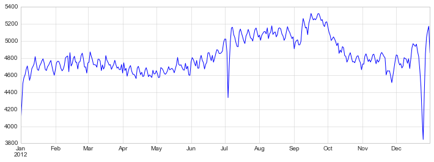
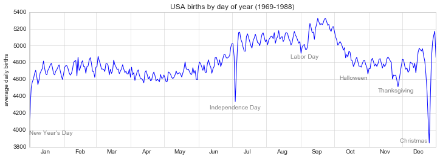
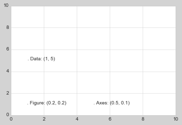
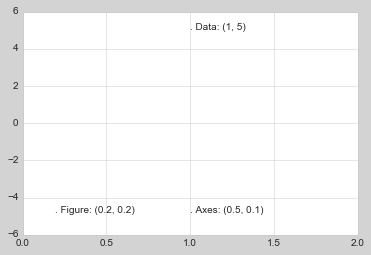
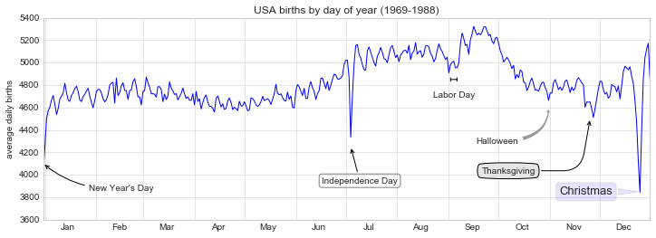

# 8.12 文本和注解

> 原文：[Text and Annotation](http://nbviewer.jupyter.org/github/donnemartin/data-science-ipython-notebooks/blob/master/matplotlib/04.09-Text-and-Annotation.ipynb)
> 
> 译者：[飞龙](https://github.com/wizardforcel)
> 
> 协议：[CC BY-NC-SA 4.0](http://creativecommons.org/licenses/by-nc-sa/4.0/)
> 
> 本节是[《Python 数据科学手册》](https://github.com/jakevdp/PythonDataScienceHandbook)（Python Data Science Handbook）的摘录。

创建良好的可视化涉及引导读者并使图形讲述故事。在某些情况下，可以以完全可视的方式讲述这个故事，而不需要添加文本，但在其他情况下，需要小的文本提示和标签。也许你将使用的最基本的注释类型是轴标签和标题，但选项超出了这个范围。让我们看看一些数据，以及我们如何可视化和注释它，来有助于传达有趣的信息。 我们首先设置笔记本来绘图并导入我们将使用的函数：

```py
%matplotlib inline
import matplotlib.pyplot as plt
import matplotlib as mpl
plt.style.use('seaborn-whitegrid')
import numpy as np
import pandas as pd
```

## 示例： 美国新生儿的假期效应

让我们回到之前处理的一些数据，在“示例：出生率数据”中，我们在日历年上生成了平均出生率的图表；如前所述，这些数据可以在 <https://raw.githubusercontent.com/jakevdp/data-CDCbirths/master/births.csv> 下载。

我们将使用我们在那里使用的相同清理过程开始，并绘制结果：

```py
births = pd.read_csv('data/births.csv')

quartiles = np.percentile(births['births'], [25, 50, 75])
mu, sig = quartiles[1], 0.74 * (quartiles[2] - quartiles[0])
births = births.query('(births > @mu - 5 * @sig) & (births < @mu + 5 * @sig)')

births['day'] = births['day'].astype(int)

births.index = pd.to_datetime(10000 * births.year +
                              100 * births.month +
                              births.day, format='%Y%m%d')
births_by_date = births.pivot_table('births',
                                    [births.index.month, births.index.day])
births_by_date.index = [pd.datetime(2012, month, day)
                        for (month, day) in births_by_date.index]

fig, ax = plt.subplots(figsize=(12, 4))
births_by_date.plot(ax=ax);
```




When we're communicating data like this, it is often useful to annotate certain features of the plot to draw the reader's attention.
This can be done manually with the ``plt.text``/``ax.text`` command, which will place text at a particular x/y value:

```py
fig, ax = plt.subplots(figsize=(12, 4))
births_by_date.plot(ax=ax)

# 向绘图添加标签
style = dict(size=10, color='gray')

ax.text('2012-1-1', 3950, "New Year's Day", **style)
ax.text('2012-7-4', 4250, "Independence Day", ha='center', **style)
ax.text('2012-9-4', 4850, "Labor Day", ha='center', **style)
ax.text('2012-10-31', 4600, "Halloween", ha='right', **style)
ax.text('2012-11-25', 4450, "Thanksgiving", ha='center', **style)
ax.text('2012-12-25', 3850, "Christmas ", ha='right', **style)

# 标记轴域
ax.set(title='USA births by day of year (1969-1988)',
       ylabel='average daily births')

# 使用中心化的月标签将 x 轴格式化
ax.xaxis.set_major_locator(mpl.dates.MonthLocator())
ax.xaxis.set_minor_locator(mpl.dates.MonthLocator(bymonthday=15))
ax.xaxis.set_major_formatter(plt.NullFormatter())
ax.xaxis.set_minor_formatter(mpl.dates.DateFormatter('%h'));
```




``ax.text``方法接受`x`位置，`y`位置，字符串，然后是可选关键字，指定文本的颜色，大小，样式，对齐方式和其他属性。在这里，我们使用``ha='right'``和``ha='center'``，其中``ha``是 horizonal alignment 的缩写。可用选项的更多信息，请参阅``plt.text()``和``mpl.text.Text()``的文档字符串。

## 变换和文本位置

在前面的示例中，我们将文本注释锚定到数据位置。 有时最好将文本锚定到轴或图上的位置，与数据无关。在 Matplotlib 中，这是通过修改变换来完成的。

任何图形显示框架都需要一些在坐标系之间进行转换的方案。例如，`(x, y) = (1, 1)`处的数据点，需要以某种方式表示在图上的某个位置，而该位置又需要在屏幕上以像素表示。在数学上，这种坐标转换相对简单，Matplotlib 有一套完善的工具，它们在内部使用来执行（这些工具可以在``matplotlib.transforms``子模块中进行探索）。

普通用户很少需要关心这些变换的细节，但在考虑在图形上放置文本时，它是有用的知识。 在这种情况下，有三种预定义的转换可能很有用：

- ``ax.transData``：数据坐标相关的变换
- ``ax.transAxes``：轴域（以轴域维度为单位）相关的变换
- ``fig.transFigure``：图形（以图形维度为单位）相关的变换

这里让我们看一下，使用这些变换在不同位置绘制文本的示例：

```py
fig, ax = plt.subplots(facecolor='lightgray')
ax.axis([0, 10, 0, 10])

# transform=ax.transData 是默认值，但是我们无论如何也要指定它
ax.text(1, 5, ". Data: (1, 5)", transform=ax.transData)
ax.text(0.5, 0.1, ". Axes: (0.5, 0.1)", transform=ax.transAxes)
ax.text(0.2, 0.2, ". Figure: (0.2, 0.2)", transform=fig.transFigure);
```




请注意，默认情况下，文本在指定坐标的上方和左侧对齐：这里，在每个字符串的开头的`'.'`将近似标记给定的坐标位置。

``transData``坐标给出了关联`x`轴和`y`轴标签的常用数据坐标。``transAxes``坐标给出了相对于轴域左下角（这里是白框）的位置，作为轴域大小的比例。``transFigure``坐标是相似的，但是指定相对于图左下角（这里是灰框）的位置，作为图形大小的比例。

现在请注意，如果我们更改轴限制，那么只有`transData`坐标会受到影响，而其他坐标则保持不变：

```py
ax.set_xlim(0, 2)
ax.set_ylim(-6, 6)
fig
```




通过交互式更改轴限制可以更清楚地看到这种行为：如果你在笔记本中执行此代码，你可以通过将``%matplotlib inline``更改为``%matplotlib notebook``，并使用每个绘图的菜单与它互动来实现它。

## 箭头和标注

除了刻度线和文本，另一个有用的标注或标记是简单的箭头。

在 Matplotlib 中绘制箭头通常比砍价要困难得多。虽然``plt.arrow()``函数是可用的，我不建议使用它：它创建的箭头是 SVG 对象，它们会受到不同长宽比的影响，结果很少是用户所期望的。相反，我建议使用``plt.annotate()``函数。此函数可创建一些文本和箭头，并且箭头可以非常灵活地指定。

在这里，我们将使用``annotate``及其几个选项：

```py
%matplotlib inline

fig, ax = plt.subplots()

x = np.linspace(0, 20, 1000)
ax.plot(x, np.cos(x))
ax.axis('equal')

ax.annotate('local maximum', xy=(6.28, 1), xytext=(10, 4),
            arrowprops=dict(facecolor='black', shrink=0.05))

ax.annotate('local minimum', xy=(5 * np.pi, -1), xytext=(2, -6),
            arrowprops=dict(arrowstyle="->",
                            connectionstyle="angle3,angleA=0,angleB=-90"));
```




箭头样式通过``arrowprops``字典控制，该字典有许多选项。这些选项在 Matplotlib 的在线文档中有相当详细的记录，因此，比起在此复述这些选项，快速展示一些选项可能更有用。让我们使用之前的出生率图表演示几种可用选项：

```py
fig, ax = plt.subplots(figsize=(12, 4))
births_by_date.plot(ax=ax)

# 向绘图添加标签
ax.annotate("New Year's Day", xy=('2012-1-1', 4100),  xycoords='data',
            xytext=(50, -30), textcoords='offset points',
            arrowprops=dict(arrowstyle="->",
                            connectionstyle="arc3,rad=-0.2"))

ax.annotate("Independence Day", xy=('2012-7-4', 4250),  xycoords='data',
            bbox=dict(boxstyle="round", fc="none", ec="gray"),
            xytext=(10, -40), textcoords='offset points', ha='center',
            arrowprops=dict(arrowstyle="->"))

ax.annotate('Labor Day', xy=('2012-9-4', 4850), xycoords='data', ha='center',
            xytext=(0, -20), textcoords='offset points')
ax.annotate('', xy=('2012-9-1', 4850), xytext=('2012-9-7', 4850),
            xycoords='data', textcoords='data',
            arrowprops={'arrowstyle': '|-|,widthA=0.2,widthB=0.2', })

ax.annotate('Halloween', xy=('2012-10-31', 4600),  xycoords='data',
            xytext=(-80, -40), textcoords='offset points',
            arrowprops=dict(arrowstyle="fancy",
                            fc="0.6", ec="none",
                            connectionstyle="angle3,angleA=0,angleB=-90"))

ax.annotate('Thanksgiving', xy=('2012-11-25', 4500),  xycoords='data',
            xytext=(-120, -60), textcoords='offset points',
            bbox=dict(boxstyle="round4,pad=.5", fc="0.9"),
            arrowprops=dict(arrowstyle="->",
                            connectionstyle="angle,angleA=0,angleB=80,rad=20"))


ax.annotate('Christmas', xy=('2012-12-25', 3850),  xycoords='data',
             xytext=(-30, 0), textcoords='offset points',
             size=13, ha='right', va="center",
             bbox=dict(boxstyle="round", alpha=0.1),
             arrowprops=dict(arrowstyle="wedge,tail_width=0.5", alpha=0.1));

# 标记轴域
ax.set(title='USA births by day of year (1969-1988)',
       ylabel='average daily births')

# 使用中心化的月标签将 x 轴格式化
ax.xaxis.set_major_locator(mpl.dates.MonthLocator())
ax.xaxis.set_minor_locator(mpl.dates.MonthLocator(bymonthday=15))
ax.xaxis.set_major_formatter(plt.NullFormatter())
ax.xaxis.set_minor_formatter(mpl.dates.DateFormatter('%h'));

ax.set_ylim(3600, 5400);
```


你会注意到箭头和文本框的规格非常详细：这使你能够创建几乎任何箭头样式。不幸的是，这也意味着这些功能通常必须手动调整，这个过程在制作出版品质的图形时非常耗时！最后我要提醒你，前面的样式混合绝不是展示数据的最佳实践，而是作为一些可用选项的演示。

可用箭头和注释样式的更多讨论和示例，可以在 Matplotlib 库中找到，特别是[标注的演示](http://matplotlib.org/examples/pylab_examples/annotation_demo2.html)。