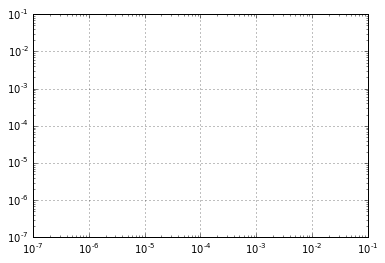
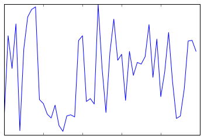
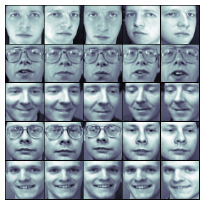
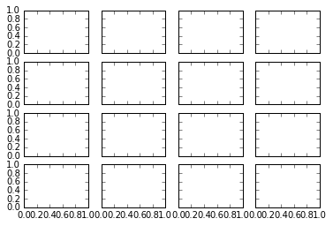
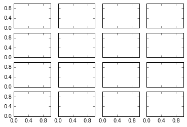
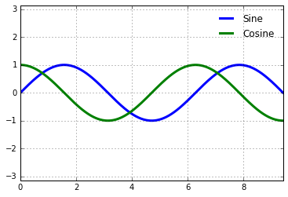
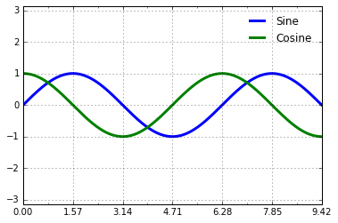
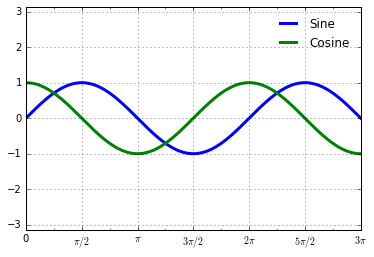

# 8.13 自定义刻度

> 原文：[Customizing Ticks](https://nbviewer.jupyter.org/github/donnemartin/data-science-ipython-notebooks/blob/master/matplotlib/04.10-Customizing-Ticks.ipynb)
> 
> 译者：[飞龙](https://github.com/wizardforcel)
> 
> 协议：[CC BY-NC-SA 4.0](http://creativecommons.org/licenses/by-nc-sa/4.0/)
> 
> 本节是[《Python 数据科学手册》](https://github.com/jakevdp/PythonDataScienceHandbook)（Python Data Science Handbook）的摘录。

Matplotlib 的默认刻度定位器和格式化程序，在许多常见情况下通常都足够了，但对于每个绘图都不是最佳选择。本节将提供几个刻度位置和格式的示例，它们调整你感兴趣的特定绘图类型。

在我们进入示例之前，我们最好进一步了解 Matplotlib 绘图的对象层次结构。Matplotlib 旨在用 Python 对象表示绘图中出现的所有内容：例如，回想一下``figure``是绘图元素所在的边框。每个 Matplotlib 对象也可以充当子对象的容器：例如，每个``figure``可以包含一个或多个``axes``对象，它们的每个又包含表示绘图内容的其他对象。

刻度线也不例外。 每个``axes``都有属性``xaxis``和``yaxis``，它们又具有一些属性，包括构成轴域的直线，刻度和标签。

## 主要和次要刻度

在每个轴内，有主要刻度标记和次要刻度标记的概念。 正如名称所暗示的那样，主要刻度通常更大或更明显，而次要刻度通常更小。 默认情况下，Matplotlib 很少使用次要刻度，但是你可以在对数绘图中看到它们：

```py
import matplotlib.pyplot as plt
plt.style.use('classic')
%matplotlib inline
import numpy as np

ax = plt.axes(xscale='log', yscale='log')
ax.grid();
```




我们在这里看到每个主刻度线显示为一个大刻度线和一个标签，而每个次刻度线显示为一个没有标签的较小刻度线。

这些刻度属性 - 位置和标签 - 也就是说，可以通过设置每个轴的``formatter``和``locator``对象来定制。 让我们检查刚刚展示的绘图的`x`轴：

```py
print(ax.xaxis.get_major_locator())
print(ax.xaxis.get_minor_locator())

'''
<matplotlib.ticker.LogLocator object at 0x10dbaf630>
<matplotlib.ticker.LogLocator object at 0x10dba6e80>
'''

print(ax.xaxis.get_major_formatter())
print(ax.xaxis.get_minor_formatter())

'''
<matplotlib.ticker.LogFormatterMathtext object at 0x10db8dbe0>
<matplotlib.ticker.NullFormatter object at 0x10db9af60>
'''
```

我们看到主要和次要刻度标签的位置都由`LogLocator`指定（这对于对数图是有意义的）。 但是，次要刻度的标签格式为`NullFormatter`：这表示不会显示任何标签。我们现在将展示一些为各种图设置这些定位器和格式化器的示例。

## 隐藏刻度或标签

也许最常见的刻度/标签格式化操作是隐藏刻度或标签。这可以使用``plt.NullLocator()``和``plt.NullFormatter()``来完成，如下所示：

```py
ax = plt.axes()
ax.plot(np.random.rand(50))

ax.yaxis.set_major_locator(plt.NullLocator())
ax.xaxis.set_major_formatter(plt.NullFormatter())
```



请注意，我们已经从`x`轴移除了标签（但保留了刻度线/网格线），并从`y`轴中删除了刻度线（以及标签）。
在许多情况下，不显示刻度可能很有用 - 例如，当你想要显示图像网格的时候。
例如，考虑下图，它包含不同的面部图像，这是监督机器学习问题中常用的一个例子（例如，参见“深入：支持向量机”）：

```py
fig, ax = plt.subplots(5, 5, figsize=(5, 5))
fig.subplots_adjust(hspace=0, wspace=0)

# 从 sklearn 获取一些人脸数据
from sklearn.datasets import fetch_olivetti_faces
faces = fetch_olivetti_faces().images

for i in range(5):
    for j in range(5):
        ax[i, j].xaxis.set_major_locator(plt.NullLocator())
        ax[i, j].yaxis.set_major_locator(plt.NullLocator())
        ax[i, j].imshow(faces[10 * i + j], cmap="bone")
```




请注意，每个图像都有自己的轴域，我们将定位器设置为`null`，因为刻度值（在这种情况下为像素数）不会传达这个特定可视化的相关信息。

## 减少或增加刻度数量

默认设置的一个常见问题是，较小的子图最终会拥有密集的标签。我们可以在这里显示的绘图网格中看到它：

```py
fig, ax = plt.subplots(4, 4, sharex=True, sharey=True)
```




特别是对于`x`刻度，数字几乎重叠并使它们很难看清。我们可以用``plt.MaxNLocator()``解决这个问题，它允许我们指定要显示的最大刻度数。给定此最大数量，Matplotlib 将使用内部逻辑来选择特定的刻度位置：

```py
# 对于每个轴，设置 x 和 y 主要定位器
for axi in ax.flat:
    axi.xaxis.set_major_locator(plt.MaxNLocator(3))
    axi.yaxis.set_major_locator(plt.MaxNLocator(3))
fig
```



这使事情变得更加干净。 如果你想要更多地控制等间隔的刻度位置，你也可以使用``plt.MultipleLocator``，我们将在下一节讨论。

## 花式刻度格式

Matplotlib 的默认刻度格式可能会有很多不足之处：它可以作为一个泛用的默认值，但有时你还想做更多的事情。考虑一下正弦和余弦的绘图：

```py
# 绘制正弦和余弦曲线
fig, ax = plt.subplots()
x = np.linspace(0, 3 * np.pi, 1000)
ax.plot(x, np.sin(x), lw=3, label='Sine')
ax.plot(x, np.cos(x), lw=3, label='Cosine')

# 配置网格，图例和限制
ax.grid(True)
ax.legend(frameon=False)
ax.axis('equal')
ax.set_xlim(0, 3 * np.pi);
```




我们可能想做一些改变。 首先，以 π 的倍数的刻度线和网格线来区分这些数据更加自然。 我们可以通过设置``MultipleLocator``来实现，它可以在你提供的数字的倍数处，设置刻度线。 为了更好地衡量，我们将以`π/4`的倍数添加主要和次要刻度：

```py
ax.xaxis.set_major_locator(plt.MultipleLocator(np.pi / 2))
ax.xaxis.set_minor_locator(plt.MultipleLocator(np.pi / 4))
fig
```



但现在这些刻度标签看起来有点傻：我们可以看到它们是 π 的倍数，但十进制表示并没有立即传达这一点。要解决这个问题，我们可以更改刻度格式化器。对于我们想要做的事情，没有内置格式化器，所以我们改为使用``plt.FuncFormatter``，它接受用户定义的函数，对刻度输出进行细粒度控制：

```py
def format_func(value, tick_number):
    # 寻找 pi/2 倍数的数字
    N = int(np.round(2 * value / np.pi))
    if N == 0:
        return "0"
    elif N == 1:
        return r"$\pi/2$"
    elif N == 2:
        return r"$\pi$"
    elif N % 2 > 0:
        return r"${0}\pi/2$".format(N)
    else:
        return r"${0}\pi$".format(N // 2)

ax.xaxis.set_major_formatter(plt.FuncFormatter(format_func))
fig
```



这要好得多！ 请注意，我们已经使用了 Matplotlib 的 LaTeX 支持，通过将字符串括在美元符号中来指定。 这对于显示数学符号和公式非常方便：在这种情况下，`$\pi$`显示为希腊字符`π`。

``plt.FuncFormatter()``提供绘图刻度外观的极细粒度控制，并且在准备绘图用于演示或发布时非常方便。

## 格式化器和定位器的总结

我们已经提到了一些可用的格式化器和定位器。我们将简要列出所有内置定位器和格式化器的选项来结束本节。 对于其中任何内容的更多信息，请参阅文档字符串或 Matplotlib 在线文档。``plt``命名空间中提供以下东西：

|      定位器类        |     描述     |
| -------------------- | ------------ |
| ``NullLocator``      | 没有刻度 |
| ``FixedLocator``     | 刻度定位器是固定的 |
| ``IndexLocator``     | 索引绘图的定位器（也就是，其中`x = range(len(y))`）  |
| ``LinearLocator``    | 等间隔的刻度，从最小值到最大值 |
| ``LogLocator``       | 对数刻度，从最小值到最大值 |
| ``MultipleLocator``  | 刻度和范围是基数的倍数 |
| ``MaxNLocator``      | 在不错的位置寻找小于等于最大值的刻度数 |
| ``AutoLocator``      | （默认）带有简单默认值的`MaxNLocator` |
| ``AutoMinorLocator`` | 用于次要刻度的定位器 |

|      格式化器类       |      描述      |
| --------------------- | -------------- |
| ``NullFormatter``     | 刻度上没有标签 |
| ``IndexFormatter``    | 从一列标签中设置字符串 |
| ``FixedFormatter``    | 手动为标签设置字符串 |
| ``FuncFormatter``     | 使用用户定义的函数设置标签 |
| ``FormatStrFormatter``| 对每个值使用格式化字符串 |
| ``ScalarFormatter``   | （默认）用于标量值的格式化器 |
| ``LogFormatter``      | 对数轴域的默认格式化器 |

我们将在本书的其余部分看到更多这些例子。