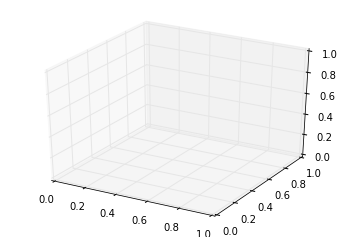
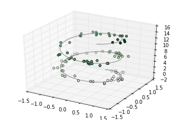
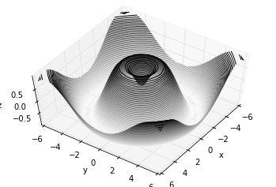
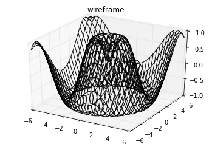
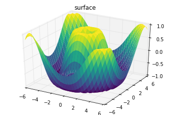
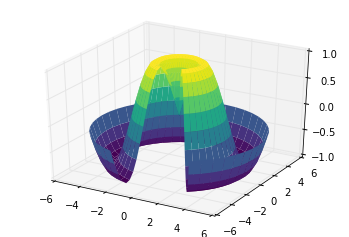
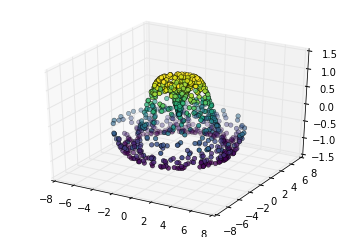
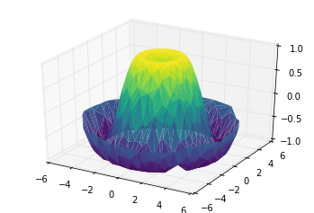
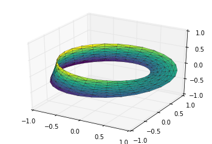

# 8.15 Matplotlib 中的三维绘图

> 原文：[Three-Dimensional Plotting in Matplotlib](https://nbviewer.jupyter.org/github/donnemartin/data-science-ipython-notebooks/blob/master/matplotlib/04.12-Three-Dimensional-Plotting.ipynb)
> 
> 译者：[飞龙](https://github.com/wizardforcel)
> 
> 协议：[CC BY-NC-SA 4.0](http://creativecommons.org/licenses/by-nc-sa/4.0/)
> 
> 本节是[《Python 数据科学手册》](https://github.com/jakevdp/PythonDataScienceHandbook)（Python Data Science Handbook）的摘录。

Matplotlib 最初设计时只考虑了二维绘图。在 1.0 版本发布时，一些三维绘图工具构建在 Matplotlib 的二维显示之上，结果是一组方便（但是有限）的三维数据可视化工具。通过导入``mplot3d``工具包来启用三维绘图，它包含在主要的 Matplotlib 安装中：

```py
from mpl_toolkits import mplot3d
```

导入子模块后，可以通过将关键字``projection ='3d'``传递给任何普通轴域创建例程来创建三维轴域：

```py
%matplotlib inline
import numpy as np
import matplotlib.pyplot as plt

fig = plt.figure()
ax = plt.axes(projection='3d')
```



启用此三维轴后，我们现在可以绘制各种三维绘图。三维绘图通过交互式查看图形，而非静态地在笔记本中查看图形而获益；回想一下，要使用交互式图形，运行此代码时可以使用``%matplotlib notebook``而不是``%matplotlib inline``。

## 三维的点和线

最基本的三维图是根据`(x, y, z)`三元组创建的散点图的线或集合。与前面讨论的更常见的二维图类比，这些可以使用``ax.plot3D``和``ax.scatter3D``函数创建。

这些调用签名几乎与它们的二维对应的签名相同，所以对于控制输出的更多信息，你可以参考“简单的折线图”和“简单的散点图”。在这里，我们将绘制一个三角螺旋线，并且在线条附近随机绘制一些点：

```py
ax = plt.axes(projection='3d')

# 三维线条的数据
zline = np.linspace(0, 15, 1000)
xline = np.sin(zline)
yline = np.cos(zline)
ax.plot3D(xline, yline, zline, 'gray')

# 三维散点的数据
zdata = 15 * np.random.random(100)
xdata = np.sin(zdata) + 0.1 * np.random.randn(100)
ydata = np.cos(zdata) + 0.1 * np.random.randn(100)
ax.scatter3D(xdata, ydata, zdata, c=zdata, cmap='Greens');
```




请注意，默认情况下，散点会调整其透明度，以便在页面上给出深度感。虽然在静态图像中有时难以看到三维效果，但是交互式视图可以产生点的布局的一些很好的直觉。

## 三维等高线图

类似于我们在“密度和等高线图”中探索的等高线图，``mplot3d``包含使用相同输入创建三维浮雕图的工具。像二维`ax.contour`图一样，`ax.contour3D`要求所有输入数据都是二维规则网格的形式，带有每个点求得的`Z`数据。这里我们将展示三维正弦函数的三维等高线图：

```py
def f(x, y):
    return np.sin(np.sqrt(x ** 2 + y ** 2))

x = np.linspace(-6, 6, 30)
y = np.linspace(-6, 6, 30)

X, Y = np.meshgrid(x, y)
Z = f(X, Y)

fig = plt.figure()
ax = plt.axes(projection='3d')
ax.contour3D(X, Y, Z, 50, cmap='binary')
ax.set_xlabel('x')
ax.set_ylabel('y')
ax.set_zlabel('z');
```


有时默认的视角不是最佳的，在这种情况下我们可以使用``view_init``方法来设置俯仰角和方位角。 在下面的示例中，我们将使用 60 度的俯仰角（即，在 x-y 平面上方 60 度）和 35 度的方位角（即绕 z 轴逆时针旋转 35 度）：

```py
ax.view_init(60, 35)
fig
```



再次注意，当使用 Matplotlib 的交互式后端之一时，通过单击和拖动可以交互式地完成这种类型的旋转。

## 线框和曲面图

处理网格化数据的另外两种类型的三维图是线框和曲面图。它们接受值的网格，并将其投影到指定的三维表面上，并且可以使得到的三维形式非常容易可视化。以下是使用线框图的示例：

```py
fig = plt.figure()
ax = plt.axes(projection='3d')
ax.plot_wireframe(X, Y, Z, color='black')
ax.set_title('wireframe');
```




曲面图类似于线框图，但线框的每个面都是填充多边形。将颜色表添加到填充多边形，有助于感知可视化的表面拓扑：

```py
ax = plt.axes(projection='3d')
ax.plot_surface(X, Y, Z, rstride=1, cstride=1,
                cmap='viridis', edgecolor='none')
ax.set_title('surface');
```




请注意，虽然曲面图的值的网格需要是二维的，但它不必是直线的。下面是一个创建部分极坐标网格的示例，与`surface3D`图形一起使用时，可以为我们提供我们正在可视化的函数的切面：

```py
r = np.linspace(0, 6, 20)
theta = np.linspace(-0.9 * np.pi, 0.8 * np.pi, 40)
r, theta = np.meshgrid(r, theta)

X = r * np.sin(theta)
Y = r * np.cos(theta)
Z = f(X, Y)

ax = plt.axes(projection='3d')
ax.plot_surface(X, Y, Z, rstride=1, cstride=1,
                cmap='viridis', edgecolor='none');
```




## 表面的三角剖分

对于某些应用，上述例程所需的均匀采样网格过于严格且不方便。在这些情况下，基于三角剖分的图形可能非常有用。如果我们不从笛卡尔坐标或极坐标网格中均匀抽取，而是随机抽取一组的话，会如何呢？

```py
theta = 2 * np.pi * np.random.random(1000)
r = 6 * np.random.random(1000)
x = np.ravel(r * np.sin(theta))
y = np.ravel(r * np.cos(theta))
z = f(x, y)
```

我们可以创建点的散点图，来了解我们从中采样的表面：

```py
ax = plt.axes(projection='3d')
ax.scatter(x, y, z, c=z, cmap='viridis', linewidth=0.5);
```




这留下了许多不足之处。在这种情况下帮助我们的函数是``ax.plot_trisurf``，它通过首先找到在相邻点之间形成的一组三角形来创建表面（请记住，这里`x`，`y`和`z`是一维数组）：

```py
ax = plt.axes(projection='3d')
ax.plot_trisurf(x, y, z,
                cmap='viridis', edgecolor='none');
```



结果当然不像用网格绘制时那样干净，但这种三角剖分的灵活性，允许一些非常有趣的三维图。例如，实际上可以使用它绘制三维莫比乌斯条带，我们将在下面看到。

### 示例：可视化莫比乌斯带

莫比乌斯条带类似于旋转 90 度而拼接的纸条。在拓扑上，它非常有趣，因为外观只有一面！在这里，我们将使用 Matplotlib 的三维工具来可视化这样的对象。

创建莫比乌斯带的关键是考虑它的参数化：它是一个二维条带，所以我们需要两个内在维度。 让我们称它们为`θ`，其范围从`0`到`2π`，并且`w`的范围从`-1`到`1`，跨越条带的宽度：

```py
theta = np.linspace(0, 2 * np.pi, 30)
w = np.linspace(-0.25, 0.25, 8)
w, theta = np.meshgrid(w, theta)
```

现在根据这个参数化，我们必须确定嵌入条带的`(x, y, z)`位置。

考虑到这一点，我们可能会发现有两个发生的旋转：一个是环绕其中心的位置（我们称之为`θ`），而另一个是条带绕其轴的扭曲（我会称其为`φ`）。 对于莫比乌斯条带，我们必须让条带在完整循环期间产生半个扭曲，或者`Δφ = Δθ/2`。

```py
phi = 0.5 * theta
```

现在我们使用三角函数的记忆来推导三维嵌入。我们将定义`r`，每个点距离中心的距离，并使用它来查找嵌入的`(x, y, z)`坐标：

```py
# x-y 平面中的半径
r = 1 + w * np.cos(phi)

x = np.ravel(r * np.cos(theta))
y = np.ravel(r * np.sin(theta))
z = np.ravel(w * np.sin(phi))
```

最后，为了绘制对象，我们必须确保三角剖分是正确的。 执行此操作的最佳方法是，在底层参数化中定义三角剖分，然后让 Matplotlib 将此三角剖分投影到莫比乌斯条带的三维空间中。这可以通过以下方式完成：

```py
# 在底层参数化中进行三角剖分
from matplotlib.tri import Triangulation
tri = Triangulation(np.ravel(w), np.ravel(theta))

ax = plt.axes(projection='3d')
ax.plot_trisurf(x, y, z, triangles=tri.triangles,
                cmap='viridis', linewidths=0.2);

ax.set_xlim(-1, 1); ax.set_ylim(-1, 1); ax.set_zlim(-1, 1);
```



结合所有这些技巧，可以在 Matplotlib 中创建和展示各种各样的三维对象和图案。