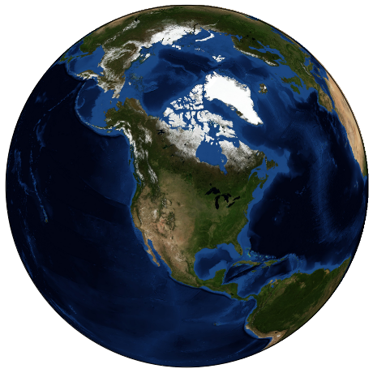
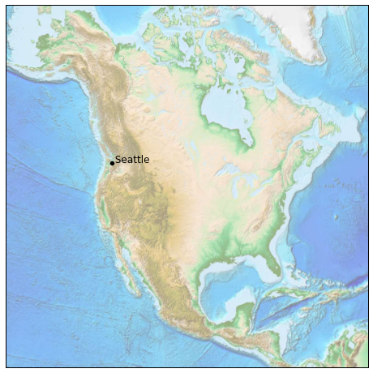
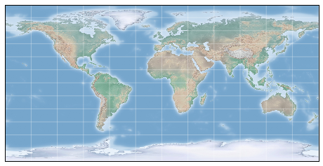
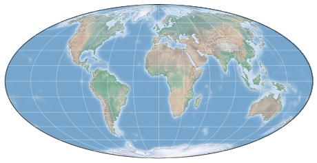
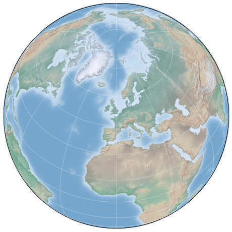
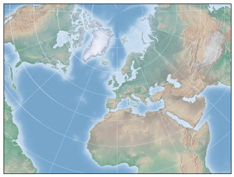
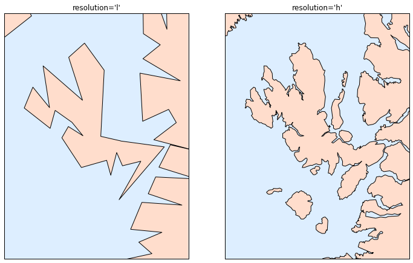
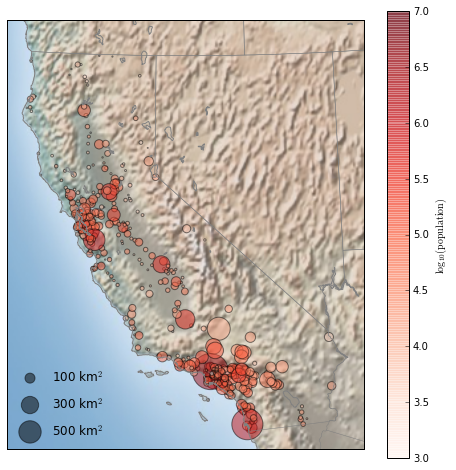
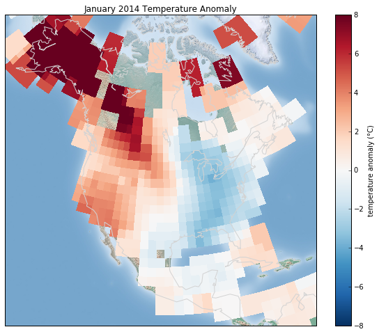

# 8.16 地理数据和 Basemap

> 原文：[Geographic Data with Basemap](https://nbviewer.jupyter.org/github/donnemartin/data-science-ipython-notebooks/blob/master/matplotlib/04.13-Geographic-Data-With-Basemap.ipynb)
> 
> 译者：[飞龙](https://github.com/wizardforcel)
> 
> 协议：[CC BY-NC-SA 4.0](http://creativecommons.org/licenses/by-nc-sa/4.0/)
> 
> 本节是[《Python 数据科学手册》](https://github.com/jakevdp/PythonDataScienceHandbook)（Python Data Science Handbook）的摘录。

数据科学中一种常见的可视化类型是地理数据。Matplotlib 用于此类可视化的主要工具是 Basemap 工具包，它是位于``mpl_toolkits``命名空间下的几个 Matplotlib 工具包之一。不可否认，Basemap 使用时有点笨拙，甚至简单的可视化渲染也要花费更长的时间，超出你的想象。

更传统的解决方案（如 leaflet 或 Google Maps API）可能是更加密集的地图可视化的更好选择。尽管如此，Basemap 仍然是 Python 用户在其虚拟工具栏中拥有的有用工具。在本节中，我们将展示使用此工具包可以实现的地图可视化类型的几个示例。

Basemap 的安装很简单；如果你正在使用 conda，你可以输入这个，然后下载包：

```
$ conda install basemap
```

我们只在标准样板中添加一个新的导入：

```py
%matplotlib inline
import numpy as np
import matplotlib.pyplot as plt
from mpl_toolkits.basemap import Basemap
```

一旦安装并导入了 Basemap 工具包，地理绘图就能在几行之内实现（下面的图形也需要 Python 2 中的``PIL``包，或者 Python 3 中的``pillow``包）：

```py
plt.figure(figsize=(8, 8))
m = Basemap(projection='ortho', resolution=None, lat_0=50, lon_0=-100)
m.bluemarble(scale=0.5);
```



`Basemap`参数的含义将立即讨论。

有用的是这里显示的地球不仅仅是一个图像; 它是一个功能齐全的 Matplotlib 轴域，它可以理解球面坐标，这使我们可以轻松地在地图上绘制数据！例如，我们可以使用不同的地图投影，放大到北美并绘制西雅图的位置。我们将使用 etopo 图像（显示陆地和海底的地形特征）作为地图背景：

```py
fig = plt.figure(figsize=(8, 8))
m = Basemap(projection='lcc', resolution=None,
            width=8E6, height=8E6, 
            lat_0=45, lon_0=-100,)
m.etopo(scale=0.5, alpha=0.5)

# 将 (long, lat) 映射为 (x, y) 以便绘图
x, y = m(-122.3, 47.6)
plt.plot(x, y, 'ok', markersize=5)
plt.text(x, y, ' Seattle', fontsize=12);
```




通过几行 Python，你可以轻松了解可能的地理可视化类型。我们现在将更深入地讨论 Basemap 的功能，并提供几个可视化地图数据的示例。使用这些简短的示例作为积木，你应该能够创建几乎任何你想要的地图可视化。

## 地图投影

使用地图时要决定的第一件事，是要使用什么投影。你可能已经熟悉这样一个事实：不可能将球形地图（例如地球的地图）投影到平坦的表面上，而不会以某种方式扭曲或破坏其连续性。这些预测是在人类历史进程中发展起来的，有很多选择！取决于地图投影的预期用途，有一些地图特征，保留它们很有用（例如，方向，区域，距离，形状或其他考虑因素）。

Basemap 包实现了几十个这样的投影，全部由短格式代码引用。在这里，我们将简要介绍一些比较常见的。我们首先定义一个便利例程来绘制我们的世界地图以及经纬线：

```py
from itertools import chain

def draw_map(m, scale=0.2):
    # 绘制阴影浮雕图像
    m.shadedrelief(scale=scale)
    
    # 将 lats 和 lons 作为字典返回
    lats = m.drawparallels(np.linspace(-90, 90, 13))
    lons = m.drawmeridians(np.linspace(-180, 180, 13))

    # 键包含 plt.Line2D 实例
    lat_lines = chain(*(tup[1][0] for tup in lats.items()))
    lon_lines = chain(*(tup[1][0] for tup in lons.items()))
    all_lines = chain(lat_lines, lon_lines)
    
    # 遍历这些线并设置所需的样式
    for line in all_lines:
        line.set(linestyle='-', alpha=0.3, color='w')
```

### 圆柱投影

最简单的地图投影是圆柱投影，其中恒定纬度和经度的线分别映射到水平线和垂直线。这种类型的映射很好地代表了赤道区域，但产生了极点附近的极端扭曲。纬线的间距在不同的圆柱投影之间变化，产生不同的保留特征，并且在极点附近的不同的变形。在下图中，我们展示了等距圆柱投影的示例，它选择了沿子午线保留距离的纬度缩放。其他圆柱投影是墨卡托（``projection='merc'``）和圆柱等积（``projection='cea'``）投影。

```py
fig = plt.figure(figsize=(8, 6), edgecolor='w')
m = Basemap(projection='cyl', resolution=None,
            llcrnrlat=-90, urcrnrlat=90,
            llcrnrlon=-180, urcrnrlon=180, )
draw_map(m)
```




此视图的 Basemap 的附加参数，为所需的地图指定左下角（``llcrnr``）和右上角（``urcrnr``）的纬度（``lat``）和经度（``lon``），以度为单位。

### 伪圆柱投影

伪圆柱投影放松了子午线（恒定经线）保持垂直的要求; 这可以在投影的极点附近提供更好的特性。墨卡托投影（``projection ='moll'``）是这方面的一个常见例子，其中所有经线都是椭圆弧。它的构造是为了保留地图上的区域：尽管两极附近存在扭曲，但小块的区域反映了真实区域。其他伪圆柱投影是正弦曲线（``projection='sinu'``）和罗宾逊（``projection='robin'``）投影。

```py
fig = plt.figure(figsize=(8, 6), edgecolor='w')
m = Basemap(projection='moll', resolution=None,
            lat_0=0, lon_0=0)
draw_map(m)
```




这里 Basemap 的额外参数是指所需映射的中心纬度（``lat_0``）和经度（``lon_0``）。

### 透视投影

透视投影使用透视点的特定选择构建，类似于你从空间中的特定点拍摄地球（对于某些投影，技术上点位于地球内部！）。一个常见的例子是正交投影（``projection='ortho'``），它显示了远处的观察者看到的地球的一侧。因此，它一次只能显示全球的一半。

其他基于视角的投影包括 gnomonic 投影（``projection='gnom'``）和立体投影（``projection='stere'``）。这些通常对于显示地图的一小部分最有用。

以下是正交投影的示例：

```py
fig = plt.figure(figsize=(8, 8))
m = Basemap(projection='ortho', resolution=None,
            lat_0=50, lon_0=0)
draw_map(m);
```




### 圆锥投影

圆锥投影将地图投影到单个圆锥上，然后展开。这可以产生非常好的局部特性，但是远离圆锥焦点的区域可能变得非常扭曲。其中一个例子是 Lambert Conformal 圆锥投影（``projection='lcc'``），我们之前在北美地图中看到过。

它将地图投影到一个圆锥上，这个圆锥的排列方式使得两个标准平行线（在 Basemap 中由``lat_1``和``lat_2``规定）的距离是良好表示的，比例在它们之间减小并且在它们之外增加。其他有用的圆锥投影是等距圆锥投影（``projection='eqdc'``）和 Albers 等面投影（``projection='aea'``）。圆锥投影，就像透视投影，往往是表示地球中小块区域的良好选择。

```py
fig = plt.figure(figsize=(8, 8))
m = Basemap(projection='lcc', resolution=None,
            lon_0=0, lat_0=50, lat_1=45, lat_2=55,
            width=1.6E7, height=1.2E7)
draw_map(m)
```




### 其它投影

如果你要对基于地图的可视化做很多事情，我建议你了解其他可用的投影，以及它们的属性，优点和缺点。
最有可能的是，它们可以在[ Basemap 包](http://matplotlib.org/basemap/users/mapsetup.html)中找到。
如果你深入研究这个主题，你会发现一个令人难以置信的极客的亚文化 geo-viz，他们为热烈争论做好了准备，来为任何给定应用支持他们最喜欢的投影！

## 绘制地图背景

之前我们看过``bluemarble()``和``shadedrelief()``方法，用于在地图上投影全球图像，以及``drawparallels()``和``drawmeridians()``方法用于绘制恒定经纬度的线。Basemap 包包含一系列有用的函数，用于绘制物理特征的边界，例如大陆，海洋，湖泊和河流等，以及政治边界，例如国家地区，以及美国各州和县。以下是一些可用绘图功能，你可能希望使用 IPython 帮助特性来探索：

-   **物理边界和水体**
    - ``drawcoastlines()``：绘制大陆海岸线
    - ``drawlsmask()``：绘制陆地和海洋之间的掩码，用于在一个或另一个上投射图像
    - ``drawmapboundary()``：绘制地图边界，包括海洋的填充颜色。
    - ``drawrivers()``：在地图上绘制河流
    - ``fillcontinents()``：用给定的颜色填充大陆；可选择用另一种颜色填充湖泊

-   **政治边界**
    - ``drawcountries()``：绘制国界
    - ``drawstates()``：绘制美国国界
    - ``drawcounties()``：绘制美国县界

-   **地图功能**
    - ``drawgreatcircle()``：在两点之间绘制大圆圈
    - ``drawparallels()``：绘制恒定纬度的线条
    - ``drawmeridians()``：绘制恒定经度的线条
    - ``drawmapscale()``：在地图上绘制线性刻度

-   **全球图像**
    - ``bluemarble()``：将 NASA 的蓝色大理石图像投影到地图上
    - ``shadedrelief()``：将阴影浮雕图像投影到地图上
    - ``etopo()``：在地图上绘制一个 etopo 浮雕图像
    - ``warpimage()``：将用户提供的图像投影到地图上

对于基于边界的特性，必须在创建 Basemap 图像时设置所需的分辨率。``Basemap``类的``resolution``参数设置边界中的细节级别，他们是``'c'``（原始），``'l'``（低），``'i'`（中），``'h'``（高），``'f'``（完整）或`None`（如果没有使用边界）。这个选项很重要：例如，在全局地图上设置高分辨率边界可能非常慢。

这是绘制陆地/海洋边界，以及分辨率参数的效果的示例。我们将创建苏格兰的美丽的斯凯岛的低分辨率和高分辨率地图。它位于北纬 57.3°，6.2°W，90,000×120,000 公里的地图很好显示它：

```py
fig, ax = plt.subplots(1, 2, figsize=(12, 8))

for i, res in enumerate(['l', 'h']):
    m = Basemap(projection='gnom', lat_0=57.3, lon_0=-6.2,
                width=90000, height=120000, resolution=res, ax=ax[i])
    m.fillcontinents(color="#FFDDCC", lake_color='#DDEEFF')
    m.drawmapboundary(fill_color="#DDEEFF")
    m.drawcoastlines()
    ax[i].set_title("resolution='{0}'".format(res));
```



请注意，低分辨率海岸线不适合此级别的缩放，而高分辨率的工作正常。然而，低水平对于全局视图来说效果会很好，并且比加载整个地球的高分辨率边界数据要快得多！可能需要进行一些实验，才能找到给定视图的正确分辨率参数：最佳路径是从快速低分辨率的绘图开始，并根据需要增加分辨率。

## 在 Basemap 上绘制数据

也许 Basemap 工具包中最有用的部分，是将各种数据绘制到地图背景上的能力。对于简单的绘图和文本，任何``plt``函数都可以在地图上执行；你可以使用``Basemap``实例将纬度和经度坐标投影到``(x, y)``坐标，用于``plt``的绘图，正如我们在西雅图示例中所见。

除此之外，还有许多特定于地图的函数，可用作``Basemap``实例的方法。这些东西与它们的标准 Matplotlib 对应物非常相似，但是有一个额外的布尔参数``latlon``，如果设置为``True``，它允许你将原始纬度和经度传递给方法，而不是投影``(x, y)``坐标。

其中一些特定于地图的方法是：

- ``contour()/contourf()``：绘制等高线或填充的等高线
- ``imshow()``：绘制图像
- ``pcolor()/pcolormesh()``：为不规则/规则网格绘制伪彩色图
- ``plot()``：绘制线条和/或标记。
- ``scatter()``：绘制带标记的点。
- ``quiver()``：绘制向量。
- ``barbs()``：绘制风向。
- ``drawgreatcircle()``：绘制大圆圈。
 
我们将继续并看到其中一些例子。这些函数的更多信息，包括几个示例图，请参阅[在线 Basemap 文档](http://matplotlib.org/basemap/)。

## 示例：加利福尼亚的城市

回想一下，在“自定义图例”中，我们演示了在散点图中使用大小和颜色，来传达加州城市的位置，大小和人口的信息。在这里，我们将再次创建此绘图，但使用 Basemap 将数据放在上下文中。

我们开始加载数据，就像我们之前做的那样：

```py
import pandas as pd
cities = pd.read_csv('data/california_cities.csv')

# 提取我们感兴趣的数据
lat = cities['latd'].values
lon = cities['longd'].values
population = cities['population_total'].values
area = cities['area_total_km2'].values
```

接下来，我们设置地图投影，绘制数据的散点图，然后创建颜色条和图例：

```py
# 1. 绘制地图北京
fig = plt.figure(figsize=(8, 8))
m = Basemap(projection='lcc', resolution='h', 
            lat_0=37.5, lon_0=-119,
            width=1E6, height=1.2E6)
m.shadedrelief()
m.drawcoastlines(color='gray')
m.drawcountries(color='gray')
m.drawstates(color='gray')

# 2. 绘制城市数据的散点图，其中颜色反映人口
# 尺寸反映面积
m.scatter(lon, lat, latlon=True,
          c=np.log10(population), s=area,
          cmap='Reds', alpha=0.5)

# 3. 创建颜色条和图例
plt.colorbar(label=r'$\log_{10}({\rm population})$')
plt.clim(3, 7)

# 使用虚拟的点生成图例
for a in [100, 300, 500]:
    plt.scatter([], [], c='k', alpha=0.5, s=a,
                label=str(a) + ' km$^2$')
plt.legend(scatterpoints=1, frameon=False,
           labelspacing=1, loc='lower left');
```




这向我们展示了大量人口在加利福尼亚定居的地方：它们聚集在洛杉矶和旧金山地区的海岸附近，沿着平坦的中央山谷中的高速公路延伸，几乎完全避开了沿着国界的山区。 

## 示例：表面温度数据

作为一些更连续的地理数据的可视化示例，让我们考虑一下 2014 年 1 月袭击美国东部的“极涡”。任何气候数据的重要来源是[美国宇航局 Goddard 空间研究所](http://data.giss.nasa.gov/)。这里我们将使用 GIS 250 温度数据，我们可以使用 shell 命令下载（在 Windows 机器上，这些命令可能必须修改）。此处使用的数据下载于 2016 年 6 月 12 日，文件大小约为 9MB：

```py
# !curl -O http://data.giss.nasa.gov/pub/gistemp/gistemp250.nc.gz
# !gunzip gistemp250.nc.gz
```

数据采用NetCDF格式，可以通过``netCDF4``库在 Python 中读取。你可以像此处所示安装此库：

```
$ conda install netcdf4
```

我们这样读取数据：

```py
from netCDF4 import Dataset
data = Dataset('gistemp250.nc')
```

该文件包含不同日期的许多全球温度读数；我们需要选择我们感兴趣的日期的索引 - 这里是 2014 年 1 月 15 日：

```py
from netCDF4 import date2index
from datetime import datetime
timeindex = date2index(datetime(2014, 1, 15),
                       data.variables['time'])
```

现在我们可以加载经纬度数据，以及这个索引的温度异常：

```py
lat = data.variables['lat'][:]
lon = data.variables['lon'][:]
lon, lat = np.meshgrid(lon, lat)
temp_anomaly = data.variables['tempanomaly'][timeindex]
```

最后，我们将使用``pcolormesh()``方法绘制数据的颜色网格。我们将看看北美，并在背景中使用阴影浮雕地图。请注意，对于此数据，我们专门选择了一个离散颜色表，其中零处为中性色，负值和正值为两个对比色。我们还会在颜色上轻轻划出海岸线以供参考：

```py
fig = plt.figure(figsize=(10, 8))
m = Basemap(projection='lcc', resolution='c',
            width=8E6, height=8E6, 
            lat_0=45, lon_0=-100,)
m.shadedrelief(scale=0.5)
m.pcolormesh(lon, lat, temp_anomaly,
             latlon=True, cmap='RdBu_r')
plt.clim(-8, 8)
m.drawcoastlines(color='lightgray')

plt.title('January 2014 Temperature Anomaly')
plt.colorbar(label='temperature anomaly (°C)');
```



该数据描绘了该月发生的局部极端温度异常。美国东部比正常情况要冷得多，而西部和阿拉斯加的温度要高得多。没有记录温度的区域显示地图背景。
