# 8.17 使用 Seaborn 的可视化

> 原文：[Visualization with Seaborn](https://nbviewer.jupyter.org/github/donnemartin/data-science-ipython-notebooks/blob/master/matplotlib/04.14-Visualization-With-Seaborn.ipynb)
> 
> 译者：[飞龙](https://github.com/wizardforcel)
> 
> 协议：[CC BY-NC-SA 4.0](http://creativecommons.org/licenses/by-nc-sa/4.0/)
> 
> 本节是[《Python 数据科学手册》](https://github.com/jakevdp/PythonDataScienceHandbook)（Python Data Science Handbook）的摘录。

Matplotlib 据证明是一种非常有用和流行的可视化工具，但即使狂热的用户也会承认它经常会有很多不足之处。有几个对 Matplotlib 的有效的抱怨常常出现：

- 在 2.0 版之前，Matplotlib 的默认值并不是最佳选择。 它基于大约 1999 年的 MATLAB，经常是这样。
- Matplotlib 的 API 相对较低。 可以进行复杂的统计可视化，但通常需要大量的样板代码。
- Matplotlib 比 Pandas 早了十多年，因此不适合与 Pandas 的``DataFrame`一起使用。 为了可视化来自 Pandas ``DataFrame``的数据，你必须提取每个``Series``并经常将它们连接成正确的格式。 如果有一个绘图库可以智能地在绘图中使用`DataFrame`标签会更好。

这些问题的答案是[Seaborn](http://seaborn.pydata.org/)。 Seaborn 在 Matplotlib 之上提供 API，为绘图样式和颜色默认值提供合理的选择，为常见的统计绘图类型定义简单的高级函数，并与 Pandas `DataFrame`提供的功能集成。

公平地说，Matplotlib 团队正在解决这个问题：它最近添加了“自定义 Matplotlib：配置和样式表”中讨论的``plt.style``工具，并且正在开始 更无缝地处理 Pandas 数据。该库的 2.0 版本将包含新的默认样式表，它将改善现状。但出于所讨论的所有原因，Seaborn 仍然是一个非常有用的插件。

## Seaborn VS Matplotlib

下面是 Matplotlib 中简单随机游走图的示例，使用其经典的绘图格式和颜色。我们从典型的导入开始：

```py
import matplotlib.pyplot as plt
plt.style.use('classic')
%matplotlib inline
import numpy as np
import pandas as pd
```

现在我们创建一些随机游走数据：

```py
# 创建一些数据
rng = np.random.RandomState(0)
x = np.linspace(0, 10, 500)
y = np.cumsum(rng.randn(500, 6), 0)
```

并执行简单的绘图：

```py
# 使用 Matplotlib 默认值绘制数据
plt.plot(x, y)
plt.legend('ABCDEF', ncol=2, loc='upper left');
```


虽然结果包含了我们希望传达的所有信息，但它的确以一种并非好看的方式，甚至在 21 世纪数据可视化的背景下看起来有点过时。

现在让我们来看看它如何与 Seaborn 一起使用。我们将要看到，Seaborn 有许多自己的高级绘图例程，但它也可以覆盖 Matplotlib 的默认参数，反过来甚至可以使简单的 Matplotlib 脚本产生非常出色的输出。我们可以通过调用 Seaborn 的``set()``方法来设置样式。按照惯例，Seaborn 被导入为``sns``：

```py
import seaborn as sns
sns.set()
```

现在让我们重新运行与以前相同的两行：

```py
# 和上面一样的绘图代码
plt.plot(x, y)
plt.legend('ABCDEF', ncol=2, loc='upper left');
```

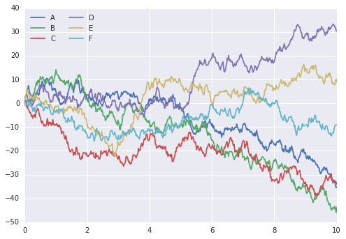

啊，好多了！

## 探索 Seaborn 绘图

Seaborn 的主要思想是它提供高级命令，来创建用于统计数据探索，甚至是一些统计模型拟合的各种绘图类型。

我们来看看Seaborn中可用的一些数据集和绘图类型。 请注意，以下所有都可以使用原始 Matplotlib 命令完成（事实上，这是 Seaborn 所做的事情），但 Seaborn API 更方便。

### 直方图，KDE，和密度

通常在统计数据可视化中，你只需要绘制直方图和变量的联合分布。我们已经看到这在 Matplotlib 中相对简单：

```py
data = np.random.multivariate_normal([0, 0], [[5, 2], [2, 2]], size=2000)
data = pd.DataFrame(data, columns=['x', 'y'])

for col in 'xy':
    plt.hist(data[col], normed=True, alpha=0.5)
```

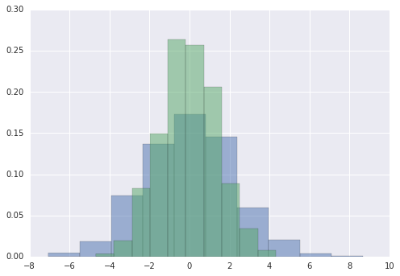

我们可以使用核密度估计来获得对分布的平滑估计，而不是直方图，Seaborn 使用``sns.kdeplot``来执行：

```py
for col in 'xy':
    sns.kdeplot(data[col], shade=True)
```

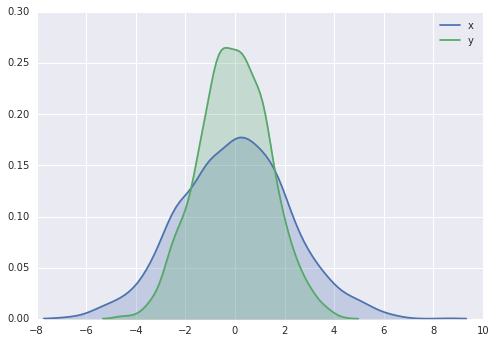

直方图和 KDE 可以使用``distplot``组合：

```py
sns.distplot(data['x'])
sns.distplot(data['y']);
```


如果我们将完整的二维数据集传递给``kdeplot``，我们将获得数据的二维可视化：

```py
sns.kdeplot(data);
```

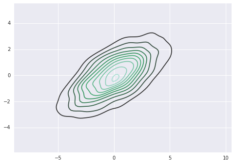

我们可以使用``sns.jointplot``查看联合分布和边缘分布。对于此图，我们将样式设置为白色背景：

```py
with sns.axes_style('white'):
    sns.jointplot("x", "y", data, kind='kde');
```

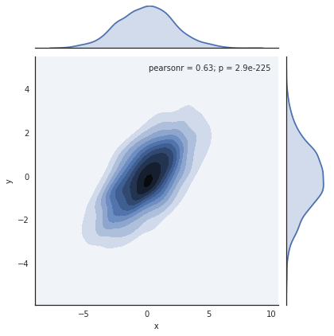

还有其他参数可以传递给``jointplot`` - 例如，我们可以使用基于六边形的直方图：

```py
with sns.axes_style('white'):
    sns.jointplot("x", "y", data, kind='hex')
```

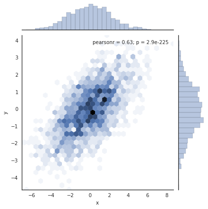

### 配对绘图

将联合绘图推广到高维数据集时，最终会得到配对绘图。 当你想要绘制所有值对于彼此的配对时，这对于探索多维数据之间的相关性非常有用。

我们将使用着名的鸢尾花数据集进行演示，该数据集列出了三种鸢尾花物种的花瓣和萼片的测量值：

```py
iris = sns.load_dataset("iris")
iris.head()
```

|  | sepal_length | sepal_width | petal_length | petal_width | species |
| --- | --- | --- | --- | --- | --- |
| 0 | 5.1 | 3.5 | 1.4 | 0.2 | setosa |
| 1 | 4.9 | 3.0 | 1.4 | 0.2 | setosa |
| 2 | 4.7 | 3.2 | 1.3 | 0.2 | setosa |
| 3 | 4.6 | 3.1 | 1.5 | 0.2 | setosa |
| 4 | 5.0 | 3.6 | 1.4 | 0.2 | setosa |

可视化样本之间的多维关系就像调用``sns.pairplot``一样简单：

```py
sns.pairplot(iris, hue='species', size=2.5);
```

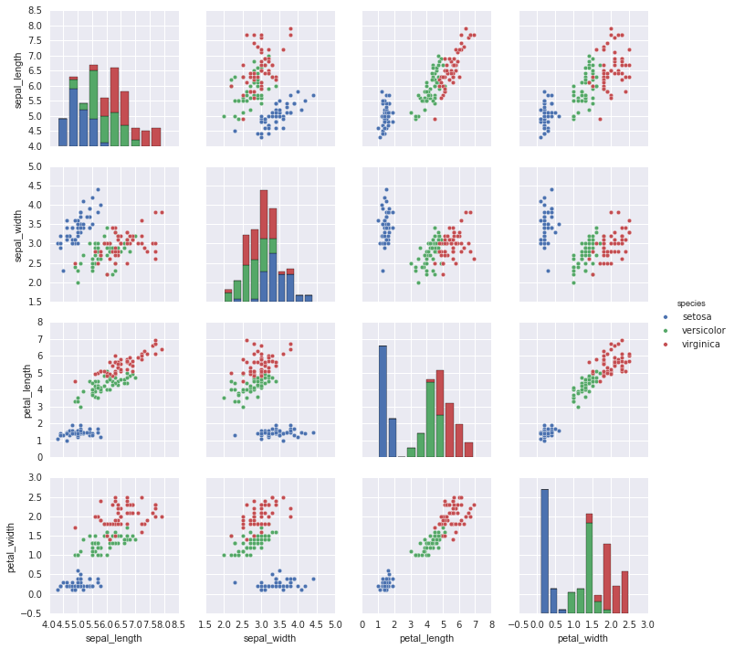


### 分面直方图

有时，查看数据的最佳方式是通过子集的直方图。 Seaborn 的``FacetGrid``使其非常简单。我们将根据各种指标数据查看一些数据，它们显示餐厅员工在小费中收到的金额：

```py
tips = sns.load_dataset('tips')
tips.head()
```

|  | total_bill | tip | sex | smoker | day | time | size |
| --- | --- | --- | --- | --- | --- | --- |
| 0 | 16.99 | 1.01 | Female | No | Sun | Dinner | 2 |
| 1 | 10.34 | 1.66 | Male | No | Sun | Dinner | 3 |
| 2 | 21.01 | 3.50 | Male | No | Sun | Dinner | 3 |
| 3 | 23.68 | 3.31 | Male | No | Sun | Dinner | 2 |
| 4 | 24.59 | 3.61 | Female | No | Sun | Dinner | 4 |

```py
tips['tip_pct'] = 100 * tips['tip'] / tips['total_bill']

grid = sns.FacetGrid(tips, row="sex", col="time", margin_titles=True)
grid.map(plt.hist, "tip_pct", bins=np.linspace(0, 40, 15));
```


### 因子图

因子图也可用于此类可视化。 这允许你查看由任何其他参数定义的桶中的参数分布：

```py
with sns.axes_style(style='ticks'):
    g = sns.factorplot("day", "total_bill", "sex", data=tips, kind="box")
    g.set_axis_labels("Day", "Total Bill");
```

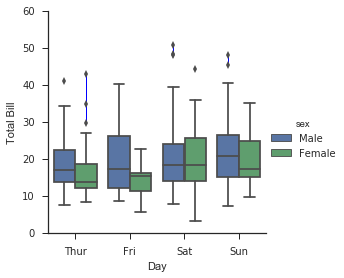


### 联合分布

与我们之前看到的配对图类似，我们可以使用``sns.jointplot``来显示不同数据集之间的联合分布以及相关的边缘分布：

```py
with sns.axes_style('white'):
    sns.jointplot("total_bill", "tip", data=tips, kind='hex')
```

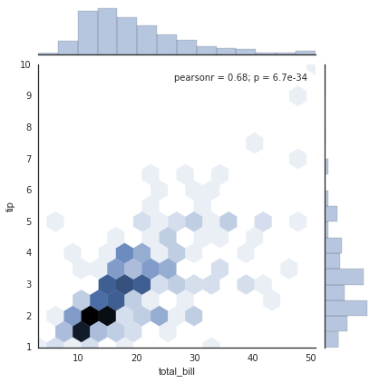

联合图甚至可以做一些自动的核密度估计和回归：

```py
sns.jointplot("total_bill", "tip", data=tips, kind='reg');
```

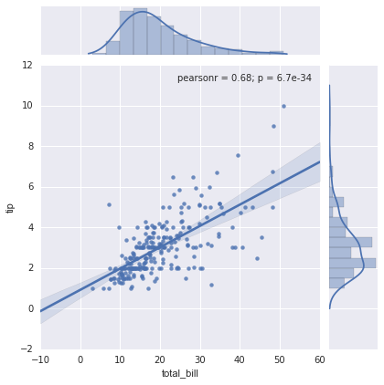


### 条形图

时间序列可以使用``sns.factorplot``绘制。 在下面的示例中，我们将使用我们在“聚合和分组”中首次看到的行星数据：

```py
planets = sns.load_dataset('planets')
planets.head()
```

|  | method | number | orbital_period | mass | distance | year |
| --- | --- | --- | --- | --- | --- | --- |
| 0 | Radial Velocity | 1 | 269.300 | 7.10 | 77.40 | 2006 |
| 1 | Radial Velocity | 1 | 874.774 | 2.21 | 56.95 | 2008 |
| 2 | Radial Velocity | 1 | 763.000 | 2.60 | 19.84 | 2011 |
| 3 | Radial Velocity | 1 | 326.030 | 19.40 | 110.62 | 2007 |
| 4 | Radial Velocity | 1 | 516.220 | 10.50 | 119.47 | 2009 |

```py
with sns.axes_style('white'):
    g = sns.factorplot("year", data=planets, aspect=2,
                       kind="count", color='steelblue')
    g.set_xticklabels(step=5)
```


通过查看每个行星的发现方法，我们可以了解更多信息：

```py
with sns.axes_style('white'):
    g = sns.factorplot("year", data=planets, aspect=4.0, kind='count',
                       hue='method', order=range(2001, 2015))
    g.set_ylabels('Number of Planets Discovered')
```

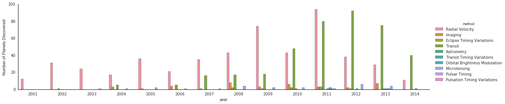

对于使用 Seaborn 进行绘图的更多信息，请参阅[ Seaborn 文档](http://seaborn.pydata.org/)，[教程](http://seaborn.pydata.org/tutorial.htm)和[ Seaborn 画廊](http://seaborn.pydata.org/examples/index.html)。

## 示例：探索马拉松结束时间

在这里，我们将使用 Seaborn 来帮我们可视化和理解马拉松的结果。我从 Web 上的数据源抓取数据，汇总并删除任何身份信息，并将其放在 GitHub 上，可以在那里下载（如果你有兴趣使用 Python 抓取网页，我建议阅读 Ryan Mitchell 的[《Web Scraping with Python》](http://shop.oreilly.com/product/0636920034391.do)。我们首先从 Web 下载数据并将其加载到 Pandas 中：

```py
# !curl -O https://raw.githubusercontent.com/jakevdp/marathon-data/master/marathon-data.csv

data = pd.read_csv('marathon-data.csv')
data.head()
```

|  | age | gender | split | final |
| --- | --- | --- | --- | --- |
| 0 | 33 | M | 01:05:38 | 02:08:51 |
| 1 | 32 | M | 01:06:26 | 02:09:28 |
| 2 | 31 | M | 01:06:49 | 02:10:42 |
| 3 | 38 | M | 01:06:16 | 02:13:45 |
| 4 | 31 | M | 01:06:32 | 02:13:59 |

默认情况下，Pandas 将时间列加载为 Python 字符串（类型``object``）；我们可以通过查看`DataFrame`的``dtypes``属性来看到它：

```py
data.dtypes

'''
age        int64
gender    object
split     object
final     object
dtype: object
'''
```

让我们通过为时间提供转换器来解决这个问题：

```py
def convert_time(s):
    h, m, s = map(int, s.split(':'))
    return pd.datetools.timedelta(hours=h, minutes=m, seconds=s)

data = pd.read_csv('marathon-data.csv',
                   converters={'split':convert_time, 'final':convert_time})
data.head()
```

|  | age | gender | split | final |
| --- | --- | --- | --- | --- |
| 0 | 33 | M | 01:05:38 | 02:08:51 |
| 1 | 32 | M | 01:06:26 | 02:09:28 |
| 2 | 31 | M | 01:06:49 | 02:10:42 |
| 3 | 38 | M | 01:06:16 | 02:13:45 |
| 4 | 31 | M | 01:06:32 | 02:13:59 |

```py
data.dtypes

'''
age                 int64
gender             object
split     timedelta64[ns]
final     timedelta64[ns]
dtype: object
'''
```

这看起来好多了。 出于我们的 Seaborn 绘图工具的目的，让我们接下来添加以秒为单位的列：

```py
data['split_sec'] = data['split'].astype(int) / 1E9
data['final_sec'] = data['final'].astype(int) / 1E9
data.head()
```

|  | age | gender | split | final | split_sec | final_sec |
| --- | --- | --- | --- | --- | --- | --- |
| 0 | 33 | M | 01:05:38 | 02:08:51 | 3938.0 | 7731.0 |
| 1 | 32 | M | 01:06:26 | 02:09:28 | 3986.0 | 7768.0 |
| 2 | 31 | M | 01:06:49 | 02:10:42 | 4009.0 | 7842.0 |
| 3 | 38 | M | 01:06:16 | 02:13:45 | 3976.0 | 8025.0 |
| 4 | 31 | M | 01:06:32 | 02:13:59 | 3992.0 | 8039.0 |

为了了解数据的样子，我们可以在数据上绘制一个``jointplot``：

```py
with sns.axes_style('white'):
    g = sns.jointplot("split_sec", "final_sec", data, kind='hex')
    g.ax_joint.plot(np.linspace(4000, 16000),
                    np.linspace(8000, 32000), ':k')
```

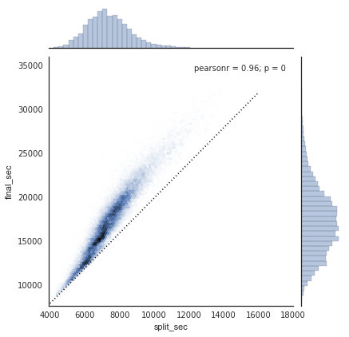

虚线表示如果他们以完全稳定的速度跑马拉松，那么某人的时间会在哪里。 分布高于此的事实表明（正如你所料）大多数人在马拉松比赛过程中减速。如果你有竞争力，那么你就会知道那些在比赛后半段跑得更快的人 - 被称为将比赛负分割（negative-split）。

让我们在数据中创建另一个列，即分割分数，它测量每个运动员将比赛负分割或正分割（positive-split）的程度：

```py
data['split_frac'] = 1 - 2 * data['split_sec'] / data['final_sec']
data.head()
```

|  | age | gender | split | final | split_sec | final_sec | split_frac |
| --- | --- | --- | --- | --- | --- | --- | --- |
| 0 | 33 | M | 01:05:38 | 02:08:51 | 3938.0 | 7731.0 | -0.018756 |
| 1 | 32 | M | 01:06:26 | 02:09:28 | 3986.0 | 7768.0 | -0.026262 |
| 2 | 31 | M | 01:06:49 | 02:10:42 | 4009.0 | 7842.0 | -0.022443 |
| 3 | 38 | M | 01:06:16 | 02:13:45 | 3976.0 | 8025.0 | 0.009097 |
| 4 | 31 | M | 01:06:32 | 02:13:59 | 3992.0 | 8039.0 | 0.006842 |

如果此分割差异小于零，则这个人将比赛以这个比例负分割。让我们绘制这个分割分数的分布图：

```py
sns.distplot(data['split_frac'], kde=False);
plt.axvline(0, color="k", linestyle="--");
```

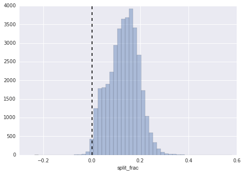

```py
sum(data.split_frac < 0)

# 251
```

在近 40,000 名参与者中，只有 250 人将马拉松负分割。

让我们看看这个分割分数和其他变量之间是否存在任何相关性。我们将使用``pairgrid``来绘制所有这些相关性：

```py
g = sns.PairGrid(data, vars=['age', 'split_sec', 'final_sec', 'split_frac'],
                 hue='gender', palette='RdBu_r')
g.map(plt.scatter, alpha=0.8)
g.add_legend();
```

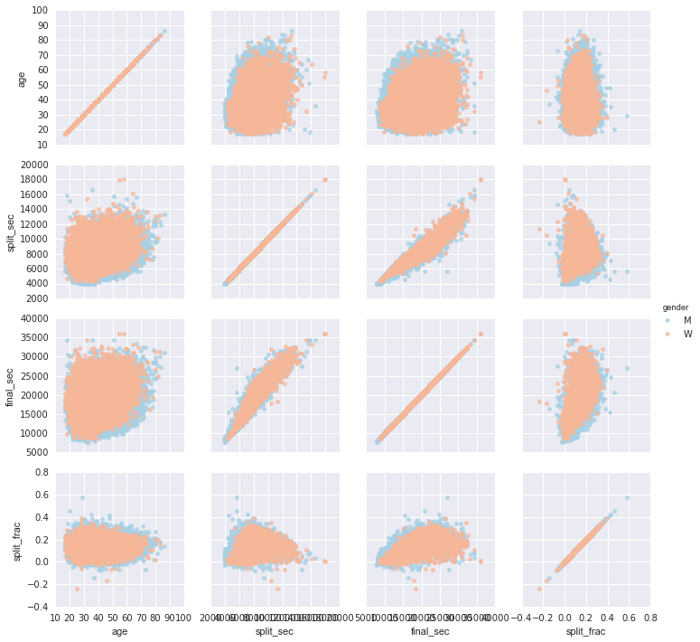


看起来分割分数与年龄没有特别的关联，但确实与最终时间相关：更快的运动员往往将马拉松时间等分。（我们在这里看到，当涉及到绘图样式时，Seaborn 不是 Matplotlib 弊病的灵丹妙药：特别是，`x`轴标签重叠。因为输出是一个简单的 Matplotlib 图，但是，“自定义刻度”中的方法可以用来调整这些东西。）

这里男女之间的区别很有意思。 让我们看看这两组的分割分数的直方图：

```py
sns.kdeplot(data.split_frac[data.gender=='M'], label='men', shade=True)
sns.kdeplot(data.split_frac[data.gender=='W'], label='women', shade=True)
plt.xlabel('split_frac');
```

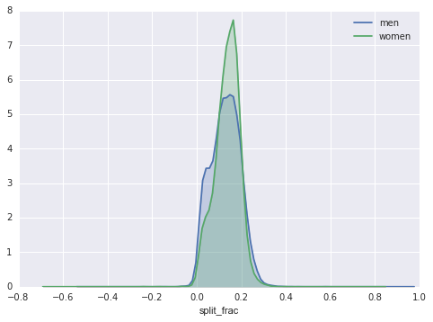

这里有趣的是，有更多的男人比女人更接近等分！这几乎看起来像男女之间的某种双峰分布。 让我们看看，我们是否可以通过将分布看做年龄的函数，来判断发生了什么。

比较分布的好方法是使用提琴图：

```py
sns.violinplot("gender", "split_frac", data=data,
               palette=["lightblue", "lightpink"]);
```

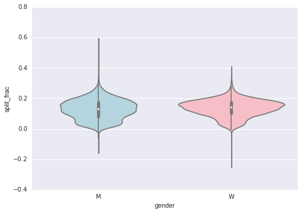


这是比较男女之间分布的另一种方式。

让我们看得深入一些，然后将这些提琴图作为年龄的函数进行比较。我们首先在数组中创建一个新列，指定每个人的年龄，以十年为单位：

```py
data['age_dec'] = data.age.map(lambda age: 10 * (age // 10))
data.head()
```

|  | age | gender | split | final | split_sec | final_sec | split_frac | age_dec |
| --- | --- | --- | --- | --- | --- | --- | --- | --- |
| 0 | 33 | M | 01:05:38 | 02:08:51 | 3938.0 | 7731.0 | -0.018756 | 30 |
| 1 | 32 | M | 01:06:26 | 02:09:28 | 3986.0 | 7768.0 | -0.026262 | 30 |
| 2 | 31 | M | 01:06:49 | 02:10:42 | 4009.0 | 7842.0 | -0.022443 | 30 |
| 3 | 38 | M | 01:06:16 | 02:13:45 | 3976.0 | 8025.0 | 0.009097 | 30 |
| 4 | 31 | M | 01:06:32 | 02:13:59 | 3992.0 | 8039.0 | 0.006842 | 30 |

```py
men = (data.gender == 'M')
women = (data.gender == 'W')

with sns.axes_style(style=None):
    sns.violinplot("age_dec", "split_frac", hue="gender", data=data,
                   split=True, inner="quartile",
                   palette=["lightblue", "lightpink"]);
```

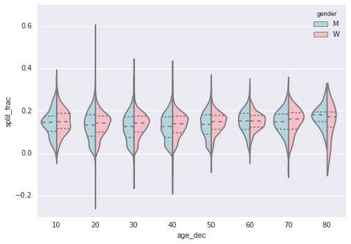


考虑到这一点，我们可以看到男性和女性的分布在哪里不同：与同龄（或任何年龄的）女性相比，20 到 50 岁男性的分割分布，与较低的分割相比，表现出明显的过度密集。

同样令人惊讶的是，这位 80 岁的女性在分割时间方面表现优于每个人。 这可能是因为我们估计来自小数字的分布，因为在该范围内只有少数运动员：

```py
(data.age > 80).sum()

# 7
```

回到带有负分割的男性：谁是这些运动员？ 这个分割分数是否与快速结束相关？ 我们可以很容易地绘制这个图。 我们将使用``regplot``，它将自动拟合数据的线性回归：

```py
g = sns.lmplot('final_sec', 'split_frac', col='gender', data=data,
               markers=".", scatter_kws=dict(color='c'))
g.map(plt.axhline, y=0.1, color="k", ls=":");
```

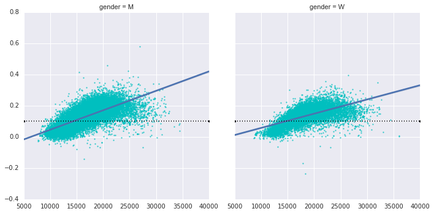

显然，带有快速分割的人是精英运动员，他们在约 15,000 秒或约 4 小时内结束。 慢于此的人不太可能具有快速的第二次分割。
