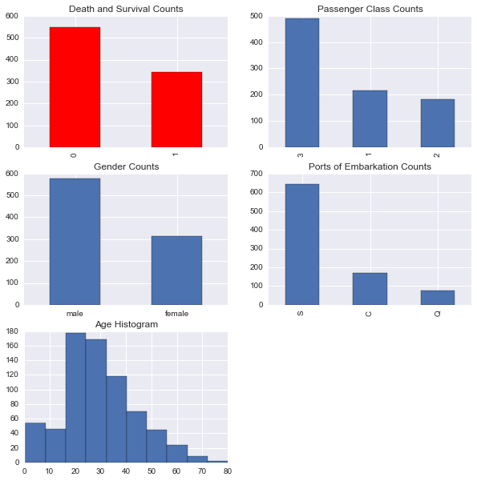
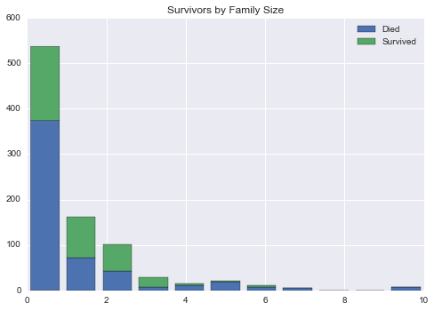
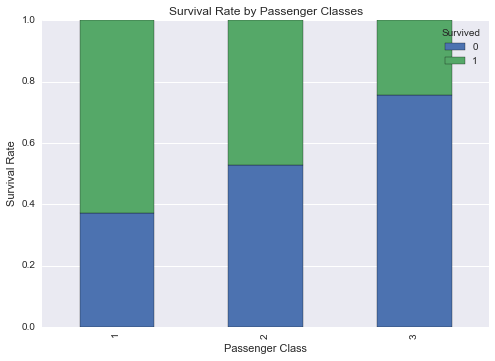
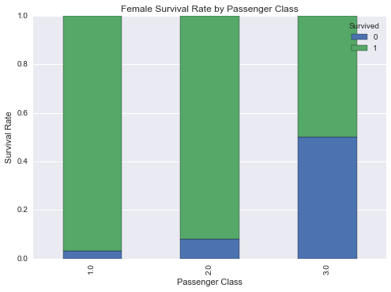
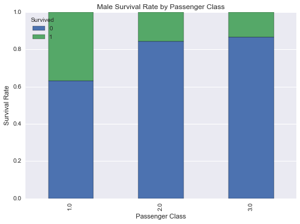
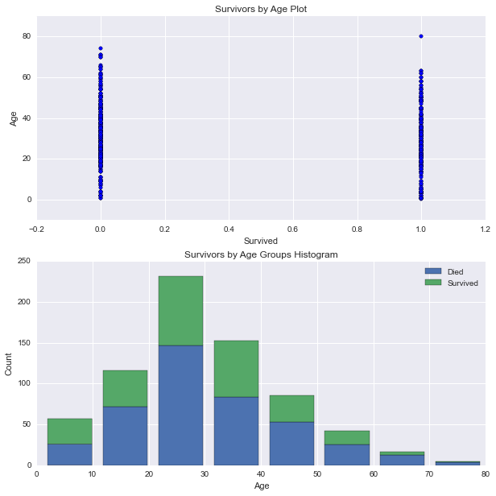
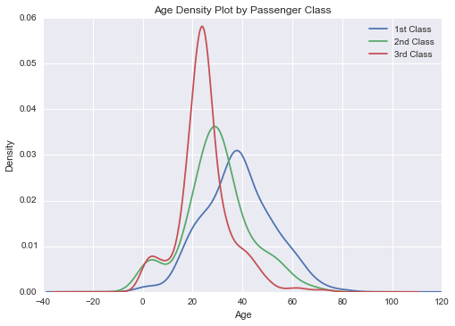

# 8.2 Matplotlib 的应用

> 原文：[matplotlib-applied](https://nbviewer.jupyter.org/github/donnemartin/data-science-ipython-notebooks/blob/master/matplotlib/matplotlib-applied.ipynb)
> 
> 译者：[飞龙](https://github.com/wizardforcel)
> 
> 协议：[CC BY-NC-SA 4.0](http://creativecommons.org/licenses/by-nc-sa/4.0/)（原文协议：[Apache License 2.0](https://github.com/donnemartin/data-science-ipython-notebooks/blob/master/LICENSE)）

* 将 Matplotlib 可视化用于 Kaggle：泰坦尼克
* 条形图，直方图，`subplot2grid`
* 标准化绘图
* 散点图，子图
* 核密度估计绘图

## 将 Matplotlib 可视化用于 Kaggle：泰坦尼克

准备泰坦尼克数据用于绘图：

```py
%matplotlib inline
import pandas as pd
import numpy as np
import pylab as plt
import seaborn

# 设置 matplotlib 图形的全局默认大小
plt.rc('figure', figsize=(10, 5))

# 将 seaborn 美学参数设为默认值
seaborn.set()

df_train = pd.read_csv('../data/titanic/train.csv')

def clean_data(df):
    
    # 获取性别的唯一值
    sexes = np.sort(df['Sex'].unique())
    
    # 生成性别的映射，从字符串到数值表示
    genders_mapping = dict(zip(sexes, range(0, len(sexes) + 1)))

    # 将性别从字符串转换为数值表示
    df['Sex_Val'] = df['Sex'].map(genders_mapping).astype(int)
    
    # 获取出发地的唯一值
    embarked_locs = np.sort(df['Embarked'].unique())

    # 生成出发地的映射，从字符串到数值表示
    embarked_locs_mapping = dict(zip(embarked_locs, 
                                     range(0, len(embarked_locs) + 1)))
    
    # 将出发地从字符串转换为数值表示
    df = pd.concat([df, pd.get_dummies(df['Embarked'], prefix='Embarked_Val')], axis=1)
    
    # 填充出发地的缺失值
    # 由于大多数乘法都从 'S': 3 出发
    # 我们将出发地的缺失值赋为 'S'
    if len(df[df['Embarked'].isnull()] > 0):
        df.replace({'Embarked_Val' : 
                       { embarked_locs_mapping[np.nan] : embarked_locs_mapping['S'] 
                       }
                   }, 
                   inplace=True)
    
    # 使用平均票价填充票价的缺失值
    if len(df[df['Fare'].isnull()] > 0):
        avg_fare = df['Fare'].mean()
        df.replace({ None: avg_fare }, inplace=True)
    
    # 为了保留年龄，制作它的副本，叫做 AgeFill
    # 我们会使用它来填充缺失值
    df['AgeFill'] = df['Age']

    # 对于每个乘客的舱位，根据 Sex_Val 决定年龄特点 
    # 我们将使用中值而不是均值
    # 因为年龄直方图看起来是右偏的
    df['AgeFill'] = df['AgeFill'] \
                        .groupby([df['Sex_Val'], df['Pclass']]) \
                        .apply(lambda x: x.fillna(x.median()))
            
    # 定义新的特征 FamilySize，它是 
    # Parch（船上的父母或子女数量）和 
    # SibSp（船上的兄弟姐妹或配偶数量）的总和
    df['FamilySize'] = df['SibSp'] + df['Parch']
    
    return df

df_train = clean_data(df_train)
```

## 条形图，直方图，`subplot2grid`

```py
# 包含子图的 matplotlib 图像尺寸
figsize_with_subplots = (10, 10)

# 配置绘图网格
fig = plt.figure(figsize=figsize_with_subplots) 
fig_dims = (3, 2)

# 绘制死亡和生存数量
plt.subplot2grid(fig_dims, (0, 0))
df_train['Survived'].value_counts().plot(kind='bar', 
                                         title='Death and Survival Counts',
                                         color='r',
                                         align='center')

# 绘制舱位计数
plt.subplot2grid(fig_dims, (0, 1))
df_train['Pclass'].value_counts().plot(kind='bar', 
                                       title='Passenger Class Counts')

# 绘制性别计数
plt.subplot2grid(fig_dims, (1, 0))
df_train['Sex'].value_counts().plot(kind='bar', 
                                    title='Gender Counts')
plt.xticks(rotation=0)

# 绘制出发港口计数
plt.subplot2grid(fig_dims, (1, 1))
df_train['Embarked'].value_counts().plot(kind='bar', 
                                         title='Ports of Embarkation Counts')

# 绘制年龄直方图
plt.subplot2grid(fig_dims, (2, 0))
df_train['Age'].hist()
plt.title('Age Histogram')

# <matplotlib.text.Text at 0x11357ac50>
```



```py
# 获取出发港口的唯一值和最大值
family_sizes = np.sort(df_train['FamilySize'].unique())
family_size_max = max(family_sizes)

df1 = df_train[df_train['Survived'] == 0]['FamilySize']
df2 = df_train[df_train['Survived'] == 1]['FamilySize']
plt.hist([df1, df2], 
         bins=family_size_max + 1, 
         range=(0, family_size_max), 
         stacked=True)
plt.legend(('Died', 'Survived'), loc='best')
plt.title('Survivors by Family Size')

# <matplotlib.text.Text at 0x1138e6f10>
```



## 标准化绘图

```py
pclass_xt = pd.crosstab(df_train['Pclass'], df_train['Survived'])

# 标准化 crosstab 并使和为一
pclass_xt_pct = pclass_xt.div(pclass_xt.sum(1).astype(float), axis=0)

pclass_xt_pct.plot(kind='bar', 
                   stacked=True, 
                   title='Survival Rate by Passenger Classes')
plt.xlabel('Passenger Class')
plt.ylabel('Survival Rate')

# 根据性别绘制生存率
females_df = df_train[df_train['Sex'] == 'female']
females_xt = pd.crosstab(females_df['Pclass'], df_train['Survived'])
females_xt_pct = females_xt.div(females_xt.sum(1).astype(float), axis=0)
females_xt_pct.plot(kind='bar', 
                    stacked=True, 
                    title='Female Survival Rate by Passenger Class')
plt.xlabel('Passenger Class')
plt.ylabel('Survival Rate')

# 根据舱位绘制生存率
males_df = df_train[df_train['Sex'] == 'male']
males_xt = pd.crosstab(males_df['Pclass'], df_train['Survived'])
males_xt_pct = males_xt.div(males_xt.sum(1).astype(float), axis=0)
males_xt_pct.plot(kind='bar', 
                  stacked=True, 
                  title='Male Survival Rate by Passenger Class')
plt.xlabel('Passenger Class')
plt.ylabel('Survival Rate')

# <matplotlib.text.Text at 0x113ccbc50>
```







## 散点图，子图

```py
# 建立绘图网格
fig, axes = plt.subplots(2, 1, figsize=figsize_with_subplots)

# 按照 Survived 分组的 AgeFill 的直方图
df1 = df_train[df_train['Survived'] == 0]['Age']
df2 = df_train[df_train['Survived'] == 1]['Age']
max_age = max(df_train['AgeFill'])

axes[1].hist([df1, df2], 
             bins=max_age / 10, 
             range=(1, max_age), 
             stacked=True)
axes[1].legend(('Died', 'Survived'), loc='best')
axes[1].set_title('Survivors by Age Groups Histogram')
axes[1].set_xlabel('Age')
axes[1].set_ylabel('Count')

# 绘图 Survived 和 AgeFill 的散点图
axes[0].scatter(df_train['Survived'], df_train['AgeFill'])
axes[0].set_title('Survivors by Age Plot')
axes[0].set_xlabel('Survived')
axes[0].set_ylabel('Age')

# <matplotlib.text.Text at 0x113f4d710>
```



## 核密度估计绘图

```py
# 获取舱位的唯一值
passenger_classes = np.sort(df_train['Pclass'].unique())

for pclass in passenger_classes:
    df_train.AgeFill[df_train.Pclass == pclass].plot(kind='kde')
plt.title('Age Density Plot by Passenger Class')
plt.xlabel('Age')
plt.legend(('1st Class', '2nd Class', '3rd Class'), loc='best')

# <matplotlib.legend.Legend at 0x113175ed0>
```

