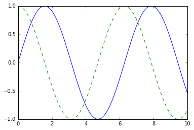
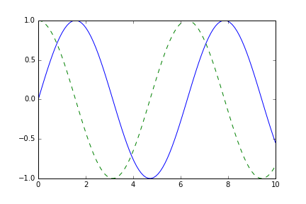
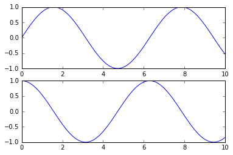

# 8.3 Matplotlib 可视化

> 原文：[Visualization with Matplotlib](https://nbviewer.jupyter.org/github/donnemartin/data-science-ipython-notebooks/blob/master/matplotlib/04.00-Introduction-To-Matplotlib.ipynb)
> 
> 译者：[飞龙](https://github.com/wizardforcel)
> 
> 协议：[CC BY-NC-SA 4.0](http://creativecommons.org/licenses/by-nc-sa/4.0/)
> 
> 本节是[《Python 数据科学手册》](https://github.com/jakevdp/PythonDataScienceHandbook)（Python Data Science Handbook）的摘录。

我们现在将深入研究M atplotlib 包，以便在 Python 中进行可视化。Matplotlib 是一个基于 NumPy 数组的多平台数据可视化库，旨在兼容更广泛的 SciPy 技术栈。它由 John Hunter 在 2002 年构思，最初是作为 IPython 的补丁，用于通过来自 IPython 命令行的`gnuplot`实现 MATLAB 风格的交互式绘图。

IPython 的创始人 Fernando Perez 当时正努力完成他的博士学位，并且 John 知道他几个月都没时间审查补丁。John 把它看做一个使自己开始的动机，之后 Matplotlib 软件包诞生了，2003 年发布了 0.1 版本。当它被用作太空望远镜科学研究所（哈勃望远镜背后的人）选择的绘图包时，它得到了早期的赞助，该研究所在财务上支持了 Matplotlib 的开发，并极大地扩展了它的能力。

Matplotlib 最重要的功能之一是，它能够很好地兼容许多操作系统和图形后端。Matplotlib 支持许多后端和输出类型，这意味着无论你使用哪种操作系统或你希望使用哪种输出格式，你都可以依赖它。

这种跨平台的通用方法是 Matplotlib 的强大优势之一。它带来了庞大的用户群，这反过来又产生了活跃的开发人员的基础，和 Python 科学世界中的 Matplotlib 的威力和普遍性。

然而，近年来，Matplotlib 的界面和风格已经有些过时。
比起 R 语言中的`ggplot`和`ggvis`等新工具，以及基于 D3js 和 HTML5 画布的 Web 可视化工具包，Matplotlib 显得笨重和陈旧。尽管如此，我认为我们不能忽视 Matplotlib 作为经过良好测试的跨平台图形引擎的优势。

最近的 Matplotlib 版本，使得设置新的全局绘图样式变得相对容易（参见“自定义 Matplotlib：配置和样式表”），人们一直在开发新的包，它们基于 Matplotlib 的强大内核，通过更清洁，更现代的 API 驱动 Matplotlib - 例如，Seaborn（“可视化与 Seaborn”），[ggpy](http://yhat.github.io/ggpy /)，[HoloViews](http://holoviews.org/)，[Altair](http://altair-viz.github.io/)，甚至 Pandas 本身都可以用作 Matplotlib API 的包装。

即使使用这样的包装器，通常也可以深入研究 Matplotlib 的语法来调整最终的绘图输出。出于这个原因，我相信 Matplotlib 本身，仍将是数据可视化技术栈的重要组件，即使新工具意味着社区逐渐不再使用 Matplotlib API。

## 一般 Matplotlib 提示

在我们深入了解使用 Matplotlib 创建可视化的细节之前，你应该了解一些使用该软件包的有用信息。

### 导入 Matplotlib

正如我们对 NumPy 使用``np``简写，对 Pandas 使用``pd``简写一样，我们将对 Matplotlib 导入使用一些标准简写：

```py
import matplotlib as mpl
import matplotlib.pyplot as plt
```

我们将经常使用``plt``接口，我们将在本章中看到。

### 设置样式

我们将使用``plt.style``指令，为我们的图形选择合适的美学风格。在这里，我们将设置``classic``样式，确保我们创建的图使用经典的 Matplotlib 样式：

```py
plt.style.use('classic')
```

在本节中，我们将按需调整此样式。请注意，此处使用的样式表从 Matplotlib 1.5 版开始得到支持；如果你使用的是早期版本的 Matplotlib ，则只能使用默认样式。样式表的更多信息，请参阅“自定义 Matplotlib：配置和样式表”。

### ``show()``还是不``show()``？如何展示你的绘图

你看不到的可视化并没什么用，但是你查看 Matplotlib 绘图的方式取决于上下文。Matplotlib 的最佳用法取决于你的使用方式；粗略地说，三个适用的上下文是，在脚本，IPython 终端或 IPython 笔记本中使用 Matplotlib。

#### 来自脚本的绘图

如果你在脚本中使用 Matplotlib，函数``plt.show()``就是你的伙伴。``plt.show()``启动一个事件循环，查找所有当前活动的图形对象，并打开一个或多个显示你的图形的交互式窗口。

因此，例如，你可能有一个名为`myplot.py`的文件，其中包含以下内容：

```py
# ------- 文件：myplot.py ------
import matplotlib.pyplot as plt
import numpy as np

x = np.linspace(0, 10, 100)

plt.plot(x, np.sin(x))
plt.plot(x, np.cos(x))

plt.show()
```

然后，你可以从命令行运行此脚本，这将打开一个窗口并显示你的图形：

```
$ python myplot.py
```

``plt.show()``命令做了很多工作，因为它必须与系统的交互式图形后端进行交互。此操作的细节可能因不同系统，甚至安装而异，但 matplotlib 会尽力对你隐藏所有这些细节。

有一点需要注意：``plt.show()``命令应该在每个 Python 会话中只使用一次，并且最常见于脚本的最后。多个``show（）``命令可能产生不可预测的后端依赖的行为，并且多数情况下应该避免。

#### 来自 IPython shell 的绘图

在 IPython shell 中以交互方式使用 Matplotlib 非常方便（参见“IPython：不只是普通的 Python”）。如果指定 Matplotlib 模式，IPython 可以很好地配合 Matplotlib。要启用此模式，可以在启动``ipython``后使用``%matplotlib``魔术命令：

```ipython
In [1]: %matplotlib
Using matplotlib backend: TkAgg

In [2]: import matplotlib.pyplot as plt
```

此时，任何``plt``绘图命令都会打开一个图形窗口，可以运行更多命令来更新绘图。一些更改（例如修改已绘制的直线的属性）将不会自动绘制：要强制更新，请使用``plt.draw()``。不需要在 Matplotlib 模式下使用``plt.show()``。

#### 来自 IPython 笔记本的绘图

IPython 笔记本是一个基于浏览器的，交互式数据分析工具，可以将叙述，代码，图形，HTML 元素等组合到一个可执行文档中（参见“IPython：不只是普通的 Python”）。

IPython 笔记本中的交互式绘图，可以使用``%matplotlib``命令完成，其工作方式与 IPython shell 类似。在 IPython 笔记本中，你还可以选择直接在笔记本中嵌入图形，有两种可能的选择：

- ``%matplotlib notebook``将产生嵌入在笔记本中的交互式绘图
- ``%matplotlib inline``将产生嵌入在笔记本中的绘图的静态图像

对于本书，我们通常会选择``%matplotlib inline``：

```py
%matplotlib inline
```

运行此命令后（每个内核/会话只需执行一次），笔记本中创建绘图的任何单元格，都将嵌入所得图形的 PNG 图像：

```py
import numpy as np
x = np.linspace(0, 10, 100)

fig = plt.figure()
plt.plot(x, np.sin(x), '-')
plt.plot(x, np.cos(x), '--');
```




### 将图形保存到文件

Matplotlib 的一个很好的功能，是以各种格式保存图形的能力。保存图形可以使用``savefig()``命令完成。例如，要将上一个图形保存为 PNG 文件，可以运行以下命令：

```py
fig.savefig('my_figure.png')
```

在当前工作目录中，我们现在有一个名为``my_figure.png``的文件：

```py
!ls -lh my_figure.png

# -rw-r--r--  1 jakevdp  staff    16K Aug 11 10:59 my_figure.png
```

为了确认它包含我们认为它包含的内容，让我们使用 IPython ``Image``对象来显示该文件的内容：

```py
from IPython.display import Image
Image('my_figure.png')
```



在``savefig()``中，文件格式是从给定文件名的扩展名推断出来的。根据你安装的后端，可以使用许多不同的文件格式。通过使用图形画布对象的以下方法，可以找到系统支持的文件类型列表：

```py
fig.canvas.get_supported_filetypes()

'''
{'eps': 'Encapsulated Postscript',
 'jpeg': 'Joint Photographic Experts Group',
 'jpg': 'Joint Photographic Experts Group',
 'pdf': 'Portable Document Format',
 'pgf': 'PGF code for LaTeX',
 'png': 'Portable Network Graphics',
 'ps': 'Postscript',
 'raw': 'Raw RGBA bitmap',
 'rgba': 'Raw RGBA bitmap',
 'svg': 'Scalable Vector Graphics',
 'svgz': 'Scalable Vector Graphics',
 'tif': 'Tagged Image File Format',
 'tiff': 'Tagged Image File Format'}
'''
```

请注意，在保存图形时，不必使用前面讨论过的``plt.show()``或相关命令。

## 一个功能的两个接口

Matplotlib 的一个可能令人困惑的特性是它的两个接口：一个是方便的 MATLAB 风格的，基于状态的接口，以及一个更强大的面向对象的接口。我们将在这里快速强调两者之间的差异。

#### MATLAB 风格的接口

Matplotlib 最初编写为 MATLAB 用户的 Python 替代品，其大部分语法都反映了这一事实。MATLAB 风格的工具包含在`pyplot`（``plt``）接口中。例如，以下代码可能对 MATLAB 用户来说非常熟悉：

```py
plt.figure()  # 创建绘图图形

# 创建两个面板的第一个并设置当前轴
plt.subplot(2, 1, 1) # 行，列，面板号
plt.plot(x, np.sin(x))

# 创建第二个面板并设置当前轴
plt.subplot(2, 1, 2)
plt.plot(x, np.cos(x));
```




重要的是要注意这个接口是有状态的：它跟踪“当前”图形和轴域，这是所有``plt``命令都适用的地方。你可以使用``plt.gcf()``（获取当前图形）和``plt.gca()``（获取当前轴域）例程来获取这些引用。

虽然这种状态接口对于简单的绘图来说既快速又方便，但很容易遇到问题。例如，一旦创建了第二个面板，我们如何返回并向第一个面板添加内容？这在 MATLAB 风格的接口中是可能的，但有点笨拙。幸运的是，有一种更好的方法。

#### 面向对象的接口

面向对象的接口可用于这些更复杂的情况，以及需要对图形进行更多控制的时候。在面向对象的界面中，绘图函数并不依赖于“活动”图形或轴域的某些概念，而是显式“图形”和“轴域”对象的方法。要使用此风格的绘图重新创建上一个绘图，你可以执行以下操作：

```py
# 首先创建绘图网格
# ax will be an array of two Axes objects
fig, ax = plt.subplots(2)

# 在对应对象上调用 plot() 方法
ax[0].plot(x, np.sin(x))
ax[1].plot(x, np.cos(x));
```


对于更简单的图，选择使用哪种样式在很大程度上取决于偏好，但随着变得更复杂，面向对象的方法可能成为必要。在本章中，我们将根据最方便的方式，在 MATLAB风 格和面向对象的界面之间切换。在大多数情况下，差异就像切换``plt.plot()``到``ax.plot()``一样小，但是在下面的章节中我们会强调一些问题。