# 8.4 简单的折线图

> 原文：[Simple Line Plots](https://nbviewer.jupyter.org/github/donnemartin/data-science-ipython-notebooks/blob/master/matplotlib/04.01-Simple-Line-Plots.ipynb)
> 
> 译者：[飞龙](https://github.com/wizardforcel)
> 
> 协议：[CC BY-NC-SA 4.0](http://creativecommons.org/licenses/by-nc-sa/4.0/)
> 
> 本节是[《Python 数据科学手册》](https://github.com/jakevdp/PythonDataScienceHandbook)（Python Data Science Handbook）的摘录。

也许最简单的绘图是单个函数`y = f(x)`的可视化。在这里，我们将首先看一下这种类型的简单绘图。与以下所有部分一样，我们首先为绘图配置笔记本，并导入我们将使用的包：

```py
%matplotlib inline
import matplotlib.pyplot as plt
plt.style.use('seaborn-whitegrid')
import numpy as np
```

对于所有 Matplotlib 绘图，我们首先创建一个图形和一个轴域。在最简单的形式中，可以按如下方式创建图形和轴域：

```py
fig = plt.figure()
ax = plt.axes()
```

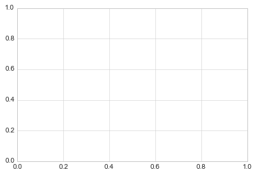

在Matplotlib中，图形（`plt.Figure`类的实例）可以视为单个容器，包含代表轴域，图形，文本和标签的所有对象。轴域（`plt.Axes`类的实例）就是我们在上面看到的：带有刻度和标签的边界框，它最终将包含构成我们可视化的绘图元素。在本书中，我们通常使用变量名``fig``来引用图形实例，而``ax``来引用一个或一组轴域实例。

一旦我们创建了轴域，我们就可以使用``ax.plot``函数来绘制一些数据。 让我们从一个简单的正弦曲线开始：

```py
fig = plt.figure()
ax = plt.axes()

x = np.linspace(0, 10, 1000)
ax.plot(x, np.sin(x));
```


或者，我们可以使用`pylab`接口，让我们在后台创建图形和轴域
（参见“一个功能的两个接口”，那里讨论了这两个接口）：

```py
plt.plot(x, np.sin(x));
```


如果我们想要创建一个包含多条直线的单个图形，我们可以简单地多次调用``plot``函数：

```py
plt.plot(x, np.sin(x))
plt.plot(x, np.cos(x));
```

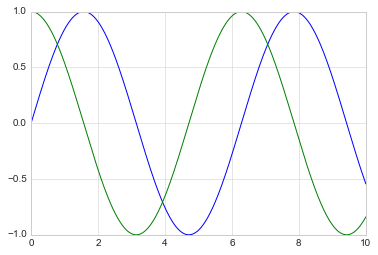


这就是在 Matplotlib 中绘制简单函数的全部内容！我们现在将深入探讨，如何控制轴域和线条的外观的更多细节。

## 调整绘图：线条颜色和样式

你可能希望对绘图进行的第一个调整，是控制线条颜色和样式。``plt.plot()``函数接受可用于指定这些的其他参数。要调整颜色，可以使用``color``关键字，该关键字接受字符串参数，表示几乎任何可以想象的颜色。颜色可以通过多种方式指定：

```py
plt.plot(x, np.sin(x - 0), color='blue')        # 根据名称指定颜色
plt.plot(x, np.sin(x - 1), color='g')           # 短颜色代码（rgbcmyk）
plt.plot(x, np.sin(x - 2), color='0.75')        # 0~1 的灰度
plt.plot(x, np.sin(x - 3), color='#FFDD44')     # 十六进制代码（00~FF 的 RRGGBB）
plt.plot(x, np.sin(x - 4), color=(1.0,0.2,0.3)) # RGB 元组，值为 0~1
plt.plot(x, np.sin(x - 5), color='chartreuse'); # 支持所有 HTML 颜色名
```

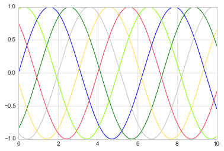


如果未指定颜色，Matplotlib 将自动遍历一组默认颜色，来显示多个线条。

同样，可以使用``linestyle``关键字调整线条样式：

```py
plt.plot(x, x + 0, linestyle='solid')
plt.plot(x, x + 1, linestyle='dashed')
plt.plot(x, x + 2, linestyle='dashdot')
plt.plot(x, x + 3, linestyle='dotted');

# 简短起见，你可以使用下面的代码
plt.plot(x, x + 4, linestyle='-')  # 实线
plt.plot(x, x + 5, linestyle='--') # 虚线
plt.plot(x, x + 6, linestyle='-.') # 点虚线
plt.plot(x, x + 7, linestyle=':');  # 点线
```

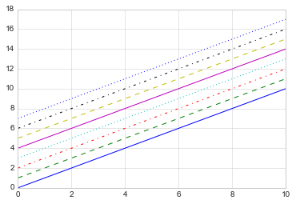

如果你想非常简洁，这些``linestyle``和``color``代码可以合并为``plt.plot()``函数的一个非关键字参数：

```py
plt.plot(x, x + 0, '-g')  # 绿色实线
plt.plot(x, x + 1, '--c') # 青色虚线
plt.plot(x, x + 2, '-.k') # 黑色点虚线
plt.plot(x, x + 3, ':r');  # 红色点线
```

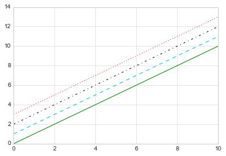


这些单字符颜色代码反映了 RGB（红色/绿色/蓝色）和 CMYK（青色/品红色/黄色/黑色）颜色系统中的标准缩写，通常用于数字彩色图形。

还有许多其他关键字参数可用于微调图的外观; 对于更多详细信息，我建议使用 IPython 的帮助工具查看``plt.plot()``函数的文档字符串（参见“IPython 中的帮助和文档”）。

## 调整绘图：轴域限制

在为你的绘图选择默认轴域限制方面，Matplotlib 做得不错，但有时候手动控制会更好。调整轴域限制的最基本方法是使用``plt.xlim()``和``plt.ylim()``方法：

```py
plt.plot(x, np.sin(x))

plt.xlim(-1, 11)
plt.ylim(-1.5, 1.5);
```


如果由于某种原因你想要反向显示任一轴，你可以简单地颠倒参数的顺序：

```py
plt.plot(x, np.sin(x))

plt.xlim(10, 0)
plt.ylim(1.2, -1.2);
```

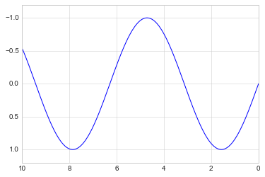

一个有用的相关方法是``plt.axis()``（注意这里`axes`（复数形式）与`axis`（单数形式）之间可能存在混淆，前者带有`e`而后者带有`i`）。``plt.axis()``方法允许你通过一次调用来设置``x``和``y``限制，通过一个指定``[xmin, xmax, ymin, ymax]``的列表：

> 注：在本书中，如果`axes`指代两个轴围成的区域，一律翻译为“轴域”。

```py
plt.plot(x, np.sin(x))
plt.axis([-1, 11, -1.5, 1.5]);
```


``plt.axis()``方法甚至超出了这个范围，允许你做一些事情，比如自动收紧当前绘图周围的边界：

```py
plt.plot(x, np.sin(x))
plt.axis('tight');
```

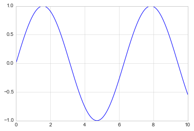

它允许你做更高级别的规定，例如确保相等的宽高比，以便在屏幕上，`x`中的一个单位等于`y`中的一个单位：

```py
plt.plot(x, np.sin(x))
plt.axis('equal');
```

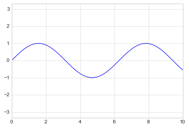


对于轴域限制和``plt.axis``方法的其他功能的更多信息，请参阅``plt.axis``文档字符串。

## 标注绘图

作为本节的最后一部分，我们将简要介绍图表的标签：标题，轴标签和简单图例。标题和轴标签是最简单的标签 - 有一些方法可用于快速设置它们：

```py
plt.plot(x, np.sin(x))
plt.title("A Sine Curve")
plt.xlabel("x")
plt.ylabel("sin(x)");
```

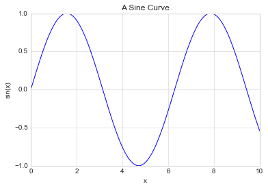


可以使用函数的可选参数调整这些标签的位置，大小和样式。更多信息请参阅 Matplotlib 文档以及每个函数的文档字符串。

当在单个轴中显示多条线时，创建标记每种线条类型的图例是很有用的。同样，Matplotlib 有一种内置方式，用于快速创建这样的图例。它是通过（你猜对了）``plt.legend()``方法完成的。虽然有几种有效的方法可以使用它，但我发现使用`plot`函数的``label``关键字，指定每行的标签是最简单的：

```py
plt.plot(x, np.sin(x), '-g', label='sin(x)')
plt.plot(x, np.cos(x), ':b', label='cos(x)')
plt.axis('equal')

plt.legend();
```

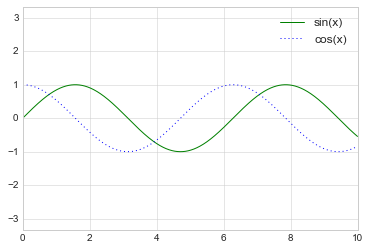


你可以看到，``plt.legend()``函数跟踪线条样式和颜色，并将它们匹配正确的标签。指定和格式化图形图例的更多信息，可以在``plt.legend``的文档字符串中找到；此外，我们将在“自定义图例”中，介绍一些更高级的图例选项。

## 旁注：Matplotlib 的陷阱

虽然大多数``plt``函数可以直接转换为``ax``方法（例如``plt.plot()``→``ax.plot()``，``plt.legend()``→ ``ax.legend()``等等，不是所有命令都是这种情况。特别是，设置限制，标签和标题的函数是稍微改动的。要在 MATLAB 风格函数和面向对象方法之间转换，请更改以下东西：

- ``plt.xlabel()``→``ax.set_xlabel()``
- ``plt.ylabel()``→``ax.set_ylabel()``
- ``plt.xlim()``→``ax.set_xlim()``
- ``plt.ylim()``→``ax.set_ylim()``
- ``plt.title()``→``ax.set_title()``

在面向对象的绘图接口中，并不单独调用这些函数，而是使用``ax.set()``方法一次设置所有这些属性，通常更方便：

```py
ax = plt.axes()
ax.plot(x, np.sin(x))
ax.set(xlim=(0, 10), ylim=(-2, 2),
       xlabel='x', ylabel='sin(x)',
       title='A Simple Plot');
```

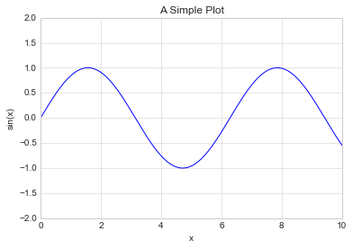