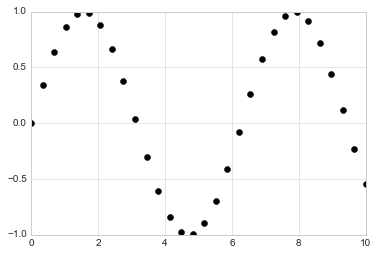
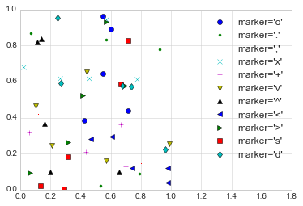
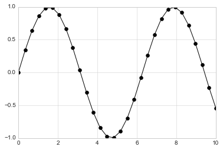
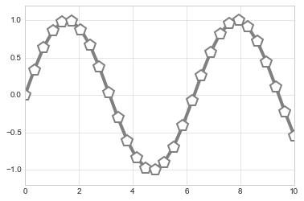
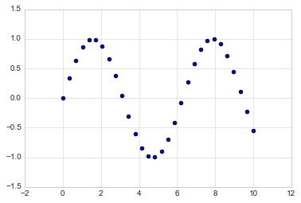
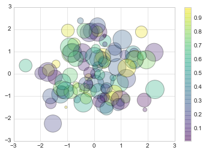
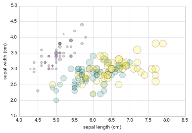

# 8.5 简单的散点图

> 原文：[Simple Scatter Plots](https://nbviewer.jupyter.org/github/donnemartin/data-science-ipython-notebooks/blob/master/matplotlib/04.02-Simple-Scatter-Plots.ipynb)
> 
> 译者：[飞龙](https://github.com/wizardforcel)
> 
> 协议：[CC BY-NC-SA 4.0](http://creativecommons.org/licenses/by-nc-sa/4.0/)
> 
> 本节是[《Python 数据科学手册》](https://github.com/jakevdp/PythonDataScienceHandbook)（Python Data Science Handbook）的摘录。

另一种常用的绘图类型是简单的散点图，是折线图的近亲。这里的点并不由线连接，而是单独表示的点，圆或其他形状。我们首先为绘图配置笔记本，并导入我们将使用的函数：

```py
%matplotlib inline
import matplotlib.pyplot as plt
plt.style.use('seaborn-whitegrid')
import numpy as np
```

## 散点图和``plt.plot``

在上一节中，我们查看了生成折线图的``plt.plot`` /``ax.plot``。事实证明，同样的函数也可以生成散点图：

```py
x = np.linspace(0, 10, 30)
y = np.sin(x)

plt.plot(x, y, 'o', color='black');
```




函数调用中的第三个参数是一个字符，表示用于绘图的符号类型。正如你可以指定选项，例如``'-'``，``'--'`来控制线条样式，标记样式有自己的一组短字符串代码。完整的可用符号列表，可以在``plt.plot``的文档中找到，或者在Matplotlib 的在线文档中看到。大多数选项非常直观，我们将在这里展示一些更常见的：

```py
rng = np.random.RandomState(0)
for marker in ['o', '.', ',', 'x', '+', 'v', '^', '<', '>', 's', 'd']:
    plt.plot(rng.rand(5), rng.rand(5), marker,
             label="marker='{0}'".format(marker))
plt.legend(numpoints=1)
plt.xlim(0, 1.8);
```




为了获得更多选项，这些字符代码可以与线条和颜色代码一起使用，来绘制点以及连接它们的线：

```py
plt.plot(x, y, '-ok');
```




``plt.plot``的附加关键字参数，指定了线条和标记的各种属性：

```py
plt.plot(x, y, '-p', color='gray',
         markersize=15, linewidth=4,
         markerfacecolor='white',
         markeredgecolor='gray',
         markeredgewidth=2)
plt.ylim(-1.2, 1.2);
```




``plt.plot``函数的这种灵活性支持各种可能的可视化选项。可用选项的完整说明，请参阅``plt.plot``文档。

## 散点图和``plt.scatter``

第二种更强大的创建散点图的方法是``plt.scatter``函数，它的用法与``plt.plot``函数非常相似：

```py
plt.scatter(x, y, marker='o');
```




``plt.scatter``与``plt.plot``的主要区别是，它可用于创建散点图，其中每个单独的点的属性（大小，填充颜色，边缘颜色等）可以单独控制，或映射到数据。

让我们通过创建一个随机散点图，包含多种颜色和大小的点，来展示它。为了更好地查看重叠结果，我们还将使用``alpha``关键字来调整透明度：

```py
rng = np.random.RandomState(0)
x = rng.randn(100)
y = rng.randn(100)
colors = rng.rand(100)
sizes = 1000 * rng.rand(100)

plt.scatter(x, y, c=colors, s=sizes, alpha=0.3,
            cmap='viridis')
plt.colorbar();  # show color scale
```



请注意，颜色参数自动映射到颜色标度（此处由``colorbar()``命令显示），`size`参数以像素为单位。通过这种方式，点的颜色和大小可用于在可视化中传达信息，以便可视化多维数据。

例如，我们可能会使用来自 Scikit-Learn 的 Iris 数据，其中每个样本是三种类型的花朵中的一种，其花瓣和萼片的大小是仔细测量的：

```py
from sklearn.datasets import load_iris
iris = load_iris()
features = iris.data.T

plt.scatter(features[0], features[1], alpha=0.2,
            s=100*features[3], c=iris.target, cmap='viridis')
plt.xlabel(iris.feature_names[0])
plt.ylabel(iris.feature_names[1]);
```




我们可以看到，这个散点图使我们能够同时探索数据的四个不同维度：每个点的`(x, y)`位置对应于萼片的长度和宽度，该点的大小与花瓣宽度有关，并且颜色与花的特定种类有关。像这样的多颜色和多特征散点图，对于数据探索和展示都是有用的。

## ``plot`` VS ``scatter``：效率的注解

除了``plt.plot``和``plt.scatter``中提供的不同功能之外，为什么你选择使用一个而不是另一个？ 虽然对于少量数据而言并不重要，因为数据集大于几千个点，``plt.plot``可能比``plt.scatter``明显更高效。原因是``plt.scatter``能够为每个点渲染不同的大小和/或颜色，因此渲染器必须执行单独构建每个点的额外工作。

另一方面，在`plt.plot`中，点基本上总是彼此的克隆，因此确定点的外观的工作，仅对整个数据集执行一次。对于大型数据集，这两者之间的差异可能会使性能大不相同，因此，对于大型数据集，``plt.plot``应优于``plt.scatter``。