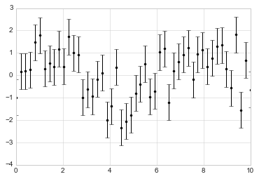
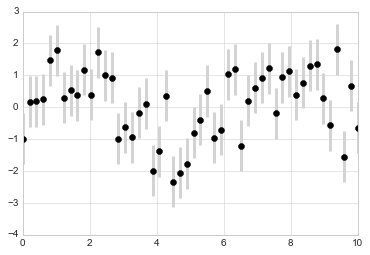
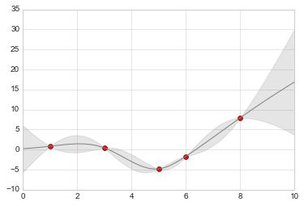

# 8.6 可视化误差

> 原文：[Visualizing Errors](https://nbviewer.jupyter.org/github/donnemartin/data-science-ipython-notebooks/blob/master/matplotlib/04.03-Errorbars.ipynb)
> 
> 译者：[飞龙](https://github.com/wizardforcel)
> 
> 协议：[CC BY-NC-SA 4.0](http://creativecommons.org/licenses/by-nc-sa/4.0/)
> 
> 本节是[《Python 数据科学手册》](https://github.com/jakevdp/PythonDataScienceHandbook)（Python Data Science Handbook）的摘录。

对于任何科学测量，误差的准确计算几乎与数字本身的准确报告一样重要，甚至更重要。例如，假设我正在使用一些天体物理观测来估计哈勃常数，即宇宙膨胀率的局部测量值。我知道目前的文献显示，它是大约`71 (km/s)/Mpc`，我用我的方法测得的值为`74 (km/s)/Mpc`。这些值是否一致？ 鉴于此信息，唯一正确的答案是：没有办法知道。

假设我用报告的不确定性来扩展这些信息：目前的文献显示它是`71 ± 2.5 (km/s)/Mpc`，我的方法测得的值为`74 ± 5 (km/s)/Mpc`。现在值是否一致？ 这是一个可以定量回答的问题。

在数据和结果的可视化中，有效地显示这些误差，可以使图表传达更完整的信息。

## 基本的误差栏

可以使用单个 Matplotlib 函数调用，创建基本误差栏：

```py
%matplotlib inline
import matplotlib.pyplot as plt
plt.style.use('seaborn-whitegrid')
import numpy as np

x = np.linspace(0, 10, 50)
dy = 0.8
y = np.sin(x) + dy * np.random.randn(50)

plt.errorbar(x, y, yerr=dy, fmt='.k');
```




这里``fmt``是控制线和点外观的格式代码，与``plt.plot``中使用的简写语法相同，在“简单的折线图”和“简单的散点图”中概述。

除了这些基本选项之外，``errorbar``函数还有许多选项可以微调输出。使用这些附加选项，你可以轻松自定义误差栏绘图的美感。我经常发现它有用，特别是在拥挤的绘图中，使误差栏比点本身更浅：

```py
plt.errorbar(x, y, yerr=dy, fmt='o', color='black',
             ecolor='lightgray', elinewidth=3, capsize=0);
```




除了这些选项，你还可以指定水平误差栏（``xerr``），单侧误差栏和许多其他变体。对于可用选项的更多信息，请参阅``plt.errorbar``的文档字符串。

## 连续误差

在某些情况下，希望在连续数量上显示误差栏。虽然 Matplotlib 没有为这种类型的应用内置便利例程，但是将`plt.plot`和`plt.fill_between`之类的原语组合起来来获得有用的结果，是相对容易的。

在这里，我们将使用 Scikit-Learn API 执行简单的高斯过程回归（详细信息，请参阅“Scikit-Learn 简介”）。这是一种方法，使用不确定性的连续测量，将非常灵活的非参数函数拟合到数据。我们现在不会深入研究高斯过程回归的细节，而是专注于如何可视化这种连续误差测量：

```py
from sklearn.gaussian_process import GaussianProcess

# 定义模型并绘制一些数据
model = lambda x: x * np.sin(x)
xdata = np.array([1, 3, 5, 6, 8])
ydata = model(xdata)

# 拟合高斯过程
gp = GaussianProcess(corr='cubic', theta0=1e-2, thetaL=1e-4, thetaU=1E-1,
                     random_start=100)
gp.fit(xdata[:, np.newaxis], ydata)

xfit = np.linspace(0, 10, 1000)
yfit, MSE = gp.predict(xfit[:, np.newaxis], eval_MSE=True)
dyfit = 2 * np.sqrt(MSE)  # 2*sigma ~ 95% confidence region
```

我们现在有``xfit``，``yfit``和``dyfit``，它们对数据的连续拟合进行抽样。我们可以将这些传递给上面的``plt.errorbar``函数，但是我们真的不想绘制 1000 个点和 1000 个误差栏。相反，我们可以使用浅色的``plt.fill_between``函数来显示这个连续误差：

```py
# 可视化结果
plt.plot(xdata, ydata, 'or')
plt.plot(xfit, yfit, '-', color='gray')

plt.fill_between(xfit, yfit - dyfit, yfit + dyfit,
                 color='gray', alpha=0.2)
plt.xlim(0, 10);
```




注意我们在这里使用``fill_between``函数做了什么：我们传递一个`x`值，然后是`y`下界，然后是`y`上面，结果就是之间的区域被填充了。

得到的图形可以用于非常直观地了解高斯过程回归算法正在做什么：在测量数据点附近的区域中，模型受到强烈约束，这反映在较小的模型误差中。在远离测量数据点的区域中，模型不受强烈约束，并且模型误差增加。

对于``plt.fill_between()``（以及密切相关的``plt.fill()``函数）中，可用选项的更多信息，请参阅函数的文档字符串或 Matplotlib 文档。

最后，如果这和你的品味相比，看起来有点太低了，请参考“可视化与 Seaborn”，其中我们讨论了 Seaborn 包，它有更简化的 API，用于可视化这种类型 的连续误差栏。