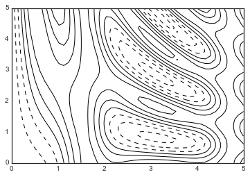
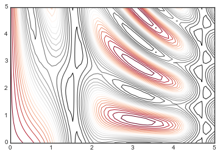
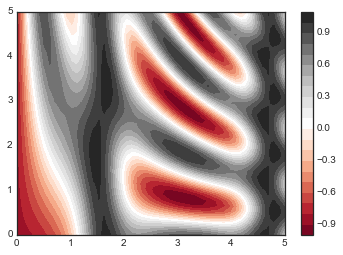
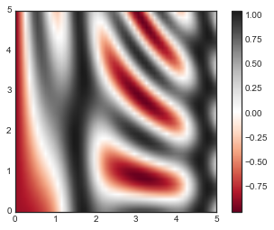
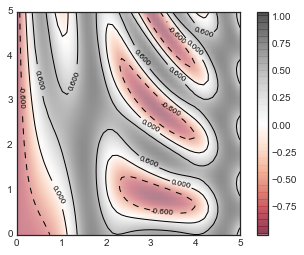

# 8.7 密度和等高线图

> 原文：[Density and Contour Plots](https://nbviewer.jupyter.org/github/donnemartin/data-science-ipython-notebooks/blob/master/matplotlib/04.04-Density-and-Contour-Plots.ipynb)
> 
> 译者：[飞龙](https://github.com/wizardforcel)
> 
> 协议：[CC BY-NC-SA 4.0](http://creativecommons.org/licenses/by-nc-sa/4.0/)
> 
> 本节是[《Python 数据科学手册》](https://github.com/jakevdp/PythonDataScienceHandbook)（Python Data Science Handbook）的摘录。

有时，使用等高线或颜色编码的区域，在二维中显示三维数据是有用的。有三个 Matplotlib 函数可以帮助完成这个任务：`plt.contour``用于等高线图，``plt.contourf``用于填充的等高线图，``plt.imshow``用于显示图像。本节介绍使用这些的几个示例。 我们首先为绘图配置笔记本，并导入我们将使用的函数：

```py
%matplotlib inline
import matplotlib.pyplot as plt
plt.style.use('seaborn-white')
import numpy as np
```

## 可视化三维函数

我们首先使用`z = f(x, y)`函数演示等高线图，为`f`使用以下特定选项（当我们将它用作数组广播的动机示例时，我们之前在“数组计算：广播”中看到过它们）：

```py
def f(x, y):
    return np.sin(x) ** 10 + np.cos(10 + y * x) * np.cos(x)
```

可以使用``plt.contour``函数创建等高线图。它需要三个参数：`x`值的网格，`y`值的网格和`z`值的网格。`x`和`y`值表示图上的位置，`z`值将由等高线水平表示。也许准备这样的数据最直接的方法是使用``np.meshgrid``函数，它从一维数组构建二维网格：

```py
x = np.linspace(0, 5, 50)
y = np.linspace(0, 5, 40)

X, Y = np.meshgrid(x, y)
Z = f(X, Y)
```

现在让我们看一下仅有线的标准等高线图：

```py
plt.contour(X, Y, Z, colors='black');
```




请注意，默认情况下，使用单一颜色时，负值由虚线表示，正值由实线表示。或者，可以通过``cmap``参数，指定颜色表来对线条进行颜色编码。在这里，我们还指定我们想要绘制更多的线 - 数据范围内的 20 个等距间隔：

```py
plt.contour(X, Y, Z, 20, cmap='RdGy');
```




在这里，我们选择了``RdGy``（`Red-Gray`的缩写）颜色表，这是居中数据的不错选择。Matplotlib 提供了各种各样的色彩表，你可以通过在``plt.cm``模块上的 TAB 补全，在 IPython 中轻松浏览它们：

```py
plt.cm.<TAB>
```

我们的绘图看起来更好，但线条之间的空间可能有点分散。通过使用``plt.contourf()``函数（注意末尾的``f``），我们可以切换到填充的等高线图来改变它，它使用与``plt.contour()``大致相同的语法。。

另外，我们将添加一个``plt.colorbar()``命令，它会自动创建一个附加轴，带有绘图的标记的颜色信息：


```py
plt.contourf(X, Y, Z, 20, cmap='RdGy')
plt.colorbar();
```




颜色条清楚地表明黑色区域是“峰值”，而红色区域是“谷值”。

这个绘图的一个潜在问题是它有些“噪点”。 也就是说，颜色阶梯是离散的而不是连续的，这并不总是所希望的。

这可以通过将等高线数设置为非常高的数量来解决，但这会使的绘图相当低效：Matplotlib必须为等高线中的每个阶梯渲染一个新的多边形。处理这个的更好方法是使用``plt.imshow()``函数，它将二维数据网格解释为图像。

以下代码显示了这一点：

```py
plt.imshow(Z, extent=[0, 5, 0, 5], origin='lower',
           cmap='RdGy')
plt.colorbar()
plt.axis(aspect='image');
```




但是，``imshow()``有一些潜在的问题：

-   ``plt.imshow()``不接受`x`和`y`网格，所以你必须在绘图上手动指定图像的边界`[xmin, xmax, ymin, ymax]`。
-   ``plt.imshow()``默认遵循标准图像数组定义，其中原点位于左上角，而不是大多数等高线图中的左下角。 显示网格化数据时必须更改此值。
-   ``plt.imshow()``将自动调整轴纵横比来匹配输入数据；这可以通过设置，例如``plt.axis（aspect ='image'）``来使`x`和`y`单位匹配来更改。
 
最后，有时可以将等高线图和图像绘图组合起来。例如，在这里我们将使用部分透明的背景图像（通过``alpha``参数设置透明度）和绘制在上面的等高线图，标签在它上面（使用``plt.clabel()``函数）：

```py
contours = plt.contour(X, Y, Z, 3, colors='black')
plt.clabel(contours, inline=True, fontsize=8)

plt.imshow(Z, extent=[0, 5, 0, 5], origin='lower',
           cmap='RdGy', alpha=0.5)
plt.colorbar();
```




这三个函数的组合 -- ``plt.contour``，``plt.contourf``和``plt.imshow`` -- 提供了几乎无限的可能性，来在二维绘图中展示这种三维数据。这些函数中可用选项的更多信息，请参阅其文档字符串。如果你对此类数据的三维可视化感兴趣，请参阅“Matplotlib 中的三维绘图”。