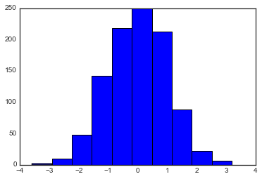
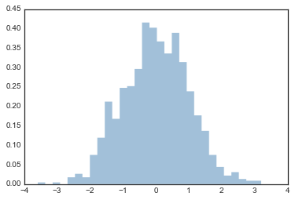
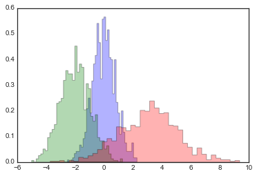
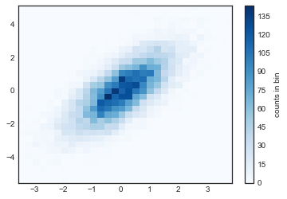
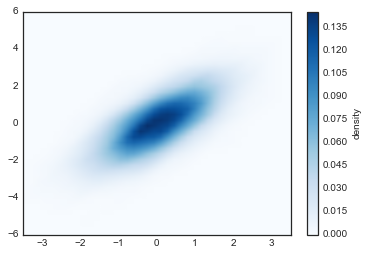

# 8.8 直方图，分箱和密度

> 原文：[Histograms, Binnings, and Density](https://nbviewer.jupyter.org/github/donnemartin/data-science-ipython-notebooks/blob/master/matplotlib/04.05-Histograms-and-Binnings.ipynb)
> 
> 译者：[飞龙](https://github.com/wizardforcel)
> 
> 协议：[CC BY-NC-SA 4.0](http://creativecommons.org/licenses/by-nc-sa/4.0/)
> 
> 本节是[《Python 数据科学手册》](https://github.com/jakevdp/PythonDataScienceHandbook)（Python Data Science Handbook）的摘录。

简单的直方图可能是理解数据集的第一步。之前，我们预览了 Matplotlib 直方图函数（参见“比较，掩码和布尔逻辑”），一旦执行了常规的导入，它在一行中创建一个基本直方图：

```py
%matplotlib inline
import numpy as np
import matplotlib.pyplot as plt
plt.style.use('seaborn-white')

data = np.random.randn(1000)

plt.hist(data);
```



``hist()``函数有很多调整计算和显示的选项；这是一个更加自定义的直方图的例子：

```py
plt.hist(data, bins=30, normed=True, alpha=0.5,
         histtype='stepfilled', color='steelblue',
         edgecolor='none');
```




``plt.hist``的文档字符串提供了其他可用自定义选项的更多信息。我发现``histtype='stepfilled'``和一些透明度``alpha``的组合，在比较几种分布的直方图时非常有用：

```py
x1 = np.random.normal(0, 0.8, 1000)
x2 = np.random.normal(-2, 1, 1000)
x3 = np.random.normal(3, 2, 1000)

kwargs = dict(histtype='stepfilled', alpha=0.3, normed=True, bins=40)

plt.hist(x1, **kwargs)
plt.hist(x2, **kwargs)
plt.hist(x3, **kwargs);
```




如果你想简单地计算直方图（也就是说，计算给定桶中的点数）而不显示它，那么``np.histogram()``函数是可用的：

```py
counts, bin_edges = np.histogram(data, bins=5)
print(counts)

# [ 12 190 468 301  29]
```

## 二维直方图和分箱

就像我们通过将数字放入桶中，创建一维直方图一样，我们也可以通过将点放入通过二维的桶中，来创建二维直方图。我们将在这里简要介绍几种方法。我们首先定义一些数据 - 从多元高斯分布中抽取的``x``和``y``数组：

```py
mean = [0, 0]
cov = [[1, 1], [1, 2]]
x, y = np.random.multivariate_normal(mean, cov, 10000).T
```

### ``plt.hist2d``：二维直方图

绘制二维直方图的一种简单方法是使用 Matplotlib 的``plt.hist2d``函数：

```py
plt.hist2d(x, y, bins=30, cmap='Blues')
cb = plt.colorbar()
cb.set_label('counts in bin')
```




就像``plt.hist``一样，``plt.hist2d``有许多微调绘图和分箱的额外选项来，这在函数的文档字符串中有很好的概述。此外，正如``plt.hist``在``np.histogram``中存在对应，``plt.hist2d``在``np.histogram2d``中也存在对应，可以按如下方式使用：

```py
counts, xedges, yedges = np.histogram2d(x, y, bins=30)
```

对于维度大于 2 的直方图分箱的推广，请参阅``np.histogramdd``函数。

### ``plt.hexbin``：六边形分箱

二维直方图创建了横跨坐标轴的正方形细分。这种细分的另一种自然形状是正六边形。为此，Matplotlib 提供了``plt.hexbin``例程，它将表示在六边形网格中分箱的二维数据集：

```py
plt.hexbin(x, y, gridsize=30, cmap='Blues')
cb = plt.colorbar(label='count in bin')
```


``plt.hexbin``有许多有趣的选项，包括为每个点指定权重，以及将每个桶中的输出更改为任何 NumPy 聚合（权重的平均值，权重的标准差等）。

### 核密度估计

另一种评估多维密度的常用方法是核密度估计（KDE）。这将在“深度：核密度估计”中全面讨论，但是现在我们只是提到，KDE 可以被认为是“消去”空间中的点，并将结果相加来获得平滑函数的一种方式。

``scipy.stats``包中存在非常快速和简单的 KDE 实现。以下是在此数据上使用 KDE 的快速示例：

```py
from scipy.stats import gaussian_kde

# 拟合大小为 [Ndim, Nsamples] 的数组
data = np.vstack([x, y])
kde = gaussian_kde(data)

# 在常规网格上评估
xgrid = np.linspace(-3.5, 3.5, 40)
ygrid = np.linspace(-6, 6, 40)
Xgrid, Ygrid = np.meshgrid(xgrid, ygrid)
Z = kde.evaluate(np.vstack([Xgrid.ravel(), Ygrid.ravel()]))

# 将结果绘制为图像
plt.imshow(Z.reshape(Xgrid.shape),
           origin='lower', aspect='auto',
           extent=[-3.5, 3.5, -6, 6],
           cmap='Blues')
cb = plt.colorbar()
cb.set_label("density")
```



KDE 具有平滑长度，可以在细节和平滑度之间有效地调整（无处不在的偏差 - 方差权衡的一个例子）。有关选择合适的平滑长度的文献非常多：``gaussian_kde``使用经验法则，试图为输入数据找到近似最佳的平滑长度。

SciPy 生态系统中提供了其他 KDE 实现，每个实现都有自己的优点和缺点；例如，参见``sklearn.neighbors.KernelDensity``和``statsmodels.nonparametric.kernel_density.KDEMultivariate``。对于基于 KDE 的可视化，使用 Matplotlib 往往过于冗长。在“可视化和 Seaborn”中讨论的 Seaborn 库，提供了更为简洁的 API 来创建基于 KDE 的可视化。