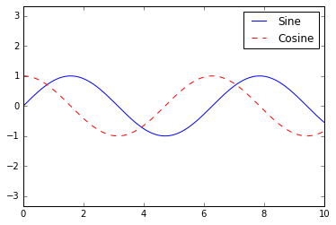
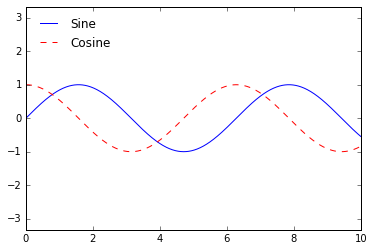
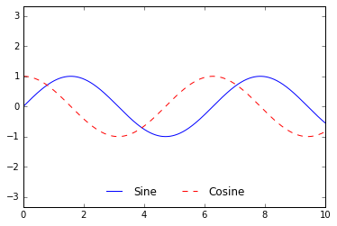
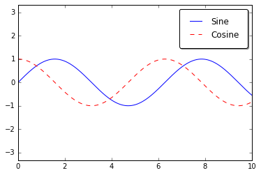
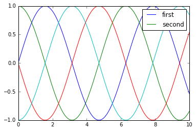
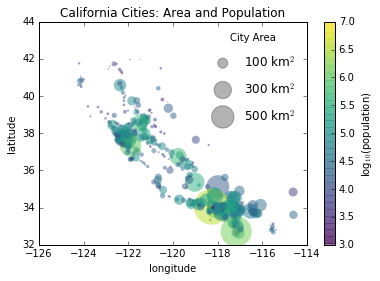
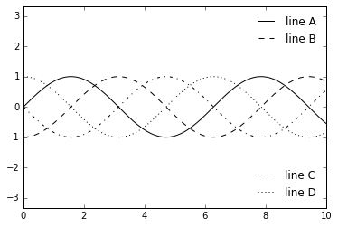

# 8.9 自定义图例

> 原文：[Customizing Plot Legends](https://nbviewer.jupyter.org/github/donnemartin/data-science-ipython-notebooks/blob/master/matplotlib/04.06-Customizing-Legends.ipynb)
> 
> 译者：[飞龙](https://github.com/wizardforcel)
> 
> 协议：[CC BY-NC-SA 4.0](http://creativecommons.org/licenses/by-nc-sa/4.0/)
> 
> 本节是[《Python 数据科学手册》](https://github.com/jakevdp/PythonDataScienceHandbook)（Python Data Science Handbook）的摘录。

绘图的图例将意义赋予可视化，为各种绘图元素标识意义。我们以前看过如何创建简单的图例；在这里，我们将介绍如何在 Matplotlib 中自定义图例的位置和样式。

可以使用``plt.legend()``命令创建最简单的图例，该命令会自动为任何已标记的绘图元素创建图例：

```py
import matplotlib.pyplot as plt
plt.style.use('classic')

%matplotlib inline
import numpy as np

x = np.linspace(0, 10, 1000)
fig, ax = plt.subplots()
ax.plot(x, np.sin(x), '-b', label='Sine')
ax.plot(x, np.cos(x), '--r', label='Cosine')
ax.axis('equal')
leg = ax.legend();
```




但是我们可能有很多方法想要定制这样一个图例。例如，我们可以指定位置并关闭边框：

```py
ax.legend(loc='upper left', frameon=False)
fig
```



我们可以使用``ncol``命令来指定图例中的列数：

```py
ax.legend(frameon=False, loc='lower center', ncol=2)
fig
```



我们可以使用圆角框（``fancybox``）或添加阴影，更改边框的透明度（`alpha`值），或更改文本周围的边距：

```py
ax.legend(fancybox=True, framealpha=1, shadow=True, borderpad=1)
fig
```



可用图例选项的更多信息，请参阅``plt.legend``文档字符串。

## 为图例选择元素

我们已经看到，图例默认包含所有已标记的元素。如果这不是我们想要的，我们可以通过使用`plot`命令返回的对象，来微调图例中出现的元素和标签。``plt.plot()``命令可以一次创建多个线条，并返回已创建的线条实例的列表。将这些中的任何一个，以及我们想要标识的标签传递给``plt.legend()``将告诉它识别哪些：

```py
y = np.sin(x[:, np.newaxis] + np.pi * np.arange(0, 2, 0.5))
lines = plt.plot(x, y)

# 直线是 plt.Line2D 实例的列表
plt.legend(lines[:2], ['first', 'second']);
```


我通常在实践中发现使用第一种方法更清晰，将标签应用于你想要在图例上显示的绘图元素：

```py
plt.plot(x, y[:, 0], label='first')
plt.plot(x, y[:, 1], label='second')
plt.plot(x, y[:, 2:])
plt.legend(framealpha=1, frameon=True);
```



请注意，默认情况下，图例会忽略没有设置``label``属性的所有元素。

## 用于点的大小的图例

有时，图例默认值不足以满足给定的可视化效果。例如，你可能正在使用点的大小来标记数据的某些特征，并且想要创建反映这一点的图例。这是一个例子，我们将使用点的大小来表示加州城市的人口。我们想要一个标识点大小比例的图例，我们将通过绘制一些没有条目的标记数据来实现它：

```py
import pandas as pd
cities = pd.read_csv('data/california_cities.csv')

# 提取我们感兴趣的数据
lat, lon = cities['latd'], cities['longd']
population, area = cities['population_total'], cities['area_total_km2']

# 将点绘制为散点图，使用尺寸和颜色，但没有标签
plt.scatter(lon, lat, label=None,
            c=np.log10(population), cmap='viridis',
            s=area, linewidth=0, alpha=0.5)
plt.axis(aspect='equal')
plt.xlabel('longitude')
plt.ylabel('latitude')
plt.colorbar(label='log$_{10}$(population)')
plt.clim(3, 7)

# 这里我们创建图例
# 我们使用所需大小和标签绘制空列表
for area in [100, 300, 500]:
    plt.scatter([], [], c='k', alpha=0.3, s=area,
                label=str(area) + ' km$^2$')
plt.legend(scatterpoints=1, frameon=False, labelspacing=1, title='City Area')

plt.title('California Cities: Area and Population');
```




图例始终引用绘图上的某个对象，因此如果我们想要显示特定的形状，我们需要绘制它。在这种情况下，我们想要的对象（灰色圆圈）不在图上，所以我们通过绘制空列表来伪造它们。另请注意，图例仅列出了指定标签的绘图元素。

通过绘制空列表，我们创建了带标签的绘图对象，由图例拾取，现在我们的图例告诉我们一些有用的信息。此策略可用于创建更复杂的可视化。

最后，请注意，对于这样的地理数据，如果我们可以显示州边界或其他特定于地图的元素，则会更清楚。为此，一个很好的工具选择是 Matplotlib 的 Basemap 附加工具包，我们将在“地理数据和 Basemap”中探讨。

## 多个图例

有时在设计绘图时，你需要在同一轴域上添加多个图例。不幸的是，这对 Matplotlib 并不容易：通过标准的``legend``接口，只能为整个绘图创建一个图例。如果你尝试使用``plt.legend()``或``ax.legend()``创建第二个图例，它将简单地覆盖第一个。我们可以通过从头开始创建一个新的图例艺术家来解决这个问题，然后使用较低级别的``ax.add_artist()``方法，手动将第二个艺术家添加到绘图中：

```py
fig, ax = plt.subplots()

lines = []
styles = ['-', '--', '-.', ':']
x = np.linspace(0, 10, 1000)

for i in range(4):
    lines += ax.plot(x, np.sin(x - i * np.pi / 2),
                     styles[i], color='black')
ax.axis('equal')

# 指定第一个图例的直线和标签
ax.legend(lines[:2], ['line A', 'line B'],
          loc='upper right', frameon=False)

# 创建第二个图例，并手动添加艺术家
from matplotlib.legend import Legend
leg = Legend(ax, lines[2:], ['line C', 'line D'],
             loc='lower right', frameon=False)
ax.add_artist(leg);
```




这是对构成任何 Matplotlib 绘图的，低级艺术家对象的窥视。
如果你检查一下``ax.legend()``的源代码（回想一下你可以在 IPython 笔记本中使用``ax.legend??``来实现），你会看到该函数只包含一些逻辑，创建合适的``Legend``艺术家，然后将其保存在``legend_``属性中，并在绘图时添加到图形中。
